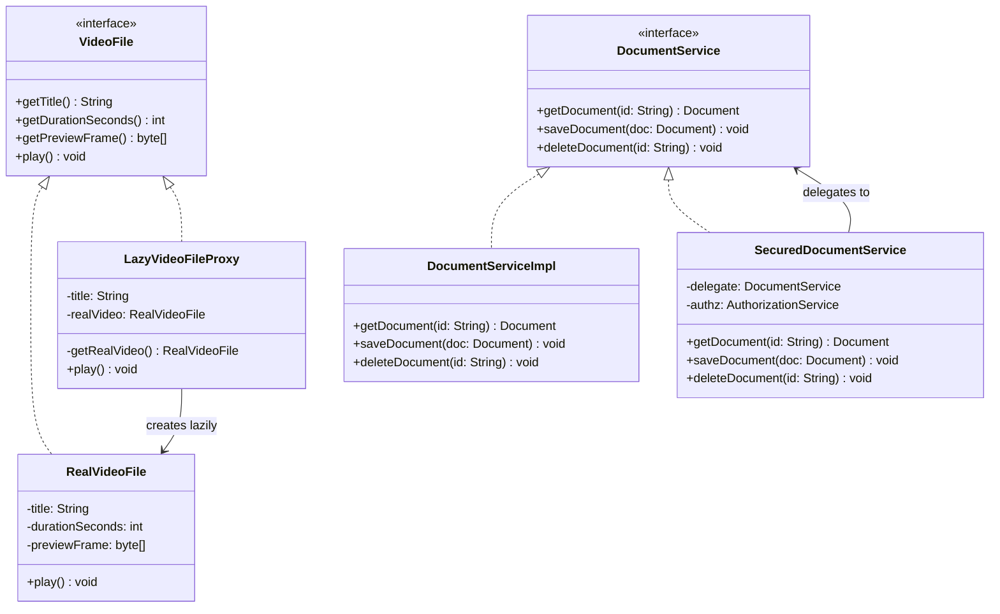
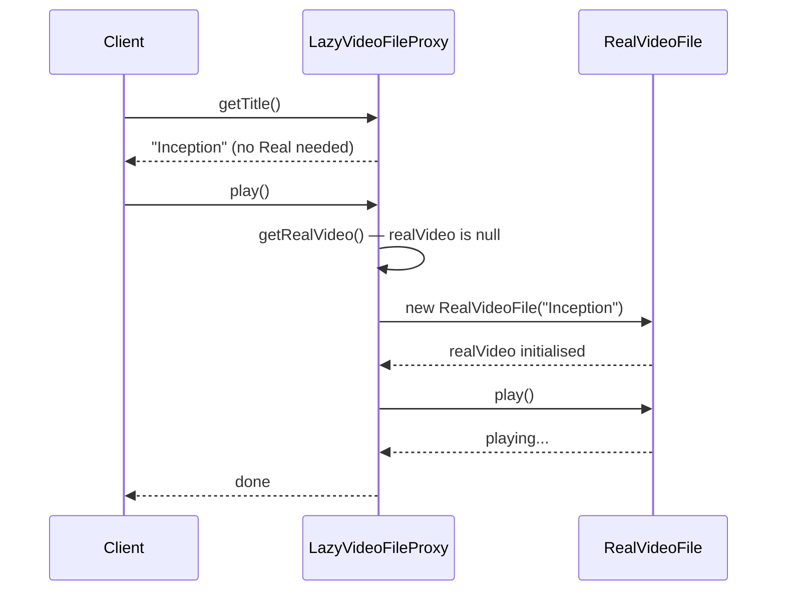

# Proxy Pattern

> *"Provide a surrogate or placeholder for another object to control access to it."*
> — GoF Design Patterns

Proxy places an intermediary in front of an object. The intermediary implements the same interface as the real object, so clients can't tell the difference. This transparent substitution enables a family of powerful capabilities: lazy initialisation, access control, remote communication, caching, and logging — without any changes to the client or the real object.

---

## The Problem it Solves

A `VideoLibrary` service loads high-resolution video metadata on construction. The metadata for each video takes 500ms and 50MB of memory to load. Your application starts with 1,000 videos in the catalogue:

```java
// Naive — loads everything upfront
public class VideoLibrary {
    private final Map<String, VideoFile> videos = new HashMap<>();

    public VideoLibrary() {
        // 1,000 videos × 500ms each = 500 seconds startup time
        for (String title : catalogue.getAllTitles()) {
            videos.put(title, new VideoFile(title));    // loads metadata + preview frame
        }
    }

    public VideoFile getVideo(String title) {
        return videos.get(title);
    }
}
```

The user will watch maybe 3 videos per session. Loading 1,000 is wasteful. But you don't want to change the client code — it already calls `library.getVideo(title)` and expects a `VideoFile` back.

A **Virtual Proxy** intercepts the call and delays loading until first access.

---

## Four Types of Proxy

| Type | Problem it solves | Mechanism |
|---|---|---|
| **Virtual** | Expensive object initialisation | Defers creation until first use |
| **Protection** | Access control | Checks permissions before delegating |
| **Remote** | Object lives on another machine | Hides network communication |
| **Caching** | Repeated expensive computations | Stores and returns cached results |
| **Logging** | Audit and observability | Records calls, arguments, results |

---

## Type 1 — Virtual Proxy (Lazy Initialisation)

```java
// Subject interface — shared by real object and proxy
public interface VideoFile {
    String  getTitle();
    int     getDurationSeconds();
    byte[]  getPreviewFrame();
    void    play();
}

// Real Subject — expensive to create
public class RealVideoFile implements VideoFile {
    private final String title;
    private final int    durationSeconds;
    private final byte[] previewFrame;     // 50MB

    public RealVideoFile(String title) {
        System.out.println("Loading video: " + title);
        this.title           = title;
        this.durationSeconds = loadDuration(title);    // slow
        this.previewFrame    = loadPreviewFrame(title);// slow + heavy
    }

    @Override public String  getTitle()           { return title; }
    @Override public int     getDurationSeconds() { return durationSeconds; }
    @Override public byte[]  getPreviewFrame()    { return previewFrame; }
    @Override public void    play()               { System.out.println("Playing: " + title); }
}

// Virtual Proxy — same interface; defers real object creation
public class LazyVideoFileProxy implements VideoFile {
    private final String    title;
    private       RealVideoFile realVideo;   // null until first access

    public LazyVideoFileProxy(String title) {
        this.title = title;   // fast — no I/O
    }

    private RealVideoFile getRealVideo() {
        if (realVideo == null) {
            realVideo = new RealVideoFile(title);   // only created here
        }
        return realVideo;
    }

    @Override public String  getTitle()           { return title; }   // can answer without loading
    @Override public int     getDurationSeconds() { return getRealVideo().getDurationSeconds(); }
    @Override public byte[]  getPreviewFrame()    { return getRealVideo().getPreviewFrame(); }
    @Override public void    play()               { getRealVideo().play(); }
}

// Client code — no change needed
public class VideoLibrary {
    private final Map<String, VideoFile> videos = new HashMap<>();

    public VideoLibrary() {
        // Fast: creates 1,000 lightweight proxies
        for (String title : catalogue.getAllTitles()) {
            videos.put(title, new LazyVideoFileProxy(title));
        }
    }

    public VideoFile getVideo(String title) {
        return videos.get(title);
    }
}
```

The `VideoLibrary` still returns a `VideoFile` per its contract. The client calls `video.play()` exactly as before. The proxy loads the real file only when `play()`, `getPreviewFrame()`, or `getDurationSeconds()` is called.

---

## Type 2 — Protection Proxy (Access Control)

```java
// Subject interface
public interface DocumentService {
    Document getDocument(String id);
    void     saveDocument(Document doc);
    void     deleteDocument(String id);
}

// Real service — no access control concern
public class DocumentServiceImpl implements DocumentService {
    private final DocumentRepository repository;

    public DocumentServiceImpl(DocumentRepository repository) {
        this.repository = repository;
    }

    @Override public Document getDocument(String id)   { return repository.findById(id).orElseThrow(); }
    @Override public void     saveDocument(Document d) { repository.save(d); }
    @Override public void     deleteDocument(String id){ repository.delete(id); }
}

// Protection Proxy — enforces access rules
public class SecuredDocumentService implements DocumentService {
    private final DocumentService delegate;
    private final AuthorizationService authz;
    private final SecurityContext context;

    public SecuredDocumentService(DocumentService delegate,
                                   AuthorizationService authz,
                                   SecurityContext context) {
        this.delegate = delegate;
        this.authz    = authz;
        this.context  = context;
    }

    @Override
    public Document getDocument(String id) {
        authz.requirePermission(context.getCurrentUser(), "document:read", id);
        return delegate.getDocument(id);
    }

    @Override
    public void saveDocument(Document doc) {
        authz.requirePermission(context.getCurrentUser(), "document:write", doc.getId());
        delegate.saveDocument(doc);
    }

    @Override
    public void deleteDocument(String id) {
        authz.requirePermission(context.getCurrentUser(), "document:delete", id);
        delegate.deleteDocument(id);
    }
}
```

The real `DocumentServiceImpl` has zero access control code — it does one thing (persistence). The proxy handles security as a cross-cutting concern.

---

## Type 3 — Caching Proxy

```java
public interface ProductCatalogService {
    List<Product> findByCategory(String category);
    Product       findById(String id);
}

public class CachingProductCatalogProxy implements ProductCatalogService {
    private final ProductCatalogService    delegate;
    private final Cache<String, Object>    cache;

    public CachingProductCatalogProxy(ProductCatalogService delegate, Cache<String, Object> cache) {
        this.delegate = delegate;
        this.cache    = cache;
    }

    @Override
    @SuppressWarnings("unchecked")
    public List<Product> findByCategory(String category) {
        String cacheKey = "category:" + category;
        List<Product> cached = (List<Product>) cache.getIfPresent(cacheKey);
        if (cached != null) {
            return cached;
        }
        List<Product> fresh = delegate.findByCategory(category);
        cache.put(cacheKey, fresh);
        return fresh;
    }

    @Override
    public Product findById(String id) {
        String cacheKey = "product:" + id;
        Product cached = (Product) cache.getIfPresent(cacheKey);
        if (cached != null) return cached;

        Product fresh = delegate.findById(id);
        cache.put(cacheKey, fresh);
        return fresh;
    }
}
```

---

## Type 4 — Logging Proxy

```java
public class AuditingOrderService implements OrderService {
    private final OrderService   delegate;
    private final AuditLog       auditLog;
    private final SecurityContext securityContext;

    public AuditingOrderService(OrderService delegate, AuditLog auditLog,
                                 SecurityContext securityContext) {
        this.delegate        = delegate;
        this.auditLog        = auditLog;
        this.securityContext = securityContext;
    }

    @Override
    public Order placeOrder(PlaceOrderRequest request) {
        String user = securityContext.getCurrentUser().getId();
        auditLog.record(user, "placeOrder", "request=" + request);
        try {
            Order result = delegate.placeOrder(request);
            auditLog.record(user, "placeOrder", "success orderId=" + result.getId());
            return result;
        } catch (Exception e) {
            auditLog.record(user, "placeOrder", "failure: " + e.getMessage());
            throw e;
        }
    }

    @Override
    public void cancelOrder(String orderId, String reason) {
        String user = securityContext.getCurrentUser().getId();
        auditLog.record(user, "cancelOrder", "orderId=" + orderId + " reason=" + reason);
        delegate.cancelOrder(orderId, reason);
    }
}
```

---

## Class Diagram



---

## Sequence Diagram: Virtual Proxy Flow



---

## Proxy in the Java Ecosystem

| Framework | Proxy type | How |
|---|---|---|
| Spring AOP (`@Transactional`) | Caching + Logging | JDK Dynamic Proxy or CGLIB subclass proxy |
| JPA lazy loading | Virtual | Hibernate creates a proxy for each lazily-loaded association |
| RMI / gRPC stubs | Remote | Generated stub implements the service interface, hides network |
| Spring Security | Protection | Proxy intercepts method calls, checks security context |
| `java.lang.reflect.Proxy` | All types | Creates dynamic proxy at runtime for any interface |

### Dynamic Proxy in Java

```java
// Create a proxy for any interface at runtime
public static <T> T createLoggingProxy(T delegate, Class<T> interfaceClass) {
    return interfaceClass.cast(
        Proxy.newProxyInstance(
            delegate.getClass().getClassLoader(),
            new Class<?>[]{ interfaceClass },
            (proxy, method, args) -> {
                System.out.println("Calling: " + method.getName());
                long start = System.currentTimeMillis();
                try {
                    Object result = method.invoke(delegate, args);
                    System.out.printf("%s completed in %dms%n",
                        method.getName(), System.currentTimeMillis() - start);
                    return result;
                } catch (InvocationTargetException e) {
                    System.out.println(method.getName() + " threw: " + e.getCause().getMessage());
                    throw e.getCause();
                }
            }
        )
    );
}

// Usage
OrderService proxy = createLoggingProxy(realOrderService, OrderService.class);
proxy.placeOrder(request);  // automatically logged
```

---

## Proxy vs Decorator vs Adapter

| | Proxy | Decorator | Adapter |
|---|---|---|---|
| **Intent** | Control access | Add behaviour | Translate interface |
| **Interface** | Same as real object | Same as wrapped object | Different — maps one to another |
| **Who creates?** | Often infrastructure (AOP, ORM) | Client assembles stack | Application code, once |
| **Transparency** | Often transparent (client unaware) | Visible to client (they compose it) | Visible (replaces adaptee reference) |
| **Layering** | Single proxy | Multiple decorators stacked | One adapter per incompatible type |

The **structural difference** between Proxy and Decorator: both wrap an object with the same interface. The conceptual difference is purpose — Proxy controls **access**, Decorator adds **behaviour**. In practice, the implementation is nearly identical.

---

## Thread-Safe Virtual Proxy

For multithreaded environments, the lazy initialisation needs protection:

```java
public class ThreadSafeVideoProxy implements VideoFile {
    private final String    title;
    private volatile RealVideoFile realVideo;

    public ThreadSafeVideoProxy(String title) {
        this.title = title;
    }

    private RealVideoFile getRealVideo() {
        if (realVideo == null) {
            synchronized (this) {
                if (realVideo == null) {        // double-checked locking
                    realVideo = new RealVideoFile(title);
                }
            }
        }
        return realVideo;
    }

    @Override public String getTitle()           { return title; }
    @Override public int    getDurationSeconds() { return getRealVideo().getDurationSeconds(); }
    @Override public byte[] getPreviewFrame()    { return getRealVideo().getPreviewFrame(); }
    @Override public void   play()               { getRealVideo().play(); }
}
```

---

## When to Use Proxy

**Virtual Proxy:**
- When initialising an object is expensive and it may not be needed every session
- JPA lazy loading of large associations (`@OneToMany(fetch = FetchType.LAZY)`)

**Protection Proxy:**
- When security checks should be separated from business logic
- When different clients need different access levels to the same service

**Caching Proxy:**
- When the same query is called frequently with the same arguments
- When the underlying data doesn't change frequently

**Logging/Audit Proxy:**
- When audit trails are legally or operationally required
- When you need observability without touching business code

**Don't use it when:**
- The overhead of the proxy (method call + condition check) matters in a hot path
- The concern (caching, logging) is better placed in dedicated infrastructure (Spring AOP, interceptors)
- The proxy interface doesn't match the real object's usage — forcing transparency when it doesn't fit creates confusion

---

## Key Takeaways

- Proxy places a **transparent intermediary** in front of an object — clients call the proxy exactly as they'd call the real object
- The four types — Virtual, Protection, Caching, Logging — differ in *why* they intercept, not *how*
- Spring AOP (`@Transactional`, `@Cacheable`, `@PreAuthorize`) is the most pervasive Proxy system in Java enterprise applications
- The key structural requirement: **proxy and real object implement the same interface** — this is what enables transparent substitution
- **Virtual Proxy** and **Singleton** are often paired: the Singleton holds a Virtual Proxy, deferring the expensive singleton initialisation until first use
