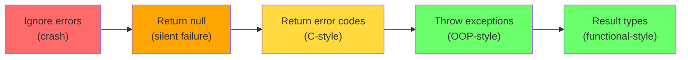
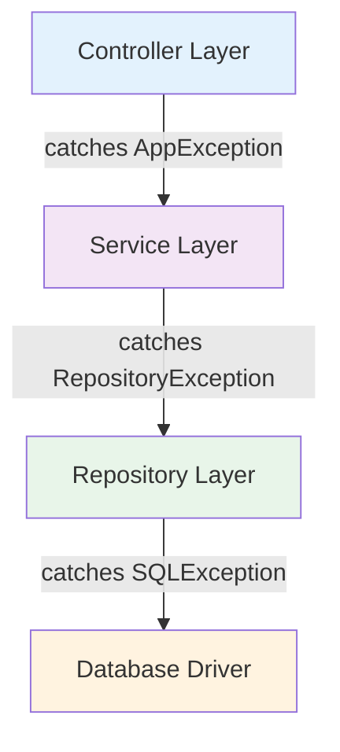
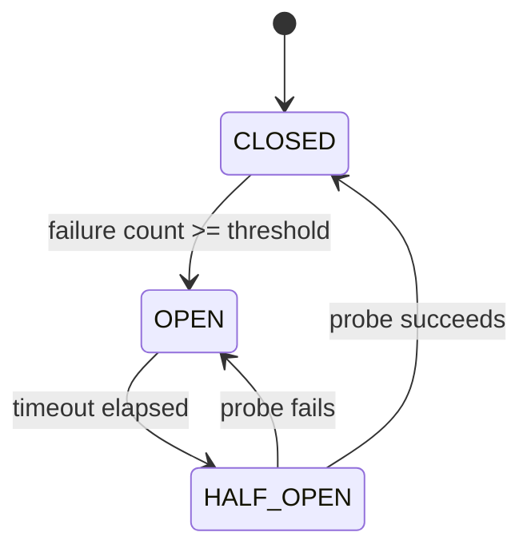

# Error Handling Strategies

A pilot doesn't panic when an engine warning light appears — they follow a trained procedure: assess, contain, communicate, recover. Software error handling is the same discipline. The difference between a fragile system and a resilient one isn't the absence of errors — it's **how gracefully the system responds** when things go wrong.

> **Interview relevance:** "How does your design handle failures?", "What happens when the payment service is down?", "Show me your error handling strategy" — interviewers probe this to distinguish candidates who design happy-path-only systems from those who build production-grade software.

---

## The Error Handling Spectrum



Most object-oriented languages use **exceptions** as the primary error-handling mechanism, but good design requires knowing when and how to use them — and when other strategies are better.

---

## Strategy 1: Fail Fast

**Principle:** Detect errors as early as possible and stop immediately — don't let invalid state propagate deeper into the system.

```java
public class UserService {
    private final UserRepository userRepository;
    private final EmailService emailService;

    public User createUser(CreateUserRequest request) {
        // Fail fast — validate at the boundary
        Objects.requireNonNull(request, "Request cannot be null");
        if (request.email() == null || request.email().isBlank()) {
            throw new IllegalArgumentException("Email is required");
        }
        if (!EmailValidator.isValid(request.email())) {
            throw new InvalidEmailException(request.email());
        }

        // If we reach here, we know the input is valid
        User user = User.create(request.email(), request.name());
        userRepository.save(user);
        emailService.sendWelcome(user);
        return user;
    }
}
```

### Where to Validate (Boundary Rules)

| Layer | What to validate | Example |
|---|---|---|
| **API/Controller** | Request format, required fields, types | JSON schema, null checks |
| **Service** | Business rules, cross-field validation | "Discount can't exceed order total" |
| **Domain object** | Invariants (always true for this object) | "Balance >= 0", "Start < End" |
| **Repository** | Never — data reaching here should already be valid | — |

**Don't validate the same thing twice** — validate at the boundary, trust internally.

---

## Strategy 2: Defensive Programming at Boundaries, Trust Internally

```java
// PUBLIC API — defensive (don't trust callers)
public class PaymentGateway {
    public PaymentResult charge(PaymentRequest request) {
        // Validate everything — external callers can send anything
        validate(request);
        return processPayment(request);
    }

    // INTERNAL — trust (already validated at the boundary)
    private PaymentResult processPayment(PaymentRequest request) {
        // No re-validation — request is guaranteed valid here
        Transaction tx = Transaction.create(request.amount(), request.currency());
        return gateway.submit(tx);
    }
}
```

---

## Strategy 3: Use Exceptions for Exceptional Conditions

Exceptions should represent **unexpected failures** or **business rule violations** — not normal control flow.

```java
// WRONG — using exceptions for control flow
public boolean isUserActive(String userId) {
    try {
        User user = userRepository.findById(userId);
        return user.isActive();
    } catch (UserNotFoundException e) {
        return false;  // ← Exception used as a glorified if-statement
    }
}

// RIGHT — use Optional for expected absence
public boolean isUserActive(String userId) {
    return userRepository.findById(userId)
        .map(User::isActive)
        .orElse(false);
}
```

### The Decision Framework

| Situation | Mechanism | Rationale |
|---|---|---|
| Value might not exist | `Optional<T>` | Absence is expected, not exceptional |
| Operation might fail (expected) | Result type or checked exception | Caller must handle it |
| Programming error (bug) | `RuntimeException` | Should crash — fix the bug |
| Unrecoverable system failure | `RuntimeException` + log | Alert humans, don't swallow |
| Business rule violation | Domain exception | Caller can present to user |

---

## Strategy 4: Translate Exceptions Across Layer Boundaries

Don't let infrastructure exceptions leak into domain code.



```java
// Repository — translates infrastructure to domain
public class JpaOrderRepository implements OrderRepository {
    @Override
    public Order findById(String id) {
        try {
            return entityManager.find(OrderEntity.class, id)
                .map(this::toDomain)
                .orElseThrow(() -> new OrderNotFoundException(id));
        } catch (PersistenceException e) {
            // Translate JPA exception to domain exception
            throw new RepositoryAccessException("Failed to fetch order: " + id, e);
        }
    }
}

// Service — doesn't know about JPA, SQL, or persistence details
public class OrderService {
    public OrderDto getOrder(String id) {
        Order order = orderRepository.findById(id);  // throws OrderNotFoundException
        return OrderDto.from(order);
        // Never catches SQLException here — it's already translated
    }
}
```

---

## Strategy 5: Retry with Backoff for Transient Failures

Not all failures are permanent. Network blips, temporary overloads, and lock contention are **transient** — they resolve themselves.

```java
public class ResilientPaymentClient {
    private static final int MAX_RETRIES = 3;
    private static final long BASE_DELAY_MS = 100;

    public PaymentResult charge(PaymentRequest request) {
        int attempt = 0;
        while (true) {
            try {
                attempt++;
                return httpClient.post("/charge", request, PaymentResult.class);
            } catch (TransientException e) {
                if (attempt >= MAX_RETRIES) {
                    throw new PaymentFailedException(
                        "Payment failed after " + MAX_RETRIES + " attempts", e);
                }
                long delay = BASE_DELAY_MS * (long) Math.pow(2, attempt - 1);
                // Add jitter to avoid thundering herd
                delay += ThreadLocalRandom.current().nextLong(delay / 2);
                sleep(delay);
            } catch (PermanentException e) {
                // Don't retry permanent failures (invalid card, insufficient funds)
                throw new PaymentFailedException("Permanent failure", e);
            }
        }
    }
}
```

### Classify Errors Before Retrying

| Type | Retry? | Examples |
|---|---|---|
| **Transient** | Yes | Network timeout, 503, connection reset |
| **Permanent** | No | 400 Bad Request, 404, invalid credentials |
| **Indeterminate** | Maybe (with idempotency key) | Timeout on write operation |

---

## Strategy 6: Circuit Breaker for Cascading Failures

When a downstream service is failing, stop hammering it — give it time to recover.

```java
public class CircuitBreaker {
    private final int failureThreshold;
    private final long resetTimeoutMs;

    private int failureCount = 0;
    private long lastFailureTime = 0;
    private State state = State.CLOSED;

    enum State { CLOSED, OPEN, HALF_OPEN }

    public CircuitBreaker(int failureThreshold, long resetTimeoutMs) {
        this.failureThreshold = failureThreshold;
        this.resetTimeoutMs = resetTimeoutMs;
    }

    public <T> T execute(Supplier<T> action, Supplier<T> fallback) {
        if (state == State.OPEN) {
            if (System.currentTimeMillis() - lastFailureTime > resetTimeoutMs) {
                state = State.HALF_OPEN;  // try one request
            } else {
                return fallback.get();  // fail fast
            }
        }

        try {
            T result = action.get();
            onSuccess();
            return result;
        } catch (Exception e) {
            onFailure();
            return fallback.get();
        }
    }

    private synchronized void onSuccess() {
        failureCount = 0;
        state = State.CLOSED;
    }

    private synchronized void onFailure() {
        failureCount++;
        lastFailureTime = System.currentTimeMillis();
        if (failureCount >= failureThreshold) {
            state = State.OPEN;
        }
    }
}
```



---

## Strategy Comparison

| Strategy | Best for | Trade-off |
|---|---|---|
| **Fail fast** | Invalid input, programming errors | Aggressive — may reject recoverable situations |
| **Retry** | Transient network/service failures | Adds latency; must ensure idempotency |
| **Circuit breaker** | Protecting against cascading failures | Complexity; must define thresholds carefully |
| **Fallback** | Degraded service is better than no service | May return stale/incomplete data |
| **Exception translation** | Clean layer boundaries | Must maintain exception hierarchy |
| **Bulkhead** | Isolating failures to subsystems | Resource overhead from separate pools |

---

## Key Takeaways

1. **Validate at boundaries, trust internally** — don't scatter validation throughout every method.
2. **Translate exceptions at layer boundaries** — callers shouldn't know about implementation details.
3. **Classify failures** as transient vs permanent before deciding to retry.
4. **Circuit breakers prevent cascading failures** — when a dependency is sick, stop calling it.
5. In interviews, **always address failure modes** — "What happens if X fails?" should have a clear answer in your design.
