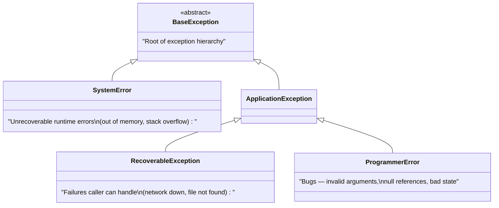
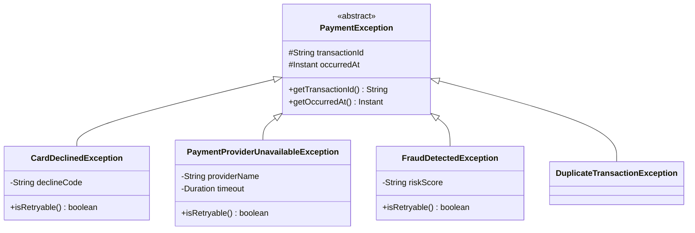
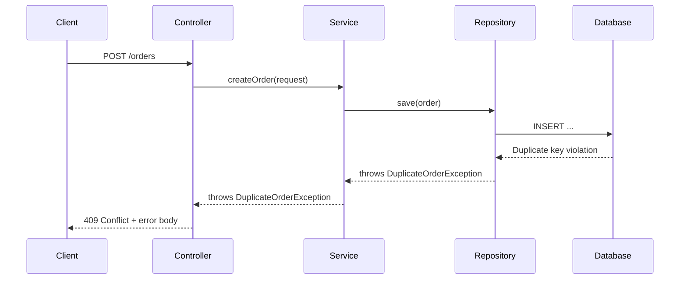

# Exception Design

Exceptions are part of your class's **public contract**. A poorly designed exception hierarchy is like having one error message for everything: "Something went wrong." A well-designed hierarchy tells callers **exactly what failed**, **why**, and **what they can do about it**.

> **Interview relevance:** "Design the exception hierarchy for this system", "How do you communicate errors to the caller?", "What exceptions can this method throw?" — interviewers use these to assess your API design maturity.

---

## Exception Categories in OOP

Every object-oriented language with exceptions distinguishes between categories of failures. The specific names differ by language, but the **concepts** are universal:



| Category | Can caller recover? | Example | Design action |
|---|---|---|---|
| **System error** | No | Out of memory, stack overflow | Let crash — fix at infrastructure level |
| **Recoverable failure** | Yes — caller should handle | File not found, network timeout, insufficient funds | Communicate clearly to caller |
| **Programmer error** | No — it's a bug | Null argument, invalid state transition | Fail fast, fix the code |

### The Checked vs Unchecked Debate

Some languages (notably Java) distinguish between **checked exceptions** (compiler forces you to handle) and **unchecked exceptions** (no compile-time enforcement). This is a language design choice, not a universal principle.

**The underlying design question is universal:** Should the caller be *forced* to handle this failure, or should it propagate automatically?

| Approach | When to use | Trade-off |
|---|---|---|
| **Forced handling** (checked/explicit) | Caller can and should recover | Verbose — signatures accumulate declarations |
| **Automatic propagation** (unchecked) | Programming errors, unrecoverable failures | Callers may forget to handle |
| **Result types** (functional approach) | Failure is a normal outcome, not exceptional | More explicit but requires pattern matching |

**Modern consensus** across languages: Favour unchecked/automatic propagation for most exceptions, with clear documentation about what can fail. Reserve forced handling for situations where ignoring the error would cause data corruption.

```java
// Recoverable — caller should handle (try another payment method)
public class InsufficientFundsException extends RuntimeException {
    private final Money currentBalance;
    private final Money requestedAmount;

    public InsufficientFundsException(Money balance, Money requested) {
        super(String.format("Insufficient funds: balance=%s, requested=%s",
            balance, requested));
        this.currentBalance = balance;
        this.requestedAmount = requested;
    }

    public Money getCurrentBalance() { return currentBalance; }
    public Money getRequestedAmount() { return requestedAmount; }
}

// Programmer error — should never happen in correct code
public class InvalidOrderStateException extends RuntimeException {
    public InvalidOrderStateException(OrderState current, OrderState attempted) {
        super(String.format("Cannot transition from %s to %s", current, attempted));
    }
}
```

---

## Designing a Domain Exception Hierarchy

### Principles

1. **One base exception per module/bounded context** — allows callers to catch broadly
2. **Specific exceptions for specific failure modes** — enables targeted recovery
3. **Include context** — not just "what" but "why" and "with what data"
4. **Never use generic `Exception` or `RuntimeException`** directly from business code

### Example: Payment System Exception Hierarchy

```java
// Base exception for the entire payment module
public abstract class PaymentException extends RuntimeException {
    private final String transactionId;
    private final Instant occurredAt;

    protected PaymentException(String message, String transactionId) {
        super(message);
        this.transactionId = transactionId;
        this.occurredAt = Instant.now();
    }

    protected PaymentException(String message, String transactionId, Throwable cause) {
        super(message, cause);
        this.transactionId = transactionId;
        this.occurredAt = Instant.now();
    }

    public String getTransactionId() { return transactionId; }
    public Instant getOccurredAt() { return occurredAt; }
}

// Specific failure: card declined
public class CardDeclinedException extends PaymentException {
    private final String declineCode;

    public CardDeclinedException(String transactionId, String declineCode) {
        super("Card declined: " + declineCode, transactionId);
        this.declineCode = declineCode;
    }

    public String getDeclineCode() { return declineCode; }
    public boolean isRetryable() {
        return "insufficient_funds".equals(declineCode);  // user might add money
    }
}

// Specific failure: provider unavailable
public class PaymentProviderUnavailableException extends PaymentException {
    private final String providerName;
    private final Duration timeout;

    public PaymentProviderUnavailableException(String transactionId,
                                                String provider, Duration timeout) {
        super(String.format("Provider %s timed out after %s", provider, timeout),
            transactionId);
        this.providerName = provider;
        this.timeout = timeout;
    }

    public boolean isRetryable() { return true; }
}

// Specific failure: fraud detected
public class FraudDetectedException extends PaymentException {
    private final String riskScore;

    public FraudDetectedException(String transactionId, String riskScore) {
        super("Transaction flagged as fraudulent", transactionId);
        this.riskScore = riskScore;
    }

    public boolean isRetryable() { return false; }
}
```



---

## Exception Design Anti-Patterns

### Anti-Pattern 1: Catch-and-Ignore

```java
// TERRIBLE — hides failures, makes debugging impossible
try {
    processPayment(order);
} catch (Exception e) {
    // TODO: handle this later
}
```

### Anti-Pattern 2: Generic Exceptions

```java
// BAD — caller can't distinguish between different failures
public void processOrder(Order order) throws Exception {
    // What kind of exception? Network? Validation? Business rule?
}
```

### Anti-Pattern 3: Exception as Control Flow

```java
// BAD — exceptions are expensive (stack trace capture) and obscure intent
public int parseAge(String input) {
    try {
        return Integer.parseInt(input);
    } catch (NumberFormatException e) {
        return -1;  // magic value — use Optional instead
    }
}

// BETTER
public Optional<Integer> parseAge(String input) {
    try {
        int age = Integer.parseInt(input);
        return age >= 0 && age <= 150 ? Optional.of(age) : Optional.empty();
    } catch (NumberFormatException e) {
        return Optional.empty();
    }
}
```

### Anti-Pattern 4: Losing the Cause

```java
// BAD — original exception is lost
try {
    database.save(entity);
} catch (SQLException e) {
    throw new RepositoryException("Save failed");  // WHERE? WHY? Lost forever.
}

// GOOD — preserve the chain
try {
    database.save(entity);
} catch (SQLException e) {
    throw new RepositoryException("Failed to save entity: " + entity.getId(), e);
}
```

### Anti-Pattern 5: Catching System-Level Errors

```java
// NEVER — system errors mean the runtime is in trouble (OOM, StackOverflow)
try {
    doWork();
} catch (Throwable t) {  // catches OutOfMemoryError — system is doomed anyway
    log.error("error", t);
}
```

**Why it's wrong:** System-level errors (out of memory, stack overflow) are unrecoverable. Catching them gives a false sense of safety while the process is in an undefined state.

---

## Exception Handling in Layered Architecture



### Centralised Exception-to-Response Mapping

In any web framework, you need a **single place** that maps domain exceptions to HTTP responses. This prevents scattered try-catch blocks in every controller and keeps the mapping consistent.

The pattern: a global handler intercepts exceptions thrown by service/domain code and translates them to appropriate HTTP status codes and error bodies.

```java
// Spring example — other frameworks have equivalent patterns
@RestControllerAdvice
public class GlobalExceptionHandler {

    @ExceptionHandler(EntityNotFoundException.class)
    public ResponseEntity<ErrorResponse> handleNotFound(EntityNotFoundException e) {
        return ResponseEntity.status(404)
            .body(new ErrorResponse("NOT_FOUND", e.getMessage()));
    }

    @ExceptionHandler(BusinessRuleException.class)
    public ResponseEntity<ErrorResponse> handleBusinessRule(BusinessRuleException e) {
        return ResponseEntity.status(422)
            .body(new ErrorResponse(e.getErrorCode(), e.getMessage()));
    }

    @ExceptionHandler(PaymentProviderUnavailableException.class)
    public ResponseEntity<ErrorResponse> handleProviderDown(
            PaymentProviderUnavailableException e) {
        return ResponseEntity.status(503)
            .body(new ErrorResponse("SERVICE_UNAVAILABLE",
                "Payment service temporarily unavailable. Please retry."));
        // Note: don't expose internal provider name to client
    }

    @ExceptionHandler(Exception.class)
    public ResponseEntity<ErrorResponse> handleUnexpected(Exception e) {
        log.error("Unexpected error", e);  // log full stack trace
        return ResponseEntity.status(500)
            .body(new ErrorResponse("INTERNAL_ERROR",
                "An unexpected error occurred"));  // generic message to client
    }
}
```

**Key design decisions:**
- Map domain exceptions to HTTP status codes in ONE place
- Log unexpected errors with full context
- Never expose internal details (stack traces, provider names) to clients
- Use a consistent error response format across all endpoints

---

## The Result Pattern (Alternative to Exceptions)

For operations where failure is a **normal outcome** (not exceptional), consider a Result type:

```java
public sealed interface Result<T> permits Result.Success, Result.Failure {

    record Success<T>(T value) implements Result<T> {}
    record Failure<T>(String errorCode, String message) implements Result<T> {}

    static <T> Result<T> success(T value) { return new Success<>(value); }
    static <T> Result<T> failure(String code, String msg) { return new Failure<>(code, msg); }

    default boolean isSuccess() { return this instanceof Success; }
}

// Usage
public class ValidationService {
    public Result<Order> validateOrder(OrderRequest request) {
        if (request.items().isEmpty()) {
            return Result.failure("EMPTY_ORDER", "Order must have at least one item");
        }
        if (request.total().isNegative()) {
            return Result.failure("INVALID_TOTAL", "Total cannot be negative");
        }
        return Result.success(Order.from(request));
    }
}

// Caller
Result<Order> result = validationService.validateOrder(request);
if (result.isSuccess()) {
    orderRepository.save(((Result.Success<Order>) result).value());
} else {
    var failure = (Result.Failure<Order>) result;
    return ResponseEntity.badRequest().body(failure.message());
}
```

---

## Key Takeaways

1. **Exceptions are part of your API contract** — design them as carefully as your methods.
2. **Include context** in exceptions — transaction IDs, amounts, entity IDs — not just messages.
3. **Use a base exception per module** — allows callers to catch broadly or specifically.
4. **Translate at boundaries** — never let infrastructure exceptions (SQL errors, HTTP failures) reach your controllers.
5. **Preserve the cause chain** — always pass the original exception as the `cause`.
6. In interviews, **show your exception hierarchy** as part of the class diagram — it demonstrates professional-grade design.
