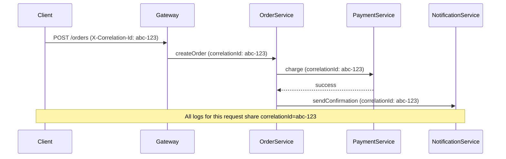

# Logging Best Practices

Logs are your system's **flight recorder**. When production breaks at 3 AM, logs are the first thing you read. Yet most developers treat logging as an afterthought — scattering `System.out.println` statements that become useless noise in production. Good logging is a design skill.

> **Interview relevance:** "How would you debug this in production?", "What would you log here?", "How do you trace a request across services?" — logging shows operational maturity that distinguishes senior engineers.

---

## Log Levels: When to Use Each

| Level | Purpose | When to use | Example |
|---|---|---|---|
| **ERROR** | System is broken, needs human attention | Unrecoverable failures, data corruption risk | Payment gateway unreachable after retries |
| **WARN** | Something unexpected, but system continues | Degraded performance, using fallback, approaching limits | Cache miss ratio > 50%, connection pool 90% full |
| **INFO** | Key business events (the "audit trail") | Request received, order placed, user registered | "Order ORD-123 placed by user USR-456" |
| **DEBUG** | Developer details for troubleshooting | Method entry/exit, intermediate computations | "Calculating discount: base=100, rate=0.15" |
| **TRACE** | Extremely detailed flow (rarely enabled) | Wire-level data, loop iterations | Full HTTP request/response bodies |

### The Golden Rule

> In production, run at **INFO** level. Every INFO message should be something an on-call engineer or business analyst would want to see.

```java
// GOOD — meaningful INFO logs
log.info("Order created: orderId={}, userId={}, total={}, items={}",
    order.getId(), order.getUserId(), order.getTotal(), order.getItemCount());

// BAD — noise at INFO level
log.info("Entering method calculateDiscount");  // This is DEBUG/TRACE
log.info("i = 5");  // This is TRACE at best
```

---

## What to Log (and What Not to Log)

### Always Log

| Event | Why | Example |
|---|---|---|
| **System startup/shutdown** | Know when deployments happen | "Application started on port 8080, version 2.3.1" |
| **Authentication events** | Security audit trail | "Login successful: userId=USR-123, ip=10.0.0.1" |
| **Business transactions** | Debugging and compliance | "Payment processed: txId=TXN-789, amount=$50.00" |
| **External service calls** | Identify integration failures | "Called inventory-service: latency=230ms, status=200" |
| **Errors with context** | Enable root-cause analysis | "Failed to send email: userId=USR-123, reason=SMTP timeout" |
| **Configuration loaded** | Verify correct settings | "Loaded config: maxPoolSize=10, timeout=30s" |

### Never Log

| Data | Why | What to do instead |
|---|---|---|
| **Passwords / tokens** | Security breach | Log "authentication attempted" without credentials |
| **Credit card numbers** | PCI compliance violation | Log last 4 digits only: `****1234` |
| **Personal health info** | HIPAA violation | Log patient ID, not diagnosis |
| **Full request bodies** | PII leakage, log volume | Log at TRACE only, mask sensitive fields |
| **Stack traces at INFO** | Noise | Stack traces belong at ERROR/WARN only |

---

## Structured Logging vs Text Logging

### Traditional (Unstructured)

```
2024-03-15 10:23:45 INFO  OrderService - User john placed order #123 for $50.00
```

Searching for "all orders over $100" requires regex parsing. Fragile.

### Structured (Key-Value / JSON)

```json
{
  "timestamp": "2024-03-15T10:23:45.123Z",
  "level": "INFO",
  "logger": "OrderService",
  "message": "Order placed",
  "orderId": "ORD-123",
  "userId": "USR-456",
  "amount": 50.00,
  "currency": "USD",
  "itemCount": 3
}
```

Now you can query: `amount > 100 AND userId = "USR-456"` — instantly.

### Implementation with SLF4J + Logback

```java
import org.slf4j.Logger;
import org.slf4j.LoggerFactory;
import net.logstash.logback.argument.StructuredArguments;
import static net.logstash.logback.argument.StructuredArguments.*;

public class OrderService {
    private static final Logger log = LoggerFactory.getLogger(OrderService.class);

    public Order placeOrder(OrderRequest request) {
        Order order = createOrder(request);

        log.info("Order placed",
            kv("orderId", order.getId()),
            kv("userId", order.getUserId()),
            kv("amount", order.getTotal()),
            kv("itemCount", order.getItemCount())
        );

        return order;
    }
}
```

---

## Correlation IDs: Tracing Across Services

In distributed systems, a single user action may touch 5+ services. Without a correlation ID, you can't connect the dots.



### MDC (Mapped Diagnostic Context)

```java
import org.slf4j.MDC;

public class CorrelationFilter implements Filter {
    @Override
    public void doFilter(ServletRequest req, ServletResponse res, FilterChain chain)
            throws IOException, ServletException {
        String correlationId = ((HttpServletRequest) req).getHeader("X-Correlation-Id");
        if (correlationId == null) {
            correlationId = UUID.randomUUID().toString();
        }

        MDC.put("correlationId", correlationId);
        try {
            chain.doFilter(req, res);
        } finally {
            MDC.clear();  // prevent leaking to the next request on this thread
        }
    }
}
```

Logback pattern includes it automatically:

```xml
<pattern>%d{ISO8601} [%thread] [%X{correlationId}] %-5level %logger - %msg%n</pattern>
```

Now every log line from every service includes the same correlation ID:

```
2024-03-15 10:23:45 [http-8080-1] [abc-123] INFO OrderService - Order created
2024-03-15 10:23:45 [http-8080-1] [abc-123] INFO PaymentService - Charge processed
2024-03-15 10:23:46 [async-1] [abc-123] INFO NotificationService - Email sent
```

---

## Logging Patterns in LLD Design

### Log-and-Throw (Avoid!)

```java
// ANTI-PATTERN — logs the same error at every layer
try {
    repository.save(order);
} catch (RepositoryException e) {
    log.error("Failed to save order", e);  // logged here
    throw e;                                // AND logged again by caller, and caller's caller
}
```

**Rule:** Log OR throw, never both. The exception handler at the top (controller advice) logs it once.

### Log-and-Wrap (Correct)

```java
try {
    externalApi.call(request);
} catch (HttpTimeoutException e) {
    // Don't log — the caller will handle or the global handler will log
    throw new ServiceUnavailableException("External API timed out", e);
}
```

### Contextual Logging in Domain Objects

```java
public class Order {
    private static final Logger log = LoggerFactory.getLogger(Order.class);

    public void confirm() {
        if (this.state != OrderState.PENDING) {
            log.warn("Attempted to confirm non-pending order: orderId={}, currentState={}",
                this.id, this.state);
            throw new InvalidOrderStateException(this.state, OrderState.CONFIRMED);
        }
        this.state = OrderState.CONFIRMED;
        this.confirmedAt = Instant.now();
        log.info("Order confirmed: orderId={}, total={}", this.id, this.total);
    }
}
```

---

## Performance Considerations

### Guard Expensive Log Statements

```java
// BAD — toString() is called even if DEBUG is disabled
log.debug("Processing items: " + items.toString());

// GOOD — SLF4J only evaluates args if level is enabled
log.debug("Processing items: {}", items);

// GOOD — for expensive computations
if (log.isDebugEnabled()) {
    log.debug("Detailed analysis: {}", expensiveComputation());
}
```

### Async Logging

For high-throughput systems, synchronous logging becomes a bottleneck:

```xml
<!-- logback.xml — async appender -->
<appender name="ASYNC" class="ch.qos.logback.classic.AsyncAppender">
    <queueSize>1024</queueSize>
    <discardingThreshold>0</discardingThreshold>
    <appender-ref ref="FILE"/>
</appender>
```

---

## Key Takeaways

1. **Log levels have precise meanings** — don't pollute INFO with debug noise.
2. **Structure your logs** — key-value pairs are queryable; prose is not.
3. **Correlation IDs** make distributed debugging possible.
4. **Log OR throw, never both** — prevents duplicate noise.
5. **Never log secrets** — passwords, tokens, PII must be masked or excluded.
6. In interviews, mention logging as part of your design — "I'd log here with orderId and userId for traceability" shows production awareness.
