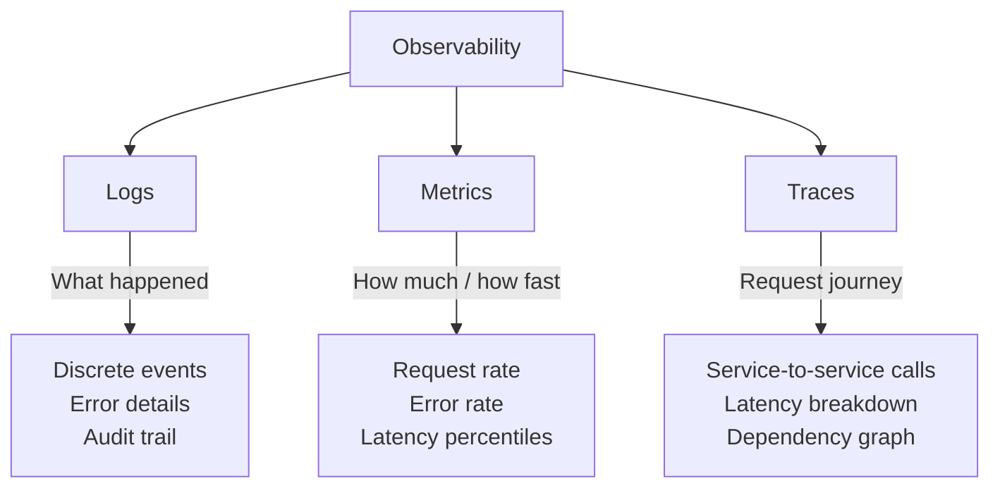
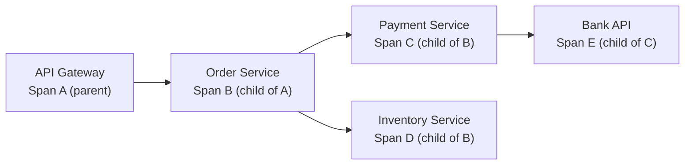

# Observability and Structured Logging

Logging tells you **what happened**. Metrics tell you **how much**. Tracing tells you **where**. Together, they form the **three pillars of observability** — the ability to understand your system's internal state from its external outputs.

> **Interview relevance:** "How would you monitor this system?", "How do you detect when something is wrong?", "How do you debug a slow request in a microservices architecture?" — observability questions appear in both LLD and system design rounds.

---

## The Three Pillars



| Pillar | Question it answers | Tool examples |
|---|---|---|
| **Logs** | What happened? Why did it fail? | ELK Stack, Loki, CloudWatch |
| **Metrics** | Is the system healthy? What's the trend? | Prometheus, Datadog, CloudWatch |
| **Traces** | Where did this request spend time? | Jaeger, Zipkin, AWS X-Ray |

---

## Structured Logging In Depth

### From Text to Structure

```java
// Evolution of a log statement

// Stage 1: println (development only)
System.out.println("Order placed");

// Stage 2: Logger with message
log.info("Order placed: " + orderId);

// Stage 3: Parameterized logging (no string concatenation when disabled)
log.info("Order placed: orderId={}", orderId);

// Stage 4: Structured logging (machine-parseable)
log.info("Order placed",
    kv("orderId", orderId),
    kv("userId", userId),
    kv("amount", amount),
    kv("currency", currency),
    kv("latencyMs", duration.toMillis())
);
```

Stage 4 produces JSON that monitoring systems can index, query, and alert on:

```json
{
  "timestamp": "2024-03-15T10:23:45.123Z",
  "level": "INFO",
  "thread": "http-8080-exec-1",
  "logger": "com.app.OrderService",
  "message": "Order placed",
  "correlationId": "req-abc-123",
  "orderId": "ORD-789",
  "userId": "USR-456",
  "amount": 99.99,
  "currency": "USD",
  "latencyMs": 45
}
```

### Logback Configuration for JSON Output

```xml
<!-- logback.xml -->
<configuration>
    <appender name="STDOUT" class="ch.qos.logback.core.ConsoleAppender">
        <encoder class="net.logstash.logback.encoder.LogstashEncoder">
            <includeMdcKeyName>correlationId</includeMdcKeyName>
            <includeMdcKeyName>userId</includeMdcKeyName>
        </encoder>
    </appender>

    <root level="INFO">
        <appender-ref ref="STDOUT"/>
    </root>
</configuration>
```

---

## Designing for Observability in LLD

When designing classes, think about **what operators need to know** at runtime.

### Observable Service Pattern

```java
public class OrderService {
    private static final Logger log = LoggerFactory.getLogger(OrderService.class);
    private final MeterRegistry metrics;  // Micrometer metrics
    private final OrderRepository repository;
    private final PaymentService paymentService;

    public OrderService(OrderRepository repository, PaymentService paymentService,
                        MeterRegistry metrics) {
        this.repository = repository;
        this.paymentService = paymentService;
        this.metrics = metrics;
    }

    public Order placeOrder(OrderRequest request) {
        Timer.Sample timer = Timer.start(metrics);  // Start timing

        try {
            Order order = Order.create(request);
            PaymentResult payment = paymentService.charge(order.getTotal());
            order.markPaid(payment.transactionId());
            repository.save(order);

            // Structured log — the "what happened"
            log.info("Order placed successfully",
                kv("orderId", order.getId()),
                kv("amount", order.getTotal()),
                kv("paymentTxId", payment.transactionId())
            );

            // Metric — the "how much"
            metrics.counter("orders.placed",
                "currency", order.getCurrency().toString()
            ).increment();

            return order;

        } catch (PaymentException e) {
            log.warn("Payment failed for order",
                kv("userId", request.getUserId()),
                kv("amount", request.getTotal()),
                kv("reason", e.getMessage())
            );
            metrics.counter("orders.payment_failed",
                "reason", e.getClass().getSimpleName()
            ).increment();
            throw e;

        } finally {
            timer.stop(metrics.timer("orders.place.duration"));  // Record latency
        }
    }
}
```

---

## Metrics Design

### The RED Method (for Services)

| Metric | Meaning | Alert on |
|---|---|---|
| **R**ate | Requests per second | Sudden drop (service down?) or spike (DDoS?) |
| **E**rrors | Error rate (percentage) | Error rate > 1% |
| **D**uration | Latency (p50, p95, p99) | p99 > 2 seconds |

### The USE Method (for Resources)

| Metric | Meaning | Alert on |
|---|---|---|
| **U**tilization | How full is the resource | Connection pool > 80% |
| **S**aturation | How much is queued | Queue depth growing continuously |
| **E**rrors | Resource errors | Disk write errors, connection refused |

### Instrumenting Code with Micrometer

```java
public class ConnectionPool {
    private final Semaphore semaphore;
    private final MeterRegistry metrics;

    public ConnectionPool(int maxSize, MeterRegistry metrics) {
        this.semaphore = new Semaphore(maxSize);
        this.metrics = metrics;

        // Gauge — current utilization
        metrics.gauge("connection_pool.available", semaphore,
            Semaphore::availablePermits);
        metrics.gauge("connection_pool.size", maxSize, n -> n);
    }

    public Connection acquire() throws InterruptedException {
        metrics.counter("connection_pool.acquire.attempts").increment();

        long start = System.nanoTime();
        semaphore.acquire();
        long waitMs = (System.nanoTime() - start) / 1_000_000;

        metrics.timer("connection_pool.acquire.wait_time")
            .record(waitMs, TimeUnit.MILLISECONDS);

        if (waitMs > 100) {
            log.warn("Slow connection acquisition",
                kv("waitMs", waitMs));
        }

        return getConnectionFromPool();
    }
}
```

---

## Distributed Tracing

### How It Works



Each **span** represents one unit of work. Spans are linked by a shared **trace ID**. Together, they form a tree showing the complete request path.

### Manual Span Creation

```java
public class OrderService {
    private final Tracer tracer;

    public Order placeOrder(OrderRequest request) {
        Span span = tracer.spanBuilder("OrderService.placeOrder")
            .setAttribute("orderId", request.getOrderId())
            .setAttribute("userId", request.getUserId())
            .startSpan();

        try (Scope scope = span.makeCurrent()) {
            // Child spans are automatically parented to this span
            Order order = createOrder(request);
            processPayment(order);
            return order;
        } catch (Exception e) {
            span.setStatus(StatusCode.ERROR, e.getMessage());
            span.recordException(e);
            throw e;
        } finally {
            span.end();
        }
    }
}
```

---

## Alerting Strategy

Not every log or metric deserves an alert. Alert on **symptoms** (user impact), not causes.

| Type | Alert on | Don't alert on |
|---|---|---|
| **Symptom** | "Error rate > 5% for 5 minutes" | "One 500 error occurred" |
| **Capacity** | "Disk 90% full" | "Disk usage increased 2%" |
| **SLO breach** | "p99 latency > 2s for 10 minutes" | "One slow request" |

### SLO-Based Alerting

```java
// Define SLO in code — makes it explicit and testable
public class OrderServiceSLO {
    static final double SUCCESS_RATE_TARGET = 0.999;  // 99.9%
    static final Duration LATENCY_P99_TARGET = Duration.ofSeconds(2);
    static final Duration EVALUATION_WINDOW = Duration.ofMinutes(5);
}
```

---

## Designing Observable Classes — Checklist

When designing a class in an LLD interview, consider:

| Question | Design decision |
|---|---|
| What business events happen here? | → INFO log with relevant IDs |
| What can fail? | → WARN/ERROR log with context + error metric |
| How do I measure health? | → Latency timer + success/error counter |
| How do I trace across boundaries? | → Propagate correlation ID via MDC |
| What should trigger an alert? | → Define thresholds for key metrics |

---

## Key Takeaways

1. **Observability is a design concern** — not an afterthought bolted on later.
2. **Structured logs** (JSON with key-value fields) enable querying and alerting.
3. **Metrics follow RED** (Rate, Errors, Duration) for services, **USE** for resources.
4. **Distributed tracing** connects the dots across service boundaries.
5. **Alert on symptoms** (user impact), investigate causes with logs and traces.
6. In interviews, mentioning observability shows you think about **production readiness**, not just correctness.
