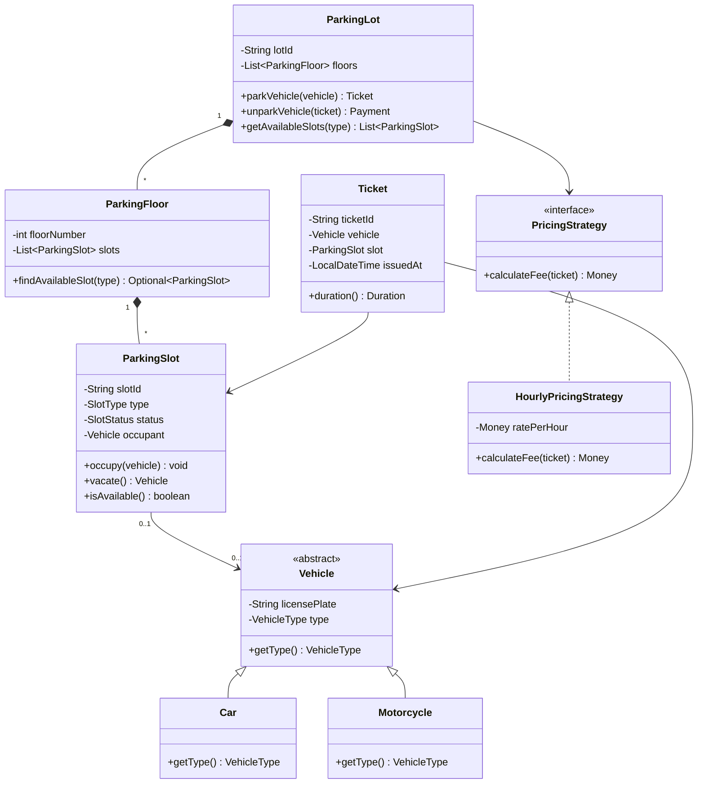
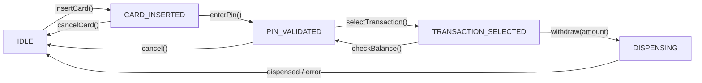

# Common LLD Interview Questions

LLD interviews follow a predictable format: you are given a real-world system to design at the class level. The interviewer evaluates whether you apply SOLID principles, choose the right patterns, model the domain cleanly, and handle edge cases with sound judgment.

This guide covers the most frequently asked LLD problems with model class designs, the reasoning behind key decisions, and what interviewers specifically look for in each.

> **How to use this guide:** For each problem, study the entity identification, the relationship decisions, and the pattern choices. Don't memorise solutions — understand the *reasoning*. Every interviewer will add or change requirements to see whether you can adapt.

---

## The Top 10 LLD Problems

| # | Problem | Core patterns tested |
|---|---|---|
| 1 | Parking Lot | State machine, Factory, Strategy |
| 2 | Library Management System | Observer, State, Repository |
| 3 | ATM Machine | State, Command, Chain of Responsibility |
| 4 | Hotel Booking System | Strategy, Observer, Builder |
| 5 | Ride-Sharing (Uber/Lyft) | Observer, Strategy, State |
| 6 | Notification Service | Strategy, Observer, Decorator |
| 7 | Chess Game | Command, Composite, State |
| 8 | Elevator System | State, Strategy, Observer |
| 9 | Vending Machine | State, Command |
| 10 | Food Delivery (Zomato/Swiggy) | Observer, Strategy, Decorator |

---

## 1. Parking Lot

**The classic warm-up problem.** Almost every LLD interview starts with variations of this.

### What interviewers look for

- Proper entity modelling: `ParkingLot` vs `Floor` vs `Slot` vs `Ticket`
- State machine for slot availability
- Strategy for pricing (hourly, daily, flat-rate)
- Factory for different vehicle types

### Key Design Decisions



```java
public enum SlotType  { MOTORCYCLE, COMPACT, LARGE }
public enum SlotStatus { AVAILABLE, OCCUPIED, MAINTENANCE }
public enum VehicleType { MOTORCYCLE, CAR, TRUCK }

public abstract class Vehicle {
    private final String      licensePlate;
    private final VehicleType type;
    protected Vehicle(String licensePlate, VehicleType type) {
        this.licensePlate = licensePlate; this.type = type;
    }
    public VehicleType getType()     { return type; }
    public String getLicensePlate()  { return licensePlate; }
}

public class Car extends Vehicle {
    public Car(String plate) { super(plate, VehicleType.CAR); }
}

public class ParkingSlot {
    private final String  slotId;
    private final SlotType type;
    private SlotStatus    status = SlotStatus.AVAILABLE;
    private Vehicle       occupant;

    public ParkingSlot(String slotId, SlotType type) {
        this.slotId = slotId; this.type = type;
    }

    public synchronized boolean occupy(Vehicle v) {
        if (status != SlotStatus.AVAILABLE) return false;
        occupant = v; status = SlotStatus.OCCUPIED;
        return true;
    }

    public synchronized Vehicle vacate() {
        Vehicle v = occupant; occupant = null;
        status = SlotStatus.AVAILABLE;
        return v;
    }

    public boolean isAvailableFor(VehicleType vt) {
        return status == SlotStatus.AVAILABLE && isCompatible(vt);
    }

    private boolean isCompatible(VehicleType vt) {
        return switch (vt) {
            case MOTORCYCLE -> type == SlotType.MOTORCYCLE;
            case CAR        -> type == SlotType.COMPACT || type == SlotType.LARGE;
            case TRUCK      -> type == SlotType.LARGE;
        };
    }

    public String getSlotId() { return slotId; }
}

public interface PricingStrategy {
    Money calculateFee(Ticket ticket);
}

public class HourlyPricingStrategy implements PricingStrategy {
    private final Map<SlotType, Money> rates;

    public HourlyPricingStrategy(Map<SlotType, Money> rates) {
        this.rates = rates;
    }

    @Override
    public Money calculateFee(Ticket ticket) {
        long hours = Math.max(1,
            Duration.between(ticket.getIssuedAt(), LocalDateTime.now()).toHours());
        Money ratePerHour = rates.get(ticket.getSlot().getType());
        return ratePerHour.multiply(hours);
    }
}
```

**Interview talking point:** Why is `ParkingSlot.occupy()` synchronized? Because two threads might race to assign the same slot. The synchronized keyword ensures at most one assignment succeeds.

---

## 2. Library Management System

### What interviewers look for

- Member borrowing limits and due-date tracking
- Book vs `BookItem` distinction (one ISBN, multiple physical copies)
- Fine calculation
- Search strategy

### Key entities

```java
// Book (catalogue entry) vs BookItem (physical copy) — crucial distinction
public class Book {
    private final String isbn;
    private final String title;
    private final List<String> authors;
    private final String genre;
    // BookItems are managed separately — one Book, many BookItems
}

public class BookItem {
    private final String     barcode;
    private final Book       book;       // reference, not ownership
    private BookItemStatus   status = BookItemStatus.AVAILABLE;
    private String           borrowedByMemberId;
    private LocalDate        dueDate;

    public boolean isAvailable() { return status == BookItemStatus.AVAILABLE; }

    public void checkout(String memberId, int loanDays) {
        if (status != BookItemStatus.AVAILABLE)
            throw new BookNotAvailableException(barcode);
        this.borrowedByMemberId = memberId;
        this.dueDate  = LocalDate.now().plusDays(loanDays);
        this.status   = BookItemStatus.LOANED;
    }

    public void returnBook() {
        this.borrowedByMemberId = null;
        this.dueDate  = null;
        this.status   = BookItemStatus.AVAILABLE;
    }

    public boolean isOverdue() {
        return status == BookItemStatus.LOANED && LocalDate.now().isAfter(dueDate);
    }

    public Money calculateFine(Money dailyFineRate) {
        if (!isOverdue()) return Money.ZERO;
        long overdueDays = ChronoUnit.DAYS.between(dueDate, LocalDate.now());
        return dailyFineRate.multiply(overdueDays);
    }
}

public class LibraryMember {
    private final String        memberId;
    private final String        name;
    private final int           maxBooksAllowed;
    private final List<BookItem> checkedOutBooks = new ArrayList<>();

    public void checkout(BookItem item, int loanDays) {
        if (checkedOutBooks.size() >= maxBooksAllowed)
            throw new BorrowLimitExceededException(memberId, maxBooksAllowed);
        item.checkout(memberId, loanDays);
        checkedOutBooks.add(item);
    }

    public void returnBook(BookItem item) {
        item.returnBook();
        checkedOutBooks.remove(item);
    }
}
```

**Interview talking point:** Why separate `Book` and `BookItem`? A library can own 5 copies of "Clean Code". The ISBN and metadata are shared (`Book`). The physical state — borrowed, overdue, lost — is per copy (`BookItem`). This is the composition pattern: `Library *-- BookItem`, `BookItem --> Book`.

---

## 3. ATM Machine

**A state-machine-heavy problem.** Interviewers want to see clean state transitions.

### The State Machine



```java
public interface ATMState {
    void insertCard(ATMContext ctx, Card card);
    void enterPin(ATMContext ctx, String pin);
    void selectTransaction(ATMContext ctx, TransactionType type);
    void withdraw(ATMContext ctx, Money amount);
    void cancel(ATMContext ctx);
}

public class IdleState implements ATMState {
    @Override
    public void insertCard(ATMContext ctx, Card card) {
        ctx.setCurrentCard(card);
        ctx.setState(new CardInsertedState());
        ctx.getDisplay().show("Enter your PIN");
    }

    @Override public void enterPin(ATMContext ctx, String pin)      { ctx.getDisplay().show("Please insert card first"); }
    @Override public void selectTransaction(ATMContext ctx, TransactionType t) { ctx.getDisplay().show("Please insert card first"); }
    @Override public void withdraw(ATMContext ctx, Money amount)    { ctx.getDisplay().show("Please insert card first"); }
    @Override public void cancel(ATMContext ctx)                    { ctx.getDisplay().show("No active session"); }
}

public class CardInsertedState implements ATMState {
    private int pinAttempts = 0;
    private static final int MAX_ATTEMPTS = 3;

    @Override
    public void insertCard(ATMContext ctx, Card card) {
        ctx.getDisplay().show("Card already inserted");
    }

    @Override
    public void enterPin(ATMContext ctx, String pin) {
        if (ctx.getBankService().validatePin(ctx.getCurrentCard(), pin)) {
            ctx.setState(new PinValidatedState());
            ctx.getDisplay().show("PIN accepted. Select transaction.");
        } else {
            pinAttempts++;
            if (pinAttempts >= MAX_ATTEMPTS) {
                ctx.getBankService().blockCard(ctx.getCurrentCard());
                ctx.setState(new IdleState());
                ctx.getDisplay().show("Card blocked after 3 failed attempts");
            } else {
                ctx.getDisplay().show("Incorrect PIN. " + (MAX_ATTEMPTS - pinAttempts) + " attempts remaining.");
            }
        }
    }

    @Override public void cancel(ATMContext ctx) {
        ctx.ejectCard();
        ctx.setState(new IdleState());
    }
    // ... other methods show appropriate error messages
}
```

**Interview talking point:** Why State pattern over a switch statement? Adding new ATM states (e.g., `MaintenanceState`, `CardCapturedState`) doesn't require modifying any existing state class — OCP. Each state class is also independently testable.

---

## 4. Notification Service

**The most common "clean extensibility" problem.**

### Core design: Strategy + Decorator

```java
// Channel abstraction — OCP: add WhatsApp, PushNotification without touching anything
public interface NotificationChannel {
    void send(Notification notification);
    String channelName();
}

public class EmailChannel implements NotificationChannel {
    private final EmailClient client;
    @Override public void send(Notification n) { client.sendEmail(n.getRecipientEmail(), n.getBody()); }
    @Override public String channelName() { return "EMAIL"; }
}

public class SmsChannel implements NotificationChannel {
    private final SmsGateway gateway;
    @Override public void send(Notification n) { gateway.sendSms(n.getRecipientPhone(), n.getBody()); }
    @Override public String channelName() { return "SMS"; }
}

// Decorator: retry logic wraps any channel
public class RetryingChannel implements NotificationChannel {
    private final NotificationChannel delegate;
    private final int maxAttempts;

    public RetryingChannel(NotificationChannel delegate, int maxAttempts) {
        this.delegate = delegate; this.maxAttempts = maxAttempts;
    }

    @Override
    public void send(Notification notification) {
        for (int attempt = 1; attempt <= maxAttempts; attempt++) {
            try { delegate.send(notification); return; }
            catch (NotificationException e) {
                if (attempt == maxAttempts) throw e;
            }
        }
    }

    @Override public String channelName() { return "RETRY(" + delegate.channelName() + ")"; }
}

// Template factory — preferred channels per notification type
public class NotificationService {
    private final Map<NotificationType, List<NotificationChannel>> channelsByType;

    public NotificationService(Map<NotificationType, List<NotificationChannel>> channelsByType) {
        this.channelsByType = channelsByType;
    }

    public void send(Notification notification) {
        List<NotificationChannel> channels = channelsByType.getOrDefault(
            notification.getType(), List.of());
        channels.forEach(ch -> ch.send(notification));
    }
}
```

**Interview talking point:** Why store `List<NotificationChannel>` per type? It lets you configure "critical alerts go via SMS + Email" and "marketing emails go via Email only" — at the wiring layer, not the logic layer.

---

## 5. Elevator System

**Multi-elevator scheduling — tests OOP + algorithm thinking.**

### Key decisions

```java
public enum Direction { UP, DOWN, IDLE }
public enum DoorState { OPEN, CLOSED }

public class Elevator {
    private final int  elevatorId;
    private int        currentFloor;
    private Direction  direction = Direction.IDLE;
    private DoorState  doorState = DoorState.CLOSED;
    private final TreeSet<Integer> upRequests   = new TreeSet<>();
    private final TreeSet<Integer> downRequests = new TreeSet<>(Comparator.reverseOrder());

    public void addRequest(int floor) {
        if (floor > currentFloor) upRequests.add(floor);
        else if (floor < currentFloor) downRequests.add(floor);
        // floor == currentFloor: open door
    }

    public void step() {
        switch (direction) {
            case IDLE -> {
                if (!upRequests.isEmpty())       { direction = Direction.UP; }
                else if (!downRequests.isEmpty()) { direction = Direction.DOWN; }
            }
            case UP -> {
                if (!upRequests.isEmpty()) {
                    currentFloor = upRequests.first();
                    upRequests.remove(currentFloor);
                    openDoor();
                } else {
                    direction = downRequests.isEmpty() ? Direction.IDLE : Direction.DOWN;
                }
            }
            case DOWN -> {
                if (!downRequests.isEmpty()) {
                    currentFloor = downRequests.first();
                    downRequests.remove(currentFloor);
                    openDoor();
                } else {
                    direction = upRequests.isEmpty() ? Direction.IDLE : Direction.UP;
                }
            }
        }
    }

    private void openDoor() { doorState = DoorState.OPEN; /* schedule close */ }

    public int getCurrentFloor() { return currentFloor; }
    public Direction getDirection() { return direction; }
}

// Dispatch strategy — decides which elevator serves a new request
public interface ElevatorDispatcher {
    Elevator dispatch(List<Elevator> elevators, int requestedFloor, Direction direction);
}

public class NearestElevatorDispatcher implements ElevatorDispatcher {
    @Override
    public Elevator dispatch(List<Elevator> elevators, int floor, Direction dir) {
        return elevators.stream()
                        .min(Comparator.comparingInt(e -> Math.abs(e.getCurrentFloor() - floor)))
                        .orElseThrow();
    }
}
```

**Interview talking point:** Why `TreeSet` for requests? It maintains sorted order — the elevator always visits the next floor in its current direction without needing to sort. This is the SCAN algorithm.

---

## 6. Vending Machine

**Clean state machine + item inventory + change calculation.**

```java
public enum VendingState { IDLE, ITEM_SELECTED, PAYMENT_PENDING, DISPENSING }

public class VendingMachine {
    private VendingState         state = VendingState.IDLE;
    private Map<String, Item>    inventory;       // item code -> Item
    private Money                insertedAmount = Money.ZERO;
    private Item                 selectedItem;

    public void selectItem(String code) {
        if (state != VendingState.IDLE)
            throw new IllegalStateException("Already in session. Please complete or cancel.");
        Item item = inventory.get(code);
        if (item == null || !item.isAvailable())
            throw new ItemUnavailableException(code);
        selectedItem = item;
        state = VendingState.ITEM_SELECTED;
    }

    public void insertMoney(Money amount) {
        if (state != VendingState.ITEM_SELECTED && state != VendingState.PAYMENT_PENDING)
            throw new IllegalStateException("Select an item first");
        insertedAmount = insertedAmount.add(amount);
        state = VendingState.PAYMENT_PENDING;
        if (insertedAmount.compareTo(selectedItem.getPrice()) >= 0) {
            dispenseItem();
        }
    }

    private void dispenseItem() {
        state = VendingState.DISPENSING;
        selectedItem.decrementStock();
        Money change = insertedAmount.subtract(selectedItem.getPrice());
        // physically dispense item + return change
        reset(change);
    }

    public Money cancel() {
        Money refund = insertedAmount;
        reset(Money.ZERO);
        return refund;
    }

    private void reset(Money change) {
        insertedAmount = Money.ZERO;
        selectedItem = null;
        state = VendingState.IDLE;
        // return change to user
    }
}
```

**Interview talking point:** What if we only have limited coin denominations for change? Add a `ChangeDispenserStrategy` — greedy algorithm (largest coins first) or dynamic programming for exact change — injected into `VendingMachine`.

---

## What Interviewers Are Really Evaluating

Across all LLD problems, interviewers score on the same axes:

| Axis | What good looks like | Red flags |
|---|---|---|
| **Entity modelling** | Domain nouns become classes; each has a clear purpose | A single class for everything; vague names |
| **Relationship types** | Composition vs aggregation vs association chosen deliberately | No relationship arrows; everything is `has-a` |
| **Interface abstraction** | Core variation points behind interfaces (Strategy, State) | Concrete implementations hardwired everywhere |
| **State management** | State transitions modelled explicitly; invalid transitions rejected | boolean fields for state; scattered if/else |
| **Extensibility** | New variants (new vehicle type, new notification channel) add classes, not edit them | Every new requirement touches the same switch statement |
| **SOLID awareness** | SRP, OCP, DIP applied naturally; articulates tradeoffs | Mentions SOLID buzzwords without applying them |
| **Edge cases** | Slot race conditions, borrowing limits, PIN lockout, empty inventory addressed proactively | Edge cases only mentioned when interviewer prompts |

---

## Quick Entity Identification Guide

For any LLD problem, start with these questions:

| Question | Why it helps |
|---|---|
| What are the **nouns** in the requirements? | Each is likely a class |
| What are the **verbs**? | Each is a method or use case |
| Which nouns have **state** that changes? | Candidates for State pattern |
| Which verbs are **interchangeable** (different algorithms)? | Candidates for Strategy pattern |
| Which nouns are **created by others** and die with them? | Composition relationship |
| Which nouns can **outlive** their container? | Aggregation relationship |
| What has **multiple variations** (vehicle types, slot types)? | Enum, or polymorphic class hierarchy |

---

## Interview Talking Points

**1. How do you start when given an LLD problem?**
> "I spend the first 2-3 minutes clarifying requirements. I ask about scale (single machine vs distributed), key constraints (capacity, user types), and what operations the system must support. Then I identify the core entities — the domain nouns. I draw them as class boxes with attributes and methods. Next I draw relationships: is this an ownership relationship (composition) or a reference (aggregation)? Finally I identify the variation points — behaviours that vary by type — and apply Strategy or State to make them extensible. I narrate the reasoning out loud throughout."

**2. How do you handle requirements you haven't seen before?**
> "I decompose the new requirement into smaller questions. What is the entity? What operation does it support? How does it relate to existing entities? If it introduces a new variant (new vehicle type, new payment method), I look for the existing Strategy or polymorphic interface it should implement. If it introduces a new state, I extend the State machine. The structure of the existing design tells me where the new requirement belongs."

**3. How do you prioritise what to implement in limited interview time?**
> "Core entities and their relationships first — that's the skeleton. Then the most interesting design decision — usually the extensibility point (what pattern makes this maintainable). Then a representative method with business logic implemented, not just stubbed. I explicitly defer infrastructure (persistence, HTTP, serialisation) and say 'in a real system, this would be behind a Repository/Gateway interface, injected through the constructor'. This shows awareness without spending 20 minutes on JDBC."

---

## Key Takeaways

- **Most LLD problems reduce to three patterns**: State (lifecycle management), Strategy (interchangeable algorithms), Observer (event notification)
- Entity identification: domain **nouns** become classes, domain **verbs** become methods
- The single most important distinction: **composition** (B dies with A) vs **aggregation** (B outlives A)
- State machines: use **State pattern** when you have 3+ states with different behaviours per state; avoid boolean flags
- Extensibility: every new *variant* (vehicle type, channel, discount type) should add a class, not edit a switch
- In the interview: **clarify first, draw entities second, draw relationships third, apply patterns fourth**
- Narrate your reasoning — interviewers value articulated tradeoffs over correct answers reached in silence
