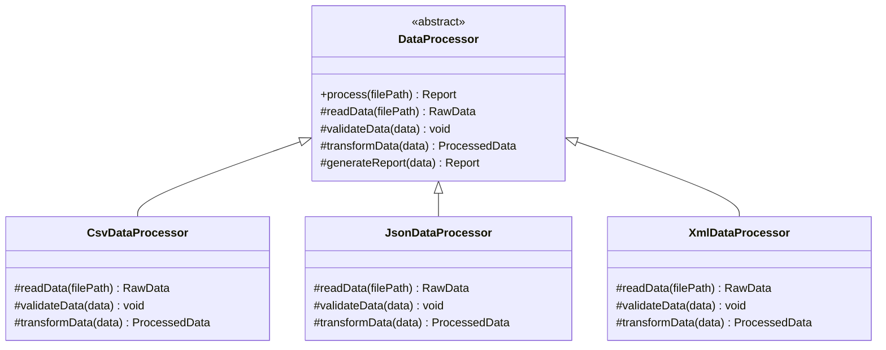

# Abstraction

When you use an ATM, you press "Withdraw $200" and money appears. You don't know about the network request to the bank's core system, the database transaction, the cash-dispensing mechanism, or the audit log being written. That complexity is **hidden behind a simple interface** — that's abstraction.

In OOP, abstraction means **exposing only what callers need** to know and hiding how things work internally. The mechanism in code: abstract classes and interfaces.

> **Interview relevance:** "Design a payment gateway", "design a notification service", "design a data export pipeline" — every system with pluggable behaviour needs abstraction. Interviewers look for your instinct to separate *what* from *how*.

---

## Abstract Classes: Partial Blueprints

An abstract class is a class that **cannot be instantiated directly** — it exists purely to be extended. It typically defines the skeleton of a system: some methods are fully implemented (shared logic), others are declared abstract (the subclass fills them in).



---

## Template Method Pattern: Abstraction in Action

The Template Method pattern is the natural expression of abstraction with abstract classes. The parent class defines the **algorithm skeleton** in a concrete `final` method. Subclasses override **specific steps** — they don't change the structure, only the implementation of individual steps.

```java
// Abstract base — defines the skeleton
public abstract class DataProcessor {

    // The template method — final so subclasses can't change the overall flow
    public final Report process(String filePath) {
        RawData raw           = readData(filePath);      // step 1 — subclass defines how
        validateData(raw);                                // step 2 — subclass defines how
        ProcessedData data    = transformData(raw);      // step 3 — subclass defines how
        return generateReport(data);                     // step 4 — default impl, can override
    }

    // Abstract: each subclass must implement these
    protected abstract RawData     readData(String filePath);
    protected abstract void        validateData(RawData data);
    protected abstract ProcessedData transformData(RawData data);

    // Concrete with default impl: subclass can override if needed (hook method)
    protected Report generateReport(ProcessedData data) {
        return new Report(data, LocalDateTime.now());
    }
}

// Concrete subclass — fills in the CSV-specific steps
public class CsvDataProcessor extends DataProcessor {
    @Override
    protected RawData readData(String filePath) {
        // CSV parsing logic — caller never sees this
        return CsvParser.parse(filePath);
    }

    @Override
    protected void validateData(RawData data) {
        if (data.rowCount() == 0)
            throw new IllegalArgumentException("CSV file is empty");
    }

    @Override
    protected ProcessedData transformData(RawData data) {
        return CsvTransformer.transform(data);
    }
}
```

The caller only touches the abstraction:

```java
DataProcessor processor = new CsvDataProcessor();
Report report = processor.process("sales_q4.csv"); // doesn't know or care about CSV details
```

Swap `CsvDataProcessor` for `JsonDataProcessor` — the calling code doesn't change at all.

---

## Full Example: Payment Processor

```java
public abstract class PaymentProcessor {

    // Template: fixed orchestration
    public final PaymentResult charge(PaymentRequest request) {
        validateRequest(request);
        String token  = tokenize(request.cardDetails());
        boolean ok    = processCharge(token, request.amount(), request.currency());
        logTransaction(request, ok);
        return ok ? PaymentResult.success(token) : PaymentResult.failure("Charge declined");
    }

    protected abstract void    validateRequest(PaymentRequest request);
    protected abstract String  tokenize(CardDetails card);
    protected abstract boolean processCharge(String token, long amountCents, String currency);

    protected void logTransaction(PaymentRequest request, boolean success) {
        // Default: write to audit log — subclasses may override for custom logging
        AuditLog.write(request.orderId(), success);
    }
}

public class StripePaymentProcessor extends PaymentProcessor {
    private final StripeClient stripe;

    public StripePaymentProcessor(StripeClient stripe) {
        this.stripe = stripe;
    }

    @Override protected void validateRequest(PaymentRequest r) {
        if (r.amount() <= 0) throw new IllegalArgumentException("Amount must be positive");
        if (r.cardDetails() == null) throw new IllegalArgumentException("Card details required");
    }

    @Override protected String tokenize(CardDetails card) {
        return stripe.createToken(card);   // Stripe-specific tokenization
    }

    @Override protected boolean processCharge(String token, long amountCents, String currency) {
        return stripe.charge(token, amountCents, currency).isSuccessful();
    }
}
```

---

## Abstract Class vs Interface

| | Abstract Class | Interface |
|---|---|---|
| **Instantiation** | Cannot instantiate directly | Cannot instantiate directly |
| **Method bodies** | Can have concrete methods | Java 8+: default methods only |
| **Fields** | Can have instance fields | Constants only |
| **Constructor** | Can have constructor | No constructor |
| **Inheritance** | Single (extends one) | Multiple (implements many) |
| **Use when** | Shared state + partial implementation | Pure contract, multiple sources |

**Rule:** If two things share *code* (fields, method implementations), use an abstract class. If they share only a *contract* (a set of methods they both promise to provide), use an interface.

---

## Interview Talking Points

**1. What is the difference between abstraction and encapsulation?**
> "Encapsulation is about hiding the *internal data and implementation details* of an object — protecting state from outside manipulation. Abstraction is about hiding *complexity* from the user of a component — showing only the relevant interface and suppressing the underlying mechanics. Encapsulation is a data protection mechanism; abstraction is a complexity management mechanism. A well-designed system uses both: encapsulated classes that expose abstract interfaces."

**2. When would you use an abstract class instead of an interface?**
> "Use an abstract class when: (1) subclasses share state that needs to be inherited (protected fields), (2) subclasses share a partial implementation and you want to avoid code duplication, or (3) you want to provide a template method that orchestrates shared logic. Use an interface when: you want to define a contract multiple unrelated classes can fulfil, you need multiple inheritance of type, or there's no shared implementation — only a shared API contract."

**3. Explain the Template Method pattern and its relationship to abstraction.**
> "The Template Method pattern uses an abstract class to define the skeleton of an algorithm in a single concrete method (often `final`), deferring the variable steps to abstract methods that subclasses implement. It's pure abstraction — the base class defines *what* happens in what order; subclasses define *how* each step happens. The caller only sees the public `process()` or `charge()` method, completely shielded from the implementation details of CSV parsing, Stripe API calls, or any other specifics."

---

## Key Takeaways

- Abstraction = exposing **what** an object does, hiding **how** it does it
- Abstract classes are **partial blueprints** — some concrete, some abstract
- Use `abstract` when subclasses share logic; use `interface` when they share only a contract
- The **Template Method pattern** is the canonical example of abstraction with abstract classes
- Hook methods (concrete with empty/default body) allow subclasses to optionally customise steps
- Abstract classes cannot be instantiated; trying to do so is a compile error
- Mark the template method `final` to prevent subclasses from changing the overall algorithm flow

