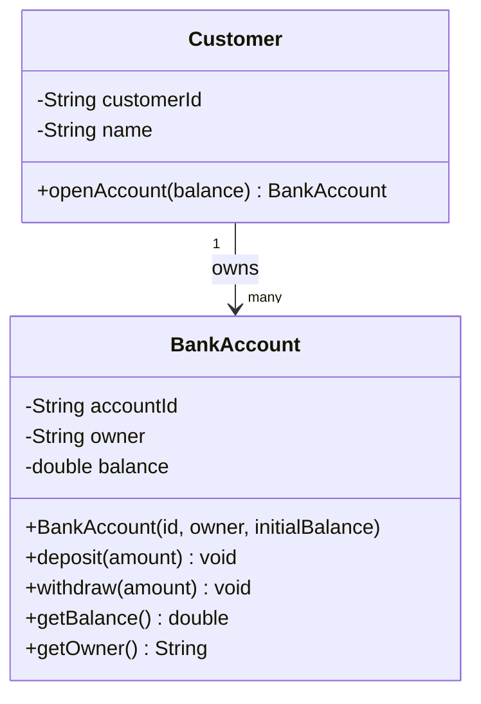
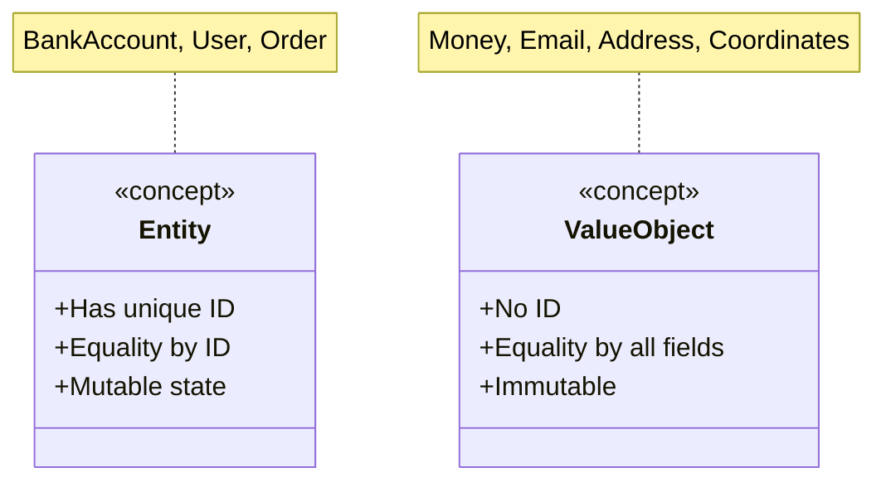

# Classes and Objects

A **class** is a blueprint; an **object** is a live instance built from that blueprint. If the class is the architectural drawing for a house, objects are the actual houses — each with the same structure but independent state (different paint colours, different owners).

Every LLD interview starts here. Interviewers watch whether you think in terms of _objects with identity, state, and behaviour_ — not just data bags with methods attached.

> **Interview relevance:** "Design a parking lot", "design a library system", "design a ride-hailing app" — all begin with identifying the right classes and their responsibilities.

---

## Anatomy of a Class

| Component | What it defines | Example |
|---|---|---|
| **Fields (state)** | Data an object holds | `balance`, `accountId` |
| **Methods (behaviour)** | Actions an object can perform | `deposit()`, `withdraw()` |
| **Constructor** | How a valid object is initialised | `BankAccount(id, owner, amount)` |
| **Access modifiers** | What is visible to outsiders | `private balance`, `public deposit()` |



---

## Constructors: Never Allow an Invalid Object

A constructor should be the _last line of defence_ against invalid state. If a `BankAccount` with a negative balance is wrong by design, reject it at construction time — not silently later.

```java
// ❌ NAIVE — no validation, caller can create garbage
BankAccount acc = new BankAccount("ACC-1", "Alice", -500.0);
acc.withdraw(100); // corrupted state from the start
```

```java
// ✅ BETTER — constructor enforces the class invariant
public BankAccount(String accountId, String owner, double initialBalance) {
    if (initialBalance < 0)
        throw new IllegalArgumentException("Balance cannot be negative: " + initialBalance);
    this.accountId = accountId;
    this.owner = owner;
    this.balance = initialBalance;
}
```

**Rule:** If you cannot create a valid object from the given arguments, throw immediately. Valid objects only, always.

---

## Full Example: BankAccount

```java
public class BankAccount {
    private final String accountId;
    private final String owner;
    private double balance;

    public BankAccount(String accountId, String owner, double initialBalance) {
        if (initialBalance < 0)
            throw new IllegalArgumentException("Balance cannot be negative");
        this.accountId = accountId;
        this.owner = owner;
        this.balance = initialBalance;
    }

    public void deposit(double amount) {
        if (amount <= 0) throw new IllegalArgumentException("Amount must be positive");
        balance += amount;
    }

    public void withdraw(double amount) {
        if (amount <= 0) throw new IllegalArgumentException("Amount must be positive");
        if (amount > balance) throw new IllegalStateException("Insufficient funds");
        balance -= amount;
    }

    public double getBalance()   { return balance; }
    public String getAccountId() { return accountId; }
    public String getOwner()     { return owner; }

    @Override public String toString() {
        return String.format("Account[id=%s, owner=%s, balance=%.2f]",
                             accountId, owner, balance);
    }
}
```

---

## Object Identity vs Object Equality

Two distinct objects can represent the **same entity** or the **same value**:

| Concept | Meaning | Implementation |
|---|---|---|
| **Identity** | Same object in memory | `a == b` (reference equality) |
| **Equality** | Same logical value or entity | `a.equals(b)` / custom logic |

```java
BankAccount a1 = new BankAccount("ACC-1", "Alice", 1000);
BankAccount a2 = new BankAccount("ACC-1", "Alice", 1000);

a1 == a2;       // false  — different heap allocations
a1.equals(a2);  // depends on your equals() — same accountId means same account
```

### Entities vs Value Objects



**Practical rule:** If two instances with the same data are _interchangeable_ (e.g., two `Money(50, USD)` objects mean the same thing), use a value object. If two instances can be _different even with same data_ (e.g., two accounts both owned by Alice with $1000 are different accounts), use an entity with a unique ID.

---

## Static vs Instance Members

- **Instance members** — each object gets its own copy; represent per-object state/behaviour
- **Static members** — shared across all instances of the class; represent class-level state/behaviour

```java
class BankAccount {
    private static int totalAccounts = 0;  // class-level — shared counter

    private double balance;                // instance-level — per-account balance

    public BankAccount(...) {
        totalAccounts++;                   // every new account bumps the class counter
        // ...
    }

    public static int getTotalAccounts() { return totalAccounts; }
}
```

> **Caution:** Mutable `static` fields are effectively global variables — avoid them in concurrent systems. Static is fine for constants (`MAX_RETRY`), pure utility methods, and factory methods.

---

## Interview Talking Points

**1. What is the difference between a class and an object?**
> "A class is a compile-time template that defines structure and behaviour. An object is a runtime instance of that class, allocated on the heap, with its own state. A single class blueprint can produce millions of independent objects."

**2. When must you override both `equals()` and `hashCode()` in Java?**
> "Whenever objects have value equality semantics — meaning two distinct instances can be logically equal. The contract is: if `a.equals(b)` is `true`, then `a.hashCode() == b.hashCode()` must also be `true`. Break this contract and your objects misbehave in `HashMap`, `HashSet`, and any hash-based structure. The reverse doesn't have to hold — two objects can share a hash code without being equal (collision)."

**3. How do you guarantee a class is always in a valid state?**
> "Validate all constructor arguments and throw immediately for invalid input. Keep fields `private` and expose mutation only through methods that enforce business rules. For the strongest guarantee, make the object immutable — once built correctly, it stays correct forever. The Builder pattern helps when construction requires many optional parameters, deferring validation to a single `build()` call."

---

## Key Takeaways

- A **class** is a blueprint; an **object** is a live, stateful runtime instance
- Always validate in the **constructor** — the contract is: *a successfully constructed object is always valid*
- **Identity** = same reference; **Equality** = same logical value or entity — override `equals()` + `hashCode()` together
- **Entities** carry a unique ID; **Value Objects** are immutable and equality is field-based
- `static` is for class-level concerns (constants, factories, shared counters) — avoid mutable static state
- `final` fields make objects safer for immutability and thread safety

