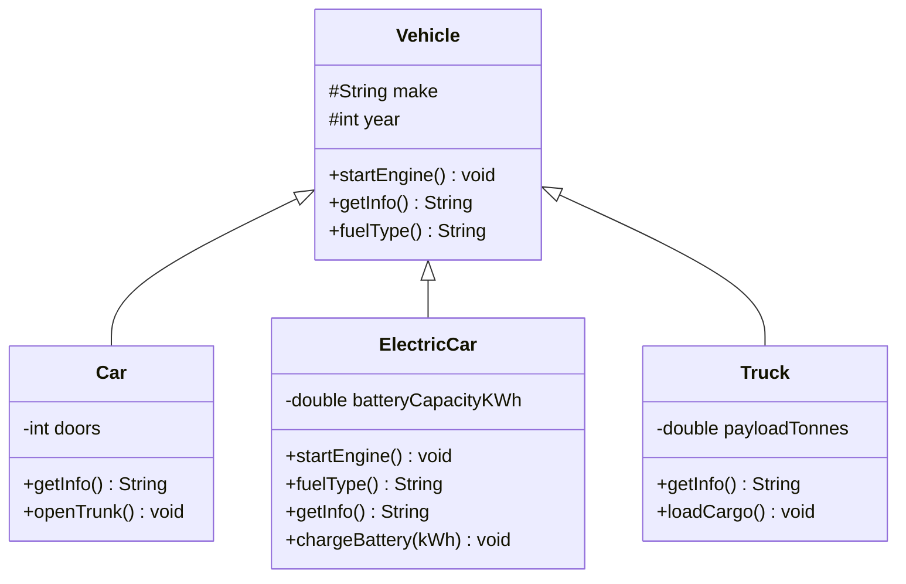

# Inheritance

Inheritance lets a class **acquire the fields and methods of another class**, modelling an *is-a* relationship. A `Car` is a `Vehicle`. A `Dog` is an `Animal`. A `SavingsAccount` is a `BankAccount`.

Done well, inheritance eliminates code duplication and creates clean hierarchies. Done poorly, it creates tight coupling, brittle base classes, and hierarchies so deep that changing the parent breaks every child. This is why _"favour composition over inheritance"_ became a mantra — not because inheritance is bad, but because it is so often overused.

> **Interview relevance:** Interviewers use inheritance to probe your understanding of the Liskov Substitution Principle, the fragile base class problem, and when composition beats inheritance. Most LLD interviews involve a decision: should X extend Y, or should X contain Y?

---

## Is-A vs Has-A

| Relationship | Mechanism | Example |
|---|---|---|
| **Is-a** | Inheritance (`extends`) | `ElectricCar` is a `Car` |
| **Has-a** | Composition (field of type) | `Car` has an `Engine` |

The litmus test: **"Can you say 'X is always a Y' without awkwardness?"** If yes, inheritance might fit. If the sentence sounds forced ("A `Stack` is a `Vector`"), use composition.

> Java's `Stack extends Vector` is the canonical example of broken inheritance. Stack inherited shuffle, contains, and addElement — none of which make sense for a stack.

---

## Method Overriding and the `super` Keyword

A subclass can **override** any non-final method of its parent to customise behaviour:



Key rules:
- Use `@Override` — the compiler catches typos that would otherwise silently create a new method
- Call `super.method()` to reuse parent logic before adding specialisation
- `protected` fields/methods in the parent are visible to subclasses but not to the outside world

---

## Full Example: Vehicle Hierarchy

```java
public abstract class Vehicle {
    protected final String make;
    protected final int year;

    protected Vehicle(String make, int year) {
        this.make = make;
        this.year = year;
    }

    // Common behaviour — all vehicles can do this
    public void startEngine() {
        System.out.println(make + ": starting engine...");
    }

    // Template for customisation
    public String getInfo() {
        return String.format("%d %s (%s)", year, make, fuelType());
    }

    // Each subclass declares its own fuel type
    public abstract String fuelType();
}

public class Car extends Vehicle {
    private final int doors;

    public Car(String make, int year, int doors) {
        super(make, year);
        this.doors = doors;
    }

    @Override public String fuelType() { return "Petrol"; }

    @Override public String getInfo() {
        return super.getInfo() + ", " + doors + "-door";
    }
}

public class ElectricCar extends Vehicle {
    private double batteryKWh;

    public ElectricCar(String make, int year, double batteryKWh) {
        super(make, year);
        this.batteryKWh = batteryKWh;
    }

    @Override public void startEngine() {
        System.out.println(make + ": electric motor engaged silently.");
    }

    @Override public String fuelType() { return "Electric"; }

    @Override public String getInfo() {
        return super.getInfo() + String.format(", %.0f kWh battery", batteryKWh);
    }
}
```

---

## The Fragile Base Class Problem

When you change a parent class, you can inadvertently break subclasses that depend on the exact old behaviour — even when you didn't intend to affect them. This is the **fragile base class problem**.

```java
// Base class — seems harmless
class CountingSet {
    private int addCount = 0;
    private Set<String> delegate = new HashSet<>();

    public void add(String element) {
        addCount++;
        delegate.add(element);
    }
    public void addAll(Collection<String> elements) {
        addCount += elements.size();
        delegate.addAll(elements);
    }
    public int getAddCount() { return addCount; }
}
```

Now someone subclasses `HashSet` and overrides `add()` to count. But `addAll()` internally calls `add()` — so every element gets counted twice. The subclass didn't know about `HashSet`'s internals.

**Signs of fragile base class:**
- Calling overridable methods from the constructor
- `addAll` internally calling `add` without documenting it
- Deep inheritance hierarchies (more than 2-3 levels is a smell)

---

## Favour Composition Over Inheritance

When in doubt, reach for composition:

```java
// ❌ Inheritance — NotificationEmailService IS-A EmailService?
class NotificationEmailService extends EmailService {
    public void sendOrderConfirmation(Order order) {
        String body = buildBody(order);   // custom logic
        super.send(order.customerEmail(), "Order confirmed", body);
    }
}

// ✅ Composition — NotificationService HAS-A EmailService
class NotificationService {
    private final EmailService emailService;     // injected, mockable
    private final SmsService   smsService;

    public NotificationService(EmailService email, SmsService sms) {
        this.emailService = email;
        this.smsService   = sms;
    }

    public void notifyOrderConfirmed(Order order) {
        emailService.send(order.customerEmail(), "Order confirmed", buildBody(order));
        smsService.send(order.customerPhone(), "Your order is confirmed!");
    }
}
```

Composition gives you flexibility: swap `EmailService` with a mock in tests; add `PushNotificationService` without changing the hierarchy.

---

## Interview Talking Points

**1. What is the Liskov Substitution Principle as it relates to inheritance?**
> "LSP states that objects of a subclass must be substitutable for objects of the parent class without breaking correctness. If code works with a `Vehicle`, it must work the same way with an `ElectricCar`. LSP is violated when a subclass throws exceptions the parent doesn't, narrows the contract (e.g., overrides a method with a no-op), or changes observable behaviour in unexpected ways. This is why the `Square extends Rectangle` example is broken — `Square` cannot honour Rectangle's invariant that width and height are independently settable."

**2. What is the fragile base class problem?**
> "When a base class changes, subclasses that override its methods may break, because they relied on the exact old implementation. For example, if `addAll()` internally calls `add()`, a subclass that overrides `add()` to count insertions will double-count when `addAll()` is called. The problem: the subclass made an assumption about how the base class works internally. Solutions: document extension points clearly, use `final` for methods not meant to be overridden, or prefer composition."

**3. When should you choose composition over inheritance?**
> "Choose inheritance only when a genuine is-a relationship exists AND the subclass preserves the full contract of the parent (LSP). Prefer composition when: you want to reuse code without committing to the parent's entire interface; you need the flexibility to swap the implementation at runtime; you want to avoid inheriting methods that don't make sense; or you want to mix behaviours from multiple sources (since single-inheritance limits you to one parent)."

---

## Key Takeaways

- Inheritance models **is-a** relationships; use `extends` only when the subclass genuinely is a subtype
- Always annotate overrides with `@Override` — the compiler catches misspellings
- Call `super.method()` to reuse parent logic; protect fields with `protected`
- The **fragile base class problem**: changing parent implementations can silently break children
- The **Liskov Substitution Principle**: subclasses must be fully substitutable for their parents
- **Favour composition over inheritance** when you need flexibility, multiple behaviours, or testability
- Inheritance depth greater than 2-3 levels is usually a sign of over-engineering

