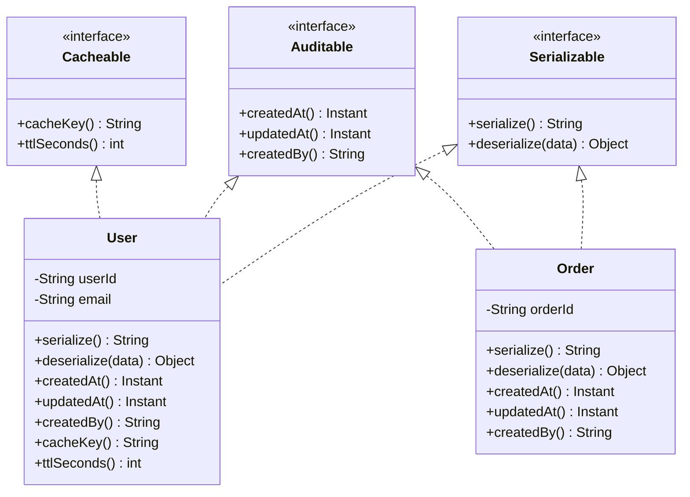

# Interfaces

An interface is a **contract without implementation** — a promise that any class implementing it will provide a specific set of methods. The implementing class decides *how*; the interface only specifies *what*.

Interfaces answer the question every good system design asks: _"What do you need from me, and what do I need from you?"_ Define that agreement in an interface, and both sides can evolve independently as long as the contract holds.

> **Interview relevance:** Almost every LLD problem has pluggable behaviour — multiple payment methods, notification channels, storage backends. Interfaces are how you model that. Interviewers watch for whether you reach for an interface or hard-code a concrete type.

---

## What an Interface Guarantees

```java
// Interface — pure contract, no implementation
public interface Notifiable {
    void send(String recipient, String message);
    boolean isAvailable();
}
```

Any class that claims to be `Notifiable` must provide both methods. The caller doesn't know or care whether it's an email, SMS, push notification, or Slack message. It just calls `notifiable.send(...)`.

---

## Multiple Interface Implementation

A class can implement **any number of interfaces** (unlike single inheritance for classes). This is one of interfaces' greatest strengths:



`User` promises it is `Serializable`, `Auditable`, and `Cacheable`. Code that needs only serializability doesn't know or care about the other two.

---

## Full Example: Notification System

```java
// Contracts
public interface NotificationChannel {
    void send(String recipient, String subject, String body);
    boolean isHealthy();
    String channelName();
}

public interface TemplateEngine {
    String render(String templateId, Map<String, Object> variables);
}

// Concrete implementations
public class EmailChannel implements NotificationChannel {
    private final SmtpClient smtpClient;

    public EmailChannel(SmtpClient smtpClient) {
        this.smtpClient = smtpClient;
    }

    @Override public void send(String recipient, String subject, String body) {
        smtpClient.sendEmail(recipient, subject, body);
    }

    @Override public boolean isHealthy() { return smtpClient.ping(); }
    @Override public String channelName() { return "email"; }
}

public class SmsChannel implements NotificationChannel {
    private final SmsGateway gateway;

    public SmsChannel(SmsGateway gateway) {
        this.gateway = gateway;
    }

    @Override public void send(String recipient, String subject, String body) {
        // SMS ignores subject — just sends body (truncated)
        gateway.sendSms(recipient, body.substring(0, Math.min(body.length(), 160)));
    }

    @Override public boolean isHealthy() { return gateway.isReachable(); }
    @Override public String channelName() { return "sms"; }
}

// NotificationService depends only on the interface — not on email or SMS specifics
public class NotificationService {
    private final List<NotificationChannel> channels;
    private final TemplateEngine templateEngine;

    public NotificationService(List<NotificationChannel> channels, TemplateEngine engine) {
        this.channels = channels;
        this.templateEngine = engine;
    }

    public void notify(String recipient, String templateId, Map<String, Object> data) {
        String body = templateEngine.render(templateId, data);
        for (NotificationChannel channel : channels) {
            if (channel.isHealthy()) {
                channel.send(recipient, templateId, body);
            }
        }
    }
}
```

---

## Interface Segregation Principle (ISP)

> **"Clients should not be forced to depend on methods they do not use."**

A fat interface is worse than several small, focused ones:

```java
// ❌ FAT interface — forced coupling
interface Worker {
    void work();
    void eat();    // robots don't eat
    void sleep();  // robots don't sleep
}

class Robot implements Worker {
    public void work()  { /* do work */ }
    public void eat()   { throw new UnsupportedOperationException(); }  // 😬
    public void sleep() { throw new UnsupportedOperationException(); }  // 😬
}
```

```java
// ✅ ISP — segregated interfaces
interface Workable { void work(); }
interface Eatable  { void eat(); }
interface Sleepable { void sleep(); }

class Human implements Workable, Eatable, Sleepable {
    public void work()  { /* work */ }
    public void eat()   { /* eat */ }
    public void sleep() { /* sleep */ }
}

class Robot implements Workable {
    public void work() { /* work — only promises what it can deliver */ }
}
```

---

## Default Methods (Java 8+)

Java 8 added `default` methods to interfaces — concrete implementations that are optionally overridden:

```java
interface Validator<T> {
    boolean isValid(T value);

    // Default: combine two validators with AND logic
    default Validator<T> and(Validator<T> other) {
        return value -> this.isValid(value) && other.isValid(value);
    }

    // Default: combine two validators with OR logic
    default Validator<T> or(Validator<T> other) {
        return value -> this.isValid(value) || other.isValid(value);
    }
}

// Usage with lambdas (functional interface style)
Validator<String> notBlank = s -> s != null && !s.isBlank();
Validator<String> maxLen   = s -> s.length() <= 100;
Validator<String> emailVal = s -> s.contains("@");

Validator<String> emailValidator = notBlank.and(maxLen).and(emailVal);
emailValidator.isValid("alice@example.com"); // true
```

Default methods enable adding new capabilities to an interface without breaking existing implementations — a key tool for evolving APIs.

---

## Interface vs Abstract Class: Decision Guide

| Question | Points to... |
|---|---|
| Need shared state (fields)? | Abstract class |
| Need shared implementation? | Abstract class |
| Multiple inheritance needed? | Interface |
| Unrelated classes need the same contract? | Interface |
| Modelling a capability/role (Printable, Serializable)? | Interface |
| Modelling a family (Animal, Vehicle)? | Abstract class |
| Need to evolve API without breaking implementations? | Interface (default methods) |

---

## Interview Talking Points

**1. Why prefer coding to interfaces rather than concrete classes?**
> "Programming to an interface means your code depends on the abstract contract, not the concrete implementation. This gives you three key benefits: (1) **Flexibility** — swap `EmailChannel` for `SmsChannel` without changing `NotificationService`; (2) **Testability** — inject a mock `NotificationChannel` in tests without sending real emails; (3) **Extensibility** — add a new `PushChannel` without changing any existing code (Open/Closed Principle). The concrete class is an implementation detail; the interface is the agreement."

**2. What is the Interface Segregation Principle and why does it matter?**
> "ISP says don't force clients to implement methods they don't need. A fat interface with 20 methods forces every implementer to provide all 20, even if they need only 3. Smaller, role-focused interfaces are more flexible. `Printable`, `Serializable`, and `Cacheable` are each small promises a class can independently choose to make. This avoids the `UnsupportedOperationException` smell — where a class throws exceptions for methods it's forced to 'implement' but can't meaningfully support."

**3. When would you use an abstract class over an interface?**
> "When related classes share both a contract AND shared state or implementation. An abstract class can have fields and concrete methods — perfect for the Template Method pattern where the skeleton is shared but individual steps differ. Interfaces have only constants and method signatures (plus Java 8 default methods for shared behaviour). Use abstract class for a *family* of related types. Use interface for a *capability* that unrelated types can share. When in doubt, prefer interfaces for maximum flexibility — you can only extend one class, but you can implement many interfaces."

---

## Key Takeaways

- An interface is a **contract** — what the implementer promises, not how they deliver it
- Code to **interfaces, not concrete types** — `List<Shape>` not `ArrayList<Circle>`
- A class can implement **multiple interfaces** — this is how you build composable capabilities
- **Interface Segregation Principle**: small, focused interfaces beat large, fat ones
- Java 8+ **default methods** let you add behaviour to interfaces without breaking existing implementations
- Interfaces enable **Dependency Inversion** (DIP) — high-level modules depend on abstractions, not concrete low-level details
- In Go, interfaces are implicit — no `implements` keyword; if a type has the right methods, it satisfies the interface

