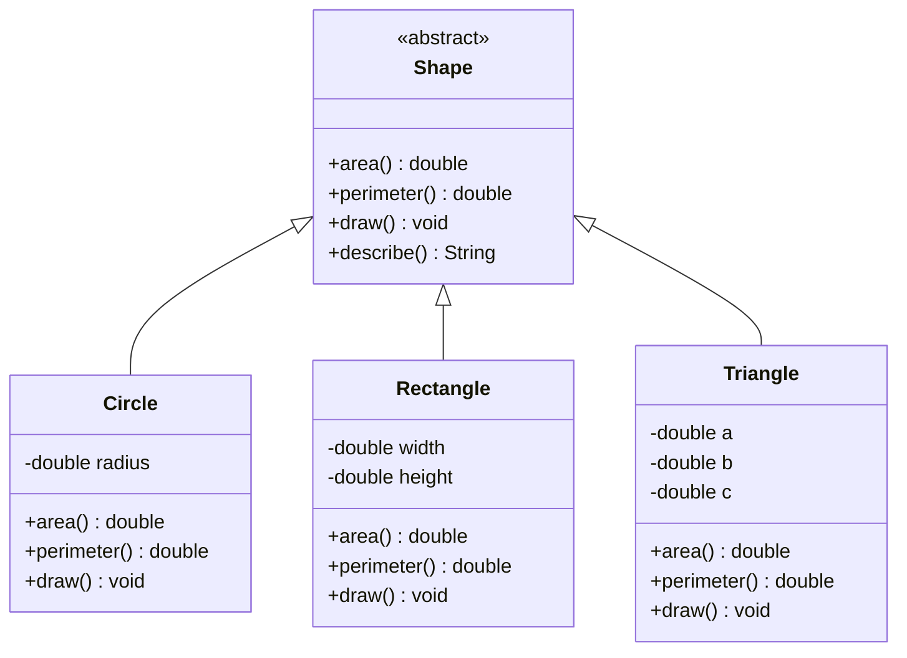

# Polymorphism

Polymorphism means **one interface, many implementations**. The same method call produces different behaviour depending on the actual type of the object at runtime. A `shape.draw()` call draws a circle when `shape` is a `Circle`, and a rectangle when it's a `Rectangle` — without the caller ever checking what type it is.

This is the engine behind extensible systems. Every design pattern that lets you "open for extension, closed for modification" (Open/Closed Principle) leans on polymorphism to do the actual work.

> **Interview relevance:** Interviewers use polymorphism to distinguish engineers who write type-checking `instanceof` chains from those who design proper abstractions. Any LLD with multiple types of the same "thing" (payment methods, notification channels, discount rules) is a polymorphism problem.

---

## Two Kinds of Polymorphism

| Kind | Also called | Resolved at | Mechanism |
|---|---|---|---|
| **Compile-time** | Static / Ad-hoc | Compile time | Method overloading |
| **Runtime** | Dynamic / Subtype | Runtime (JVM dispatch) | Method overriding |

---

## Compile-Time Polymorphism: Method Overloading

The same method name, different parameter signatures. The compiler chooses the right version:

```java
class Printer {
    void print(int value)    { System.out.println("int: " + value); }
    void print(double value) { System.out.println("double: " + value); }
    void print(String value) { System.out.println("String: " + value); }
    void print(int a, int b) { System.out.println("sum: " + (a + b)); }
}
```

Overloading is resolved entirely at compile time based on the **declared type** of the argument — not the runtime type. It's powerful for API ergonomics (constructors, builder methods, arithmetic utilities) but is not true polymorphism in the OOP sense.

---

## Runtime Polymorphism: Dynamic Dispatch

The cornerstone of OOP. The JVM determines which method to execute based on the **actual runtime type** of the object — not the declared variable type.



### Naive approach (type-checking hell)

```java
// ❌ ANTI-PATTERN — every new shape type requires modifying this method
double totalArea(List<Object> shapes) {
    double total = 0;
    for (Object obj : shapes) {
        if (obj instanceof Circle c)        total += Math.PI * c.getRadius() * c.getRadius();
        else if (obj instanceof Rectangle r) total += r.getWidth() * r.getHeight();
        else if (obj instanceof Triangle t)  total += heronFormula(t);
        // Add Triangle: modify here. Add Pentagon: modify here. No end.
    }
    return total;
}
```

### Polymorphic approach (Open/Closed Principle)

```java
// ✅ Adding a new shape never requires changing this method
double totalArea(List<Shape> shapes) {
    return shapes.stream()
                 .mapToDouble(Shape::area)
                 .sum();
}
```

---

## Full Example: Shape Hierarchy

```java
public abstract class Shape {
    private final String color;

    protected Shape(String color) {
        this.color = color;
    }

    public abstract double area();
    public abstract double perimeter();
    public abstract void draw();

    public String describe() {
        return String.format("%s[color=%s, area=%.2f, perimeter=%.2f]",
                             getClass().getSimpleName(), color, area(), perimeter());
    }
}

public class Circle extends Shape {
    private final double radius;

    public Circle(String color, double radius) {
        super(color);
        if (radius <= 0) throw new IllegalArgumentException("Radius must be positive");
        this.radius = radius;
    }

    @Override public double area()      { return Math.PI * radius * radius; }
    @Override public double perimeter() { return 2 * Math.PI * radius; }
    @Override public void   draw()      { System.out.println("Drawing circle, r=" + radius); }
}

public class Rectangle extends Shape {
    private final double width, height;

    public Rectangle(String color, double width, double height) {
        super(color);
        this.width  = width;
        this.height = height;
    }

    @Override public double area()      { return width * height; }
    @Override public double perimeter() { return 2 * (width + height); }
    @Override public void   draw()      { System.out.println("Drawing rectangle " + width + "x" + height); }
}

// Usage — caller doesn't know or care about concrete types
List<Shape> canvas = List.of(
    new Circle("red", 5),
    new Rectangle("blue", 4, 6),
    new Circle("green", 3)
);
canvas.forEach(Shape::draw);
double total = canvas.stream().mapToDouble(Shape::area).sum();
```

---

## Liskov Substitution Principle (LSP)

LSP is the litmus test for correct inheritance + polymorphism:

> **"If S is a subtype of T, then objects of type T may be replaced with objects of type S without altering the correctness of the program."**

### Classic LSP violation: Square extends Rectangle

```java
// Rectangle contract: setWidth and setHeight are independent
Rectangle r = new Rectangle();
r.setWidth(4);
r.setHeight(5);
assert r.area() == 20;  // ✅ passes for Rectangle

// Square overrides both setters to keep sides equal
Square s = new Square();
s.setWidth(4);   // also sets height = 4
s.setHeight(5);  // also sets width = 5
assert s.area() == 20; // ❌ fails — area is 25, not 20
```

`Square` violates LSP. The caller's assumptions about `Rectangle` are broken when a `Square` is substituted. Fix: don't make `Square` extend `Rectangle`. Use a `Shape` interface instead.

---

## Open/Closed Principle Connection

The classic OCP formulation: **"Open for extension, closed for modification."**

Polymorphism makes this possible. To add a new `Triangle` to the shape hierarchy:
- You add a `Triangle` class that extends `Shape` ✅
- You do NOT modify `Shape`, `Circle`, `Rectangle`, or any code that works with `Shape` ✅
- The `totalArea()` function automatically handles triangles ✅

Compare to the `instanceof` version: every new shape type requires modifying the `totalArea()` method — it's open for modification, which is exactly what OCP forbids.

---

## Interview Talking Points

**1. What is dynamic dispatch and how does the JVM implement it?**
> "When you call `shape.area()` on a `Shape` reference, the JVM looks at the actual runtime type of the object (say `Circle`) and calls the `area()` method from `Circle`, not the one from `Shape`. This is dynamic dispatch. The JVM implements it using a vtable (virtual method table) — a per-class lookup table of method pointers. Each object has a hidden pointer to its class's vtable. When a virtual method is called, the JVM follows the pointer to the vtable and jumps to the right method. This lookup is O(1) and extremely fast in practice."

**2. How does polymorphism relate to the Open/Closed Principle?**
> "OCP says software should be open for extension but closed for modification. Polymorphism is the mechanism that enables this. You define a stable abstraction (`Shape`) and add new behaviour by creating new implementations (`Triangle`, `Pentagon`) — without touching existing code. If code used `instanceof` switches instead, every new type would require modifying existing code. Polymorphism eliminates that coupling."

**3. What is the Liskov Substitution Principle and give an example of violating it?**
> "LSP says subclasses must be fully substitutable for their parent without breaking the program's correctness. The canonical violation is `Square extends Rectangle`. Rectangle's contract says width and height can be set independently. Square must keep them equal, so it either breaks the setters or breaks the expected area calculation. The fix is not to force the is-a relationship — use a common `Shape` interface instead."

---

## Key Takeaways

- **Compile-time polymorphism** = method overloading (resolved by the compiler based on declared type)
- **Runtime polymorphism** = method overriding + dynamic dispatch (resolved by the JVM based on actual type)
- Replace `instanceof` chains with polymorphism — add types by adding classes, not by modifying methods
- **Liskov Substitution Principle**: subclasses must honour the full contract of their parent
- **Open/Closed Principle**: polymorphism is what makes "open for extension, closed for modification" achievable
- In Go, polymorphism is achieved via interfaces — no inheritance required; duck typing at compile time

