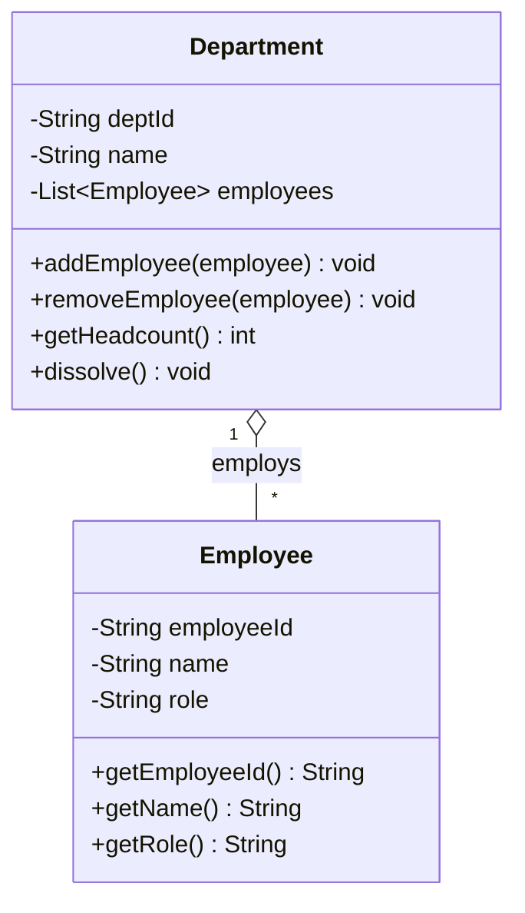

# Aggregation

Aggregation is a **"whole-part"** relationship where the parts can exist **independently of the whole**. A Library contains Books — but if the library closes, the books don't cease to exist. They can be donated, moved, or catalogued elsewhere. The library held *references* to the books; it did not own their existence.

Aggregation represents ownership of a **reference**, not ownership of a **lifecycle**.

> **Interview relevance:** The single most common LLD question on relationships: *"Is this aggregation or composition?"* The answer always comes back to one question: **can the part exist without the whole?** Get this crisp and you will always get the follow-up right.

---

## The Defining Test

| Question | YES → | NO → |
|---|---|---|
| Can the part exist without the whole? | **Aggregation** | Composition |
| Was the part created inside the whole? | Composition | **Aggregation** |
| Can the same part belong to multiple wholes? | **Aggregation** | Composition |

---

## Key Characteristics

| Characteristic | Aggregation |
|---|---|
| **Coupling** | Moderate |
| **Ownership** | Whole holds references; doesn't control lifecycle |
| **Lifecycle** | Parts outlive the whole; created and destroyed independently |
| **UML symbol** | `◇——` (hollow diamond at the whole end) |
| **Code signal** | Parts are **passed in** (constructor / setter / add method) |



---

## Code Example: Department and Employees

The dead giveaway of aggregation: the **part is constructed outside** and passed into the whole:

```java
public class Employee {
    private final String employeeId;
    private final String name;
    private String role;

    public Employee(String employeeId, String name, String role) {
        this.employeeId = Objects.requireNonNull(employeeId);
        this.name       = Objects.requireNonNull(name);
        this.role       = Objects.requireNonNull(role);
    }

    // Employee is meaningful and fully usable without any Department
    public String getEmployeeId() { return employeeId; }
    public String getName()       { return name; }
    public String getRole()       { return role; }
    public void   setRole(String r) { this.role = r; }
}

public class Department {
    private final String deptId;
    private final String name;
    private final List<Employee> employees = new ArrayList<>();

    public Department(String deptId, String name) {
        this.deptId = deptId;
        this.name   = name;
    }

    // Employee was created OUTSIDE — Department only receives a reference
    public void addEmployee(Employee employee) {
        Objects.requireNonNull(employee);
        if (!employees.contains(employee)) {
            employees.add(employee);
        }
    }

    // Removing from Department does NOT destroy the Employee object
    public boolean removeEmployee(Employee employee) {
        return employees.remove(employee);
    }

    public int getHeadcount() {
        return employees.size();
    }

    public List<Employee> getEmployees() {
        return Collections.unmodifiableList(employees);
    }

    // Department dissolves — employees still exist and can be reassigned
    public void dissolve() {
        employees.clear();   // references released; Employee objects NOT destroyed
    }
}

// Usage
Employee alice = new Employee("E-1", "Alice", "Engineer");
Employee bob   = new Employee("E-2", "Bob",   "Designer");

Department eng  = new Department("D-1", "Engineering");
Department plat = new Department("D-2", "Platform");

eng.addEmployee(alice);
eng.addEmployee(bob);
plat.addEmployee(alice);   // Alice is in TWO departments simultaneously — valid aggregation

eng.dissolve();            // Engineering gone — alice and bob still alive, reassignable
```

---

## A Part Can Belong to Multiple Wholes

Because aggregation doesn't control lifecycle, the same part can be referenced by multiple wholes at once. This is **impossible in composition**.

```java
// Tag has no meaning tied to any one Course — it can be shared freely
public class Tag {
    private final String name;

    public Tag(String name) {
        this.name = Objects.requireNonNull(name);
    }

    public String getName() { return name; }
}

public class Course {
    private final String courseId;
    private final String name;
    private final List<Tag> tags = new ArrayList<>();

    public Course(String courseId, String name) {
        this.courseId = courseId;
        this.name     = name;
    }

    // Tag is passed in — Course does not own or create Tags
    public void addTag(Tag tag) {
        if (!tags.contains(tag)) tags.add(tag);
    }

    public List<Tag> getTags() {
        return Collections.unmodifiableList(tags);
    }
}

// Shared tag — aggregation allows this
Tag javaTag = new Tag("Java");
Tag dsaTag  = new Tag("Data Structures");

Course java101 = new Course("C-1", "Java 101");
Course algo    = new Course("C-2", "Algorithms");

java101.addTag(javaTag);
algo.addTag(javaTag);   // same tag on two courses — perfectly valid
algo.addTag(dsaTag);
```

---

## Naive → Better Design

```java
// ❌ NAIVE — Team bakes in Player creation; can't reuse players across teams
public class Team {
    private final List<Player> players = new ArrayList<>();

    public void addPlayer(String name, String position) {
        players.add(new Player(name, position));  // Team creates Players internally
        // This is composition — but players SHOULD survive team dissolution
    }
}
```

```java
// ✅ AGGREGATION — Player exists independently; can move between teams
public class Team {
    private final String name;
    private final List<Player> players = new ArrayList<>();

    public Team(String name) { this.name = name; }

    public void addPlayer(Player player) {      // Player passed in — aggregation
        players.add(player);
    }

    public void releasePlayer(Player player) {
        players.remove(player);                  // Player released, not destroyed
    }

    public List<Player> getPlayers() {
        return Collections.unmodifiableList(players);
    }
}

// Player is created by a PlayerRegistry or service, then assigned to teams
PlayerRegistry registry = new PlayerRegistry();
Player messi = registry.register("Messi", "Forward");
teamA.addPlayer(messi);  // signed
teamA.releasePlayer(messi);
teamB.addPlayer(messi);  // transferred — player object unchanged
```

---

## Aggregation vs Association: The Blurry Line

Many practitioners treat aggregation as simply a more _semantic_ form of association — the code looks identical (both hold a field reference), but the **intent** differs:

- **Association**: two peers interact casually; neither is a "part" of the other
- **Aggregation**: one is clearly the container or whole; the other is a part — but the part is independent

Martin Fowler notes that the UML distinction between association and aggregation is so fuzzy it's rarely worth arguing over. What genuinely matters in practice is the distinction between **both of them and composition**: does the whole control the part's lifetime or not?

---

## SOLID Connection

**Single Responsibility:** `Employee` manages its own state; `Department` manages membership. Neither takes on the other's responsibilities.

**Open/Closed:** New container types (`Project`, `WorkGroup`, `Squad`) can aggregate `Employee` without modifying the `Employee` class at all.

**Dependency Inversion:** A `Department` should typically depend on an `Employee` abstraction or interface — making it easy to swap in a `ContractEmployee` or `RemoteEmployee` without changing Department logic.

---

## Interview Talking Points

**1. How do you identify aggregation vs composition in code?**
> "The key signal is where the part is created. In aggregation, the part is constructed *outside* and passed in — via a constructor parameter, setter, or `add()` method. The whole receives a reference it didn't create. In composition, the whole does `new Part()` internally, and the part's constructor is typically package-private or it's a private inner class, so nothing outside can create one. If I see `whole.addPart(existingPart)`, that's aggregation. If I see `new Part()` inside the whole's constructor or methods, that's composition."

**2. Can a part belong to multiple wholes in aggregation?**
> "Yes — that's one of the defining characteristics. Since the whole doesn't own the lifecycle, multiple wholes can hold references to the same part simultaneously. A Tag can appear on many Courses. A consultant Employee can belong to multiple Project aggregations. This is impossible in composition because the whole exclusively creates and owns the part — there can be no external references to it."

**3. Is aggregation worth distinguishing from simple association?**
> "Honest answer: the distinction is mainly *semantic*, not structural — both appear as a field holding a reference. The distinction matters most for communicating design intent: 'this is a whole-part relationship' vs 'these are two peers interacting'. What genuinely matters in code design is the distinction from composition — does the whole control the part's creation and destruction? The aggregation vs association debate rarely affects correctness. The composition vs aggregation debate always does."

---

## Key Takeaways

- Aggregation = **"has-a"** where parts **survive the whole**
- The part is created **outside** and passed into the whole — the whole receives a reference only
- The same part can be referenced by **multiple wholes** simultaneously
- Removing or destroying the whole leaves the parts intact and re-usable
- The code structure looks identical to association — the distinction is **semantic** (whole-part intent)
- The critical distinction is between aggregation and **composition** (not between aggregation and association)
