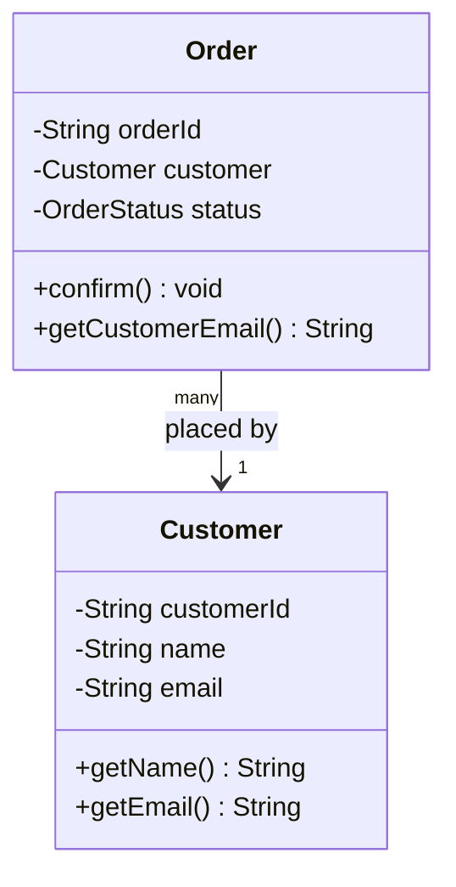
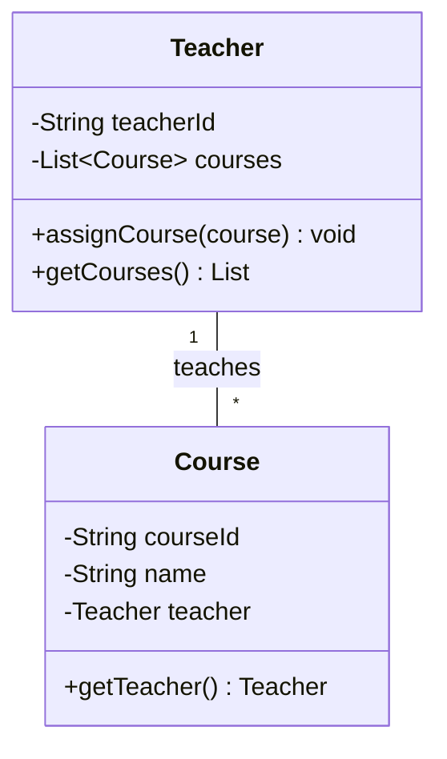

# Association

Association is the most general relationship between objects: one object **knows about** another and can interact with it. There is no ownership and no lifecycle dependency — both objects exist independently and simply hold a reference to each other.

If Inheritance answers *"What am I?"*, Association answers *"Who do I know?"*.

> **Interview relevance:** Association, Aggregation, and Composition come up in every LLD interview. The interviewer wants to see that you consciously choose the strength of coupling between classes — not just wire everything together.

---

## The Three OOP Relationships at a Glance

Before diving in, here is the full picture so the distinctions stay clear:

| Relationship | Coupling | Ownership | Part lifecycle | UML |
|---|---|---|---|---|
| **Association** | Weakest | None — peers | Independent | `——>` |
| **Aggregation** | Moderate | Whole holds refs | Outlives the whole | `◇——` |
| **Composition** | Strongest | Whole creates & owns | Dies with the whole | `◆——` |

This article covers **Association**. The other two are covered in [Aggregation](./aggregation) and [Composition](./composition).

---

## What Makes It an Association

The defining sign: the associated object is **received from outside** — passed as a constructor argument, a setter, or a method parameter — never created inside the class. Both objects can be independently instantiated, used, and discarded.

---

## Unidirectional Association

One class holds a reference to another. The other has no knowledge of the first.



```java
public class Customer {
    private final String customerId;
    private final String name;
    private final String email;

    public Customer(String customerId, String name, String email) {
        this.customerId = Objects.requireNonNull(customerId);
        this.name       = Objects.requireNonNull(name);
        this.email      = Objects.requireNonNull(email);
    }

    public String getCustomerId() { return customerId; }
    public String getName()       { return name; }
    public String getEmail()      { return email; }
}

public class Order {
    private final String orderId;
    private final Customer customer;   // association: holds a reference, does NOT own it
    private final List<String> itemIds = new ArrayList<>();
    private OrderStatus status = OrderStatus.PENDING;

    public Order(String orderId, Customer customer) {
        this.orderId  = Objects.requireNonNull(orderId);
        this.customer = Objects.requireNonNull(customer);  // passed in — not created here
    }

    public String getCustomerEmail() {
        return customer.getEmail();   // delegates to associated object
    }

    public void confirm() {
        this.status = OrderStatus.CONFIRMED;
    }
}

// Usage
Customer alice = new Customer("C-1", "Alice", "alice@example.com");
Order o1 = new Order("ORD-1", alice);  // Order knows Alice
Order o2 = new Order("ORD-2", alice);  // Alice is associated with many orders
// Deleting an order does NOT delete alice
```

---

## Bidirectional Association

Both classes hold a reference to each other. More expressive but harder to keep consistent — both sides must always agree.



```java
public class Teacher {
    private final String teacherId;
    private final String name;
    private final List<Course> courses = new ArrayList<>();

    public Teacher(String teacherId, String name) {
        this.teacherId = teacherId;
        this.name      = name;
    }

    // One method manages BOTH sides — the only safe way to keep them consistent
    public void assignCourse(Course course) {
        if (!courses.contains(course)) {
            courses.add(course);
            course.setTeacherInternal(this);   // update the other end
        }
    }

    void removeCourse(Course course) {
        courses.remove(course);
    }

    public List<Course> getCourses() {
        return Collections.unmodifiableList(courses);
    }

    public String getTeacherId() { return teacherId; }
    public String getName()      { return name; }
}

public class Course {
    private final String courseId;
    private final String name;
    private Teacher teacher;

    public Course(String courseId, String name) {
        this.courseId = courseId;
        this.name     = name;
    }

    // Package-private: only Teacher.assignCourse() should call this
    void setTeacherInternal(Teacher teacher) {
        this.teacher = teacher;
    }

    public Teacher getTeacher()  { return teacher; }
    public String  getCourseId() { return courseId; }
    public String  getName()     { return name; }
}
```

> **Production tip:** Bidirectional associations are easy to break — one side gets updated, the other doesn't. Always manage both ends from one method (as above). Ask yourself honestly whether you need the reverse navigation at runtime, or whether a repository query is simpler.

---

## Multiplicity

| Multiplicity | Example | Code pattern |
|---|---|---|
| 1 to 1 | `Driver` → `Licence` | Single field `private Licence licence` |
| 1 to many | `Playlist` → `Track` (one way) | `List<Track> tracks` |
| Many to many | `Student` ↔ `Course` | Each holds `List<>` of the other |

Many-to-many associations almost always signal a **missing class**. `Student ↔ Course` should become `Student → Enrollment ← Course`, where `Enrollment` carries grade, enrollment date, and status. The join has its own data and behaviour.

---

## Dependency: The Weakest Form

Dependency is a transient association — one class uses another **only during a method call** (as a parameter or local variable), not stored as a field. It's even lighter than association.

```java
// OrderService depends on EmailService but doesn't store it permanently
public class OrderService {
    public void processOrder(Order order, EmailService emailService) {
        order.confirm();
        emailService.send(order.getCustomerEmail(), "Your order is confirmed!");
        // emailService is used and forgotten — not a field
    }
}
```

In UML this is a dashed arrow `..>`. In code it appears as a method parameter or a local `new`.

---

## SOLID Connection: Dependency Inversion

Whenever two classes are associated, prefer depending on an **interface** rather than a concrete type:

```java
// ❌ Hard dependency — tightly coupled, untestable
public class OrderService {
    private final MySqlOrderRepository repo;  // concrete class
}

// ✅ Interface association — flexible and mockable in tests
public class OrderService {
    private final OrderRepository repo;       // interface
    private final NotificationChannel notify; // interface

    public OrderService(OrderRepository repo, NotificationChannel notify) {
        this.repo   = repo;
        this.notify = notify;
    }
}
```

This is the **Dependency Inversion Principle** applied to association: high-level modules depend on abstractions, not on concrete low-level implementations.

---

## Interview Talking Points

**1. What is the difference between Association and Dependency?**
> "Association is a *persistent* structural relationship — one class stores a reference to another as a field and interacts with it throughout its lifetime. Dependency is *transient* — a class uses another only during a method call, as a parameter or local variable, and doesn't hold onto it. Both are 'uses-a' relationships, but association is stronger: the associated object is always available to the holder. Dependency is fire-and-forget."

**2. When is a bidirectional association the right choice?**
> "Only when both sides genuinely need to navigate to the other in business logic — not just for convenience. Bidirectional associations are harder to keep consistent (both ends must be updated together) and create tighter coupling. If only one direction is needed at runtime, prefer unidirectional and let a service or repository handle the reverse lookup. Unnecessary bidirectionality is a common source of subtle bugs where one side gets stale."

**3. Why should many-to-many associations often become their own class?**
> "Because the relationship itself usually has data and behaviour. A Student-Course enrollment has a grade, an enrollment date, a withdrawal status. None of that fits naturally on Student or Course. By making Enrollment an explicit class, you can query, sort, and validate enrollment data independently. The rule: if you catch yourself adding fields to a join table or asking questions *about the relationship itself*, promote it to a first-class class."

---

## Key Takeaways

- Association = **"knows about"** — objects hold references with no lifecycle coupling
- The associated object is always **created outside and passed in** — never created by the holder
- Prefer **unidirectional** over bidirectional; only add the reverse when runtime navigation genuinely requires it
- **Dependency** (method parameter) is weaker than **Association** (stored field)
- Many-to-many usually deserves its own class to hold relationship-level data
- Apply **Dependency Inversion**: associate through interfaces, not concrete types
