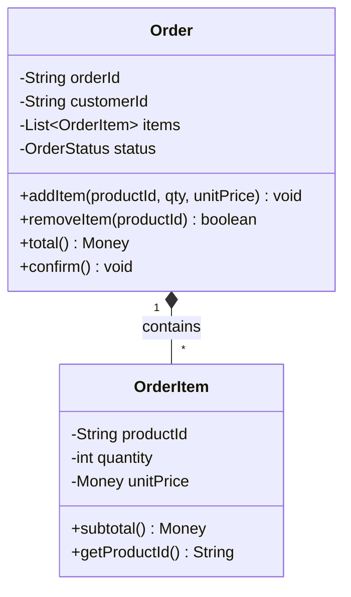
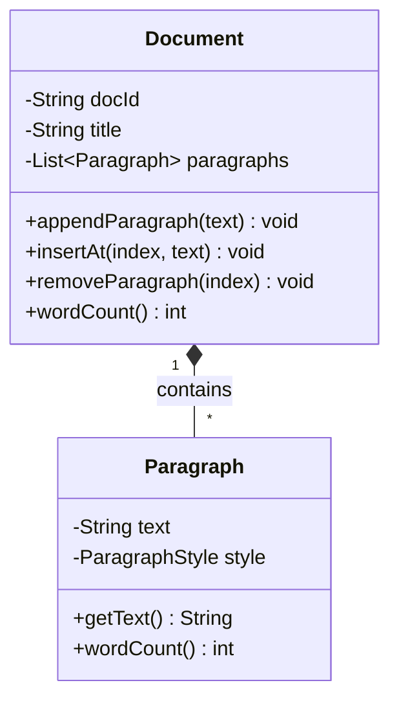

# Composition

Composition is the strongest form of the has-a relationship: the **parts cannot exist without the whole**, and the whole is entirely responsible for creating, managing, and destroying its parts.

A House has Rooms. Rooms are meaningless outside a House — they have no independent identity. When the House is demolished, the Rooms cease to exist. That is composition: the whole *owns* the parts completely.

> **Interview relevance:** "Favour composition over inheritance" is one of the most cited principles in OOP. Interviewers use composition questions to test whether you understand ownership, lifecycle, and coupling — not just how to put fields on a class.

---

## The Defining Characteristics

| Characteristic | Composition |
|---|---|
| **Coupling** | Strongest (among has-a relationships) |
| **Ownership** | Whole creates, manages, and destroys the parts |
| **Lifecycle** | Parts are born and die with the whole |
| **Sharing** | Parts belong to exactly one whole — never shared |
| **UML symbol** | `◆——` (filled diamond at the whole end) |
| **Code signal** | `new Part()` is called **inside** the whole |

---

## Code Example: Order and OrderItems

The tell-tale sign of composition: the **part is instantiated inside the whole**, and callers cannot create a part independently.



```java
public final class Money {
    private final long amountCents;
    private final String currency;

    public Money(long amountCents, String currency) {
        if (amountCents < 0) throw new IllegalArgumentException("Amount cannot be negative");
        this.amountCents = amountCents;
        this.currency    = Objects.requireNonNull(currency);
    }

    public Money add(Money other) {
        if (!this.currency.equals(other.currency))
            throw new IllegalArgumentException("Currency mismatch");
        return new Money(this.amountCents + other.amountCents, this.currency);
    }

    public long   amountCents() { return amountCents; }
    public String currency()    { return currency; }
}

// Package-private constructor: only Order (same package) can create OrderItems
final class OrderItem {
    private final String productId;
    private final int    quantity;
    private final Money  unitPrice;

    OrderItem(String productId, int quantity, Money unitPrice) {
        if (quantity <= 0) throw new IllegalArgumentException("Quantity must be positive");
        this.productId = Objects.requireNonNull(productId);
        this.quantity  = quantity;
        this.unitPrice = Objects.requireNonNull(unitPrice);
    }

    public Money subtotal() {
        return new Money(unitPrice.amountCents() * quantity, unitPrice.currency());
    }

    public String getProductId() { return productId; }
    public int    getQuantity()  { return quantity; }
    public Money  getUnitPrice() { return unitPrice; }
}

public class Order {
    private final String orderId;
    private final String customerId;
    private final List<OrderItem> items = new ArrayList<>();  // owns these
    private OrderStatus status = OrderStatus.PENDING;

    public Order(String orderId, String customerId) {
        this.orderId     = Objects.requireNonNull(orderId);
        this.customerId  = Objects.requireNonNull(customerId);
    }

    // Order CREATES the item — the caller supplies data, not an object
    public void addItem(String productId, int quantity, Money unitPrice) {
        boolean alreadyAdded = items.stream()
            .anyMatch(i -> i.getProductId().equals(productId));
        if (alreadyAdded)
            throw new IllegalStateException("Product already in order: " + productId);
        items.add(new OrderItem(productId, quantity, unitPrice));  // composition here
    }

    public boolean removeItem(String productId) {
        return items.removeIf(i -> i.getProductId().equals(productId));
    }

    public Money total() {
        return items.stream()
                    .map(OrderItem::subtotal)
                    .reduce(new Money(0, "USD"), Money::add);
    }

    public void confirm() {
        if (items.isEmpty())
            throw new IllegalStateException("Cannot confirm an empty order");
        this.status = OrderStatus.CONFIRMED;
    }

    public List<OrderItem> getItems() {
        return Collections.unmodifiableList(items);
    }

    public String      getOrderId()    { return orderId; }
    public String      getCustomerId() { return customerId; }
    public OrderStatus getStatus()     { return status; }
}
```

When an `Order` is garbage-collected, every `OrderItem` it owned goes with it — there are no external references because the package-private constructor prevents anyone outside from creating or storing them.

---

## Second Example: Document and Paragraphs



```java
public class Document {
    private final String docId;
    private final String title;
    private final List<Paragraph> paragraphs = new ArrayList<>();

    public Document(String docId, String title) {
        this.docId = docId;
        this.title = title;
        // A fresh document starts with one empty paragraph — Document creates it
        this.paragraphs.add(new Paragraph("", ParagraphStyle.BODY));
    }

    public void appendParagraph(String text) {
        paragraphs.add(new Paragraph(text, ParagraphStyle.BODY));
    }

    public void insertAt(int index, String text) {
        if (index < 0 || index > paragraphs.size())
            throw new IndexOutOfBoundsException("Invalid paragraph index: " + index);
        paragraphs.add(index, new Paragraph(text, ParagraphStyle.BODY));
    }

    public void removeParagraph(int index) {
        if (paragraphs.size() <= 1)
            throw new IllegalStateException("Document must have at least one paragraph");
        paragraphs.remove(index);
    }

    public int wordCount() {
        return paragraphs.stream().mapToInt(Paragraph::wordCount).sum();
    }

    public List<Paragraph> getParagraphs() {
        return Collections.unmodifiableList(paragraphs);
    }
}

// Paragraph has no public constructor — enforces that only Document creates these
final class Paragraph {
    private String text;
    private ParagraphStyle style;

    Paragraph(String text, ParagraphStyle style) {
        this.text  = Objects.requireNonNull(text);
        this.style = Objects.requireNonNull(style);
    }

    public String getText()   { return text; }
    public int    wordCount() { return text.isBlank() ? 0 : text.trim().split("\\s+").length; }
}
```

---

## Naive → Better Design

```java
// ❌ NAIVE — flat Order, single product only; cannot scale to multiple items
public class Order {
    public String orderId;
    public String productId;   // one product hard-coded
    public int    quantity;
    public double price;
    // Adding a second product requires rebuilding the entire class
}
```

```java
// ✅ COMPOSITION — Order owns its items; easily extended, fully encapsulated
public class Order {
    private final String orderId;
    private final List<OrderItem> items = new ArrayList<>();

    public void addItem(String productId, int qty, Money price) {
        items.add(new OrderItem(productId, qty, price));
    }

    public Money total() {
        return items.stream()
                    .map(OrderItem::subtotal)
                    .reduce(new Money(0, "USD"), Money::add);
    }

    // Adding a DiscountedItem later? Extend — don't modify Order.
}
```

---

## Composition vs Aggregation: Side by Side

| Aspect | Composition | Aggregation |
|---|---|---|
| **Part creation** | `new Part()` inside the whole | Part created outside, passed in |
| **Part sharing** | One whole only | Can be shared across multiple wholes |
| **Part lifecycle** | Dies with the whole | Outlives the whole |
| **Coupling** | Strong | Moderate |
| **UML** | Filled diamond `◆` | Hollow diamond `◇` |
| **Example** | `Order` → `OrderItem` | `Department` → `Employee` |
| **Access enforcement** | Package-private or inner class constructor | Public standalone class |

---

## "Favour Composition Over Inheritance"

This principle from the Gang of Four uses *composition* specifically. When you want to reuse behaviour, wrapping an object beats extending a class:

```java
// ❌ INHERITANCE — extends ArrayList, inherits all 30 methods, fragile base class risk
public class LoggingList<T> extends ArrayList<T> {
    @Override
    public boolean add(T item) {
        System.out.println("Adding: " + item);
        return super.add(item);   // coupled to ArrayList internals
    }
    // addAll() calls add() internally — causes double-logging. Subtle and nasty.
}
```

```java
// ✅ COMPOSITION — wraps a List, delegates, controls what it exposes
public class LoggingList<T> {
    private final List<T> delegate = new ArrayList<>();  // composed, not inherited

    public boolean add(T item) {
        System.out.println("Adding: " + item);
        return delegate.add(item);    // delegates cleanly — no fragile base class
    }

    public boolean addAll(Collection<? extends T> items) {
        System.out.println("Adding " + items.size() + " items");
        return delegate.addAll(items);  // no double-logging
    }

    public T   get(int i)  { return delegate.get(i); }
    public int size()      { return delegate.size(); }
    public boolean remove(Object o) { return delegate.remove(o); }
}
```

Composition wins because you can swap `ArrayList` for `LinkedList`, add thread-safety, add validation, or change behaviour — without touching callers and without risking the fragile base class problem.

---

## SOLID Connection

**Single Responsibility:** Composition breaks complex objects into focused parts. `Order` handles ordering workflow; `OrderItem` handles per-line price calculations. Each class has exactly one reason to change.

**Open/Closed:** Adding a `DiscountedOrderItem` or `BundledOrderItem` means creating a new class — not modifying `Order`. The `addItem()` method is the extension point.

**Liskov Substitution:** Because composed parts are not exposed publicly, substituting a different implementation of a part (e.g., a different `Money` representation) is safe — callers never hold direct references to parts.

---

## Interview Talking Points

**1. What is the lifecycle implication of composition vs aggregation?**
> "In composition, the part is born and dies with the whole. When an Order is garbage-collected, all its OrderItems go with it — there are no external references because the package-private constructor prevents anyone from holding one. In aggregation, the part outlives the whole. Deleting a Department doesn't delete its Employee objects — they're referenced from elsewhere and remain fully alive. The lifecycle coupling is the essential difference."

**2. How does composition replace inheritance in practice?**
> "Instead of extending a class to reuse its behaviour, you compose it as a field and delegate to it. LoggingList wraps a List rather than extending ArrayList, so it controls exactly which methods it exposes, avoids inheriting 30 methods it doesn't need, and sidesteps the fragile base class problem where ArrayList's internal addAll calling add can cause double-logging in a subclass. Composition also lets you change the delegate at construction time — inject a LinkedList instead of an ArrayList — without changing the LoggingList class at all."

**3. How do you enforce in code that a part can't exist independently?**
> "Three techniques: (1) Make the part's constructor package-private — place the Whole and Part in the same package; nothing outside can call the constructor. (2) Make the Part a private static nested class of the Whole — it's invisible from outside entirely. (3) Have the Part's constructor require the Whole as a parameter, making it literally impossible to construct a detached part. The package-private constructor is the most practical everyday approach; nested classes work well when the part is tightly scoped to one Whole type."

---

## Key Takeaways

- Composition = **"has-a"** where parts are **owned and managed by the whole**
- Parts are created **inside** the whole (`new Part()`) and cannot be shared or exist independently
- Use **package-private** or nested class constructors to make independence impossible to express
- When the whole is garbage-collected, all composed parts go with it — no external references remain
- **"Favour composition over inheritance"**: delegate to a composed object instead of extending — avoids fragile base class coupling and exposes only what you choose
- **Composition vs Aggregation**: filled vs hollow diamond; created internally vs passed in; dies with whole vs survives it
