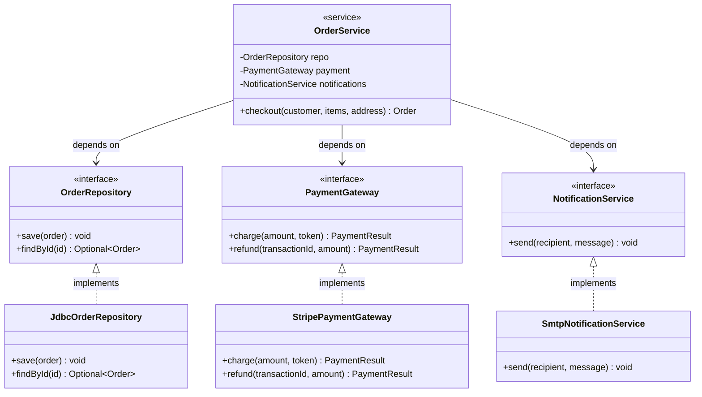

# Dependency Inversion Principle (DIP)

> "High-level modules should not depend on low-level modules. Both should depend on abstractions.
> Abstractions should not depend on details. Details should depend on abstractions."
> — Robert C. Martin

Dependency Inversion is the capstone of SOLID. It's the principle that makes the other four principles work at scale. It fundamentally redefines who "owns" an interface — and that ownership inversion is where the principle gets its name.

Without DIP, business logic is coupled to infrastructure. Changing your database, swapping your email provider, or switching HTTP clients requires touching your domain code. With DIP, the domain defines the contracts it needs and infrastructure plugs in — the dependency direction is inverted.

> **Interview relevance:** DIP underpins every architectural pattern you'll discuss in system design — Clean Architecture, Hexagonal Architecture, layered architecture. Interviewers who ask "how would you make this testable?" or "how would you swap the database?" are asking about DIP.

---

## What "Inversion" Means

In traditional layered design, the dependency flows **downward**:

```
Business Logic  -->  Database Layer  -->  MySQL Driver
```

Business logic **depends on** the database layer. If you swap MySQL for PostgreSQL, you must touch business logic. This is fragile.

DIP inverts the dependency:

```
Business Logic  -->  [Repository Interface]  <--  Database Layer
```

Business logic **defines** the `Repository` interface it needs. The database layer **implements** that interface. Now the dependency flows **toward** the abstraction from both sides. Business logic and database layer are both independent of each other — they only meet at the abstraction boundary.

The high-level module (business logic) owns the interface. The low-level module (database) is a plug-in detail.

---

## The Classic Violation: Direct Infrastructure Dependency

```java
// BAD — high-level business logic hardwired to low-level infrastructure
public class OrderService {

    // Directly instantiates concrete classes — cannot be swapped without editing OrderService
    private final MySqlOrderRepository  orderRepo    = new MySqlOrderRepository();
    private final SmtpEmailSender       emailSender  = new SmtpEmailSender("smtp.company.com");
    private final StripePaymentGateway  paymentGateway = new StripePaymentGateway("sk_live_...");

    public Order checkout(Customer customer, List<CartItem> items, Address address) {
        Order order = new Order(UUID.randomUUID().toString(), address);
        items.forEach(i -> order.addItem(i.getProduct(), i.getQuantity()));

        boolean paid = paymentGateway.charge(order.total(), customer.getCardToken());
        if (!paid) throw new PaymentException("Payment failed");

        orderRepo.save(order);
        emailSender.send(customer.getEmail(), "Order confirmed: " + order.getId());
        return order;
    }
}
```

Problems:
- **Untestable** — you cannot test `checkout()` without hitting a real MySQL database, real Stripe, and real SMTP
- **Inflexible** — swapping Stripe for PayPal requires editing `OrderService`
- **Violates OCP** — `OrderService` must be reopened to change infrastructure

---

## The DIP-Compliant Design

The domain defines the contracts it needs. Infrastructure implements them.



```java
// Abstractions defined in the DOMAIN layer — owned by business logic
public interface OrderRepository {
    void save(Order order);
    Optional<Order> findById(String orderId);
}

public interface PaymentGateway {
    PaymentResult charge(Money amount, String paymentToken);
    PaymentResult refund(String transactionId, Money amount);
}

public interface NotificationService {
    void send(String recipient, String message);
}

// High-level module — depends ONLY on abstractions it defines
public class OrderService {
    private final OrderRepository    orderRepo;
    private final PaymentGateway     paymentGateway;
    private final NotificationService notifications;

    // All dependencies injected — never constructed here
    public OrderService(OrderRepository orderRepo,
                        PaymentGateway paymentGateway,
                        NotificationService notifications) {
        this.orderRepo     = Objects.requireNonNull(orderRepo);
        this.paymentGateway = Objects.requireNonNull(paymentGateway);
        this.notifications  = Objects.requireNonNull(notifications);
    }

    public Order checkout(Customer customer, List<CartItem> items, Address address) {
        Order order = buildOrder(customer, items, address);

        PaymentResult result = paymentGateway.charge(order.total(), customer.getPaymentToken());
        if (!result.isSuccess())
            throw new PaymentException("Payment declined: " + result.reason());

        orderRepo.save(order);
        notifications.send(customer.getEmail(),
            "Order " + order.getId() + " confirmed. Total: " + order.total());
        return order;
    }

    private Order buildOrder(Customer customer, List<CartItem> items, Address address) {
        Order order = new Order(UUID.randomUUID().toString(), address);
        items.forEach(i -> order.addItem(i.getProduct(), i.getQuantity()));
        return order;
    }
}

// Low-level modules live in the INFRASTRUCTURE layer — implement the domain interfaces
public class JdbcOrderRepository implements OrderRepository {
    private final DataSource dataSource;

    public JdbcOrderRepository(DataSource dataSource) {
        this.dataSource = dataSource;
    }

    @Override
    public void save(Order order) {
        // JDBC insert — changes here never touch OrderService
    }

    @Override
    public Optional<Order> findById(String orderId) {
        // JDBC select
        return Optional.empty(); // simplified
    }
}

public class StripePaymentGateway implements PaymentGateway {
    private final String apiKey;
    private final StripeClient client;

    public StripePaymentGateway(String apiKey, StripeClient client) {
        this.apiKey = apiKey;
        this.client = client;
    }

    @Override
    public PaymentResult charge(Money amount, String token) {
        // Stripe API call
        return PaymentResult.success("txn_abc123");
    }

    @Override
    public PaymentResult refund(String transactionId, Money amount) {
        // Stripe refund
        return PaymentResult.success(transactionId);
    }
}

public class SmtpNotificationService implements NotificationService {
    private final JavaMailSender mailSender;

    public SmtpNotificationService(JavaMailSender mailSender) {
        this.mailSender = mailSender;
    }

    @Override
    public void send(String recipient, String message) {
        // SMTP send — changing to SES never touches OrderService
    }
}
```

---

## The Payoff: Testability

With DIP in place, testing `OrderService` requires **no real infrastructure**:

```java
// In-memory test double — fast, no side effects, fully controllable
class InMemoryOrderRepository implements OrderRepository {
    private final Map<String, Order> store = new HashMap<>();

    @Override public void save(Order o)                      { store.put(o.getId(), o); }
    @Override public Optional<Order> findById(String id)     { return Optional.ofNullable(store.get(id)); }
    public Order getStored(String id)                        { return store.get(id); }
}

// Fake payment — always succeeds in happy-path tests
class AlwaysSucceedPaymentGateway implements PaymentGateway {
    @Override
    public PaymentResult charge(Money amount, String token) {
        return PaymentResult.success("fake-txn-" + UUID.randomUUID());
    }
    @Override
    public PaymentResult refund(String txnId, Money amount) {
        return PaymentResult.success(txnId);
    }
}

// Fake notifier — captures what was sent for assertion
class CapturingNotificationService implements NotificationService {
    private final List<String> sent = new ArrayList<>();

    @Override
    public void send(String recipient, String message) {
        sent.add(recipient + ": " + message);
    }

    public List<String> getSent() { return Collections.unmodifiableList(sent); }
}

// Test — pure Java, runs in milliseconds, no Docker, no DB, no SMTP
class OrderServiceTest {
    private InMemoryOrderRepository    repo;
    private AlwaysSucceedPaymentGateway payment;
    private CapturingNotificationService notifications;
    private OrderService               service;

    @BeforeEach void setUp() {
        repo          = new InMemoryOrderRepository();
        payment       = new AlwaysSucceedPaymentGateway();
        notifications = new CapturingNotificationService();
        service       = new OrderService(repo, payment, notifications);
    }

    @Test void checkout_savesOrderAndSendsNotification() {
        Customer customer = new Customer("c1", "alice@example.com", "tok_test");
        List<CartItem> items = List.of(new CartItem(product("p1", 100), 2));
        Address address = new Address("123 Main St", "Springfield", "62701");

        Order result = service.checkout(customer, items, address);

        assertNotNull(result.getId());
        assertNotNull(repo.getStored(result.getId()));
        assertEquals(1, notifications.getSent().size());
        assertTrue(notifications.getSent().get(0).contains("alice@example.com"));
    }
}
```

The test for payment failure is just as easy — swap `AlwaysSucceedPaymentGateway` for `AlwaysFailPaymentGateway`. No mocking framework needed, no test database, no network.

---

## DIP and Dependency Injection

DIP tells you **what** to do: depend on abstractions. **Dependency Injection (DI)** is the primary pattern for **how** to do it — supplying dependencies from outside rather than constructing them inside.

Three forms of DI:

```java
// 1. Constructor injection (preferred — makes dependencies explicit and required)
public class OrderService {
    private final OrderRepository repo;

    public OrderService(OrderRepository repo) {   // dependency declared upfront
        this.repo = Objects.requireNonNull(repo);
    }
}

// 2. Method injection (for optional or per-call variation)
public class ReportService {
    public Report generate(DataSource source, ReportFormatter formatter) {
        // formatter injected per call — useful when it varies per request
        return formatter.format(source.load());
    }
}

// 3. Setter injection (avoid — allows partially-constructed objects)
public class EmailService {
    private NotificationSender sender;

    public void setSender(NotificationSender sender) {  // can be called after construction
        this.sender = sender;
    }
}
```

**Constructor injection is preferred** because it makes dependencies visible, prevents partially-constructed objects, and integrates naturally with DI frameworks (Spring, Guice, CDI).

---

## DIP in Layered Architecture

DIP is what defines the boundary between layers:

```
+----------------------------+
|      Domain Layer          |  Defines: Order, Customer, OrderRepository (interface)
|  (business rules, entities)|  Owns: all interfaces it needs
+----------------------------+
           ^   (depends on)
+----------------------------+
|   Application Layer        |  Defines: OrderService, CheckoutUseCase
|   (use cases, services)    |  Uses: domain interfaces — never infrastructure classes
+----------------------------+
           ^   (depends on)
+----------------------------+
| Infrastructure Layer        |  Implements: JdbcOrderRepository, StripePaymentGateway
|  (DB, email, messaging)    |  Plugs in via DI container at startup
+----------------------------+
```

The arrow points **upward** — infrastructure depends on domain, never the reverse. This is Clean Architecture / Hexagonal Architecture in a nutshell. DIP is the rule that makes the dependency arrows point the right way.

---

## DIP vs Dependency Injection vs IoC

These three terms are frequently confused:

| Term | What it is |
|---|---|
| **Dependency Inversion Principle** | Design rule: depend on abstractions, not concretions |
| **Dependency Injection (DI)** | Pattern: supply dependencies from outside, not from within |
| **Inversion of Control (IoC)** | Broader concept: framework calls your code, not the other way; DI is one form of IoC |

DIP requires DI to be practical. DI without DIP (injecting concrete classes) is better than nothing but still couples you to implementations. The combination — DI of abstract types — is the full pattern.

---

## Common DIP Mistakes

| Mistake | What happens | Fix |
|---|---|---|
| `new ConcreteClass()` inside a service | Infrastructure coupled to business logic; untestable | Constructor-inject the interface |
| Interface defined in infrastructure layer | High-level module must import from low-level | Move interface to domain layer |
| Injecting a concrete class through DI container | DIP violated even with DI framework | Bind interface → implementation in DI config |
| `@Autowired` on a concrete field | Couples to Spring's lifecycle; hard to test | `@Autowired` on constructor, `final` field |
| Service locator pattern | Global dependency lookup; hidden coupling | Use constructor injection instead |

---

## Interview Talking Points

**1. What's the difference between Dependency Inversion and Dependency Injection?**
> "DIP is the design principle: high-level modules should not depend on low-level modules; both should depend on abstractions. Dependency Injection is the implementation pattern that enables DIP: rather than constructing dependencies inside a class, you supply them from outside via constructor, setter, or method parameters. DIP tells you what to do; DI tells you how. You can violate DIP even while using a DI framework — if you're injecting concrete classes instead of interfaces, you have injection without inversion."

**2. Why should the interface be defined in the domain layer, not the infrastructure layer?**
> "Because whoever defines the interface is the one who controls it. If the database layer defines `OrderRepository`, the business logic must import from the database layer — the dependency still flows downward. When the domain layer defines `OrderRepository`, business logic owns the contract. Infrastructure implements it and depends on the domain. The direction of dependency inverts — high-level modules are no longer coupled to low-level details. This is the inversion that gives DIP its name."

**3. How does DIP relate to testability?**
> "DIP makes a class testable by construction. When all dependencies are abstract and injected, I can swap any of them for test doubles — in-memory repositories, fake payment gateways, capturing notification services. No Docker, no network, no slow integration test setup. The business logic test runs in milliseconds. Conversely, a class that uses `new ConcreteRepository()` internally is untestable without its full infrastructure stack. Testability is a direct measure of DIP compliance."

---

## Key Takeaways

- DIP = **high-level modules depend on abstractions**, not concrete low-level modules
- The **interface belongs to the module that needs it** — domain layer defines repository interfaces, infrastructure implements them
- **Dependency Injection** is how you implement DIP — supply dependencies from outside via constructor
- **Constructor injection** is preferred: explicit, complete, testable, framework-friendly
- DIP is the rule that makes the dependency arrows in Clean/Hexagonal Architecture point the right way
- With DIP, **swapping infrastructure** (DB, email, payment) never touches business logic
- With DIP, **testing business logic** needs no real infrastructure — just fast, in-memory test doubles
- Violating DIP is the most common reason services are **slow to test** and **fragile to change**
