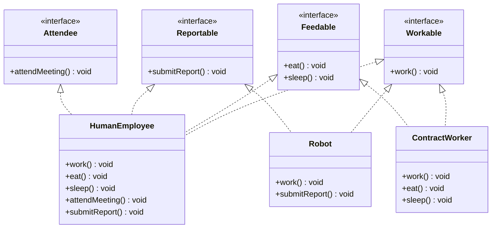

# Interface Segregation Principle (ISP)

> "Clients should not be forced to depend upon interfaces that they do not use."
> — Robert C. Martin

Interface Segregation Principle is about keeping interfaces focused and lean. When an interface grows large, implementors are forced to provide methods they don't need — either throwing `UnsupportedOperationException`, leaving empty no-ops, or returning dummy values. Each of these is a silent contract violation that erodes trust in the abstraction.

ISP says: **split fat interfaces into small, focused ones**. Clients depend only on the methods they actually call. Implementors provide only the behaviour they genuinely have.

> **Interview relevance:** ISP violations usually signal that a design didn't think carefully about who the clients are. Interviewers use ISP to test whether you separate concerns at the interface level — not just the class level.

---

## The Fat Interface Trap

```java
// BAD — one interface forces all implementors to implement everything
public interface Worker {
    void work();
    void eat();
    void sleep();
    void attendMeeting();
    void submitReport();
}
```

Now consider the implementors:

```java
public class HumanEmployee implements Worker {
    @Override public void work()          { System.out.println("Working"); }
    @Override public void eat()           { System.out.println("Eating"); }
    @Override public void sleep()         { System.out.println("Sleeping"); }
    @Override public void attendMeeting() { System.out.println("In meeting"); }
    @Override public void submitReport()  { System.out.println("Submitting report"); }
}

public class Robot implements Worker {
    @Override public void work()          { System.out.println("Processing..."); }
    @Override public void eat()           { throw new UnsupportedOperationException("Robots don't eat"); }
    @Override public void sleep()         { throw new UnsupportedOperationException("Robots don't sleep"); }
    @Override public void attendMeeting() { /* No-op — robots don't attend meetings */ }
    @Override public void submitReport()  { System.out.println("Uploading metrics"); }
}
```

`Robot` is forced to implement `eat()` and `sleep()` which are meaningless for it. Two LSP violations emerge immediately from one ISP violation. This is the chain reaction: fat interfaces breed Liskov violations.

---

## The ISP-Compliant Design

Identify the distinct **roles** — groups of related methods that clients use together — and split into one interface per role.



```java
public interface Workable {
    void work();
}

public interface Feedable {
    void eat();
    void sleep();
}

public interface Reportable {
    void submitReport();
}

public interface Attendee {
    void attendMeeting();
}

// Implements only what it genuinely supports
public class HumanEmployee implements Workable, Feedable, Reportable, Attendee {
    @Override public void work()          { System.out.println("Working"); }
    @Override public void eat()           { System.out.println("Having lunch"); }
    @Override public void sleep()         { System.out.println("Sleeping"); }
    @Override public void submitReport()  { System.out.println("Weekly report done"); }
    @Override public void attendMeeting() { System.out.println("In standup"); }
}

// Robot only implements what robots can actually do
public class Robot implements Workable, Reportable {
    @Override public void work()         { System.out.println("Processing task..."); }
    @Override public void submitReport() { System.out.println("Uploading metrics"); }
}

// Clients depend only on what they need
public class WorkflowManager {
    private final List<Workable> workers;

    public WorkflowManager(List<Workable> workers) {
        this.workers = workers;
    }

    public void runShift() {
        workers.forEach(Workable::work);
    }
}
```

`WorkflowManager` depends on `Workable` only. Adding a new type of worker — a `FreelanceBot`, a `RemoteConsultant` — only requires implementing the interfaces that are relevant. Nobody is forced to pretend they can do things they can't.

---

## Real-World Example: Printer Device Interface

The classic ISP example from Martin's original paper.

```java
// BAD — all-in-one device interface
public interface MultifunctionDevice {
    void print(Document doc);
    void scan(Document doc);
    void fax(Document doc);
    void copy(Document doc);
    void staple(Document doc);
}

// Basic printer — forced to implement scan, fax, copy, staple it doesn't have
public class BasicPrinter implements MultifunctionDevice {
    @Override public void print(Document doc) { /* actual implementation */ }
    @Override public void scan(Document doc)  { throw new UnsupportedOperationException("No scanner"); }
    @Override public void fax(Document doc)   { throw new UnsupportedOperationException("No fax"); }
    @Override public void copy(Document doc)  { throw new UnsupportedOperationException("No copier"); }
    @Override public void staple(Document doc){ throw new UnsupportedOperationException("No stapler"); }
}
```

### After ISP

```java
public interface Printable {
    void print(Document doc);
}

public interface Scannable {
    void scan(Document doc);
}

public interface Faxable {
    void fax(Document doc);
}

public interface Copyable {
    void copy(Document doc);
}

// Compose interfaces for capable devices
public interface AllInOnePrinter extends Printable, Scannable, Faxable, Copyable {
    // No new methods — just the composition
}

// BasicPrinter only commits to what it can do
public class BasicPrinter implements Printable {
    @Override
    public void print(Document doc) {
        System.out.println("Printing: " + doc.getName());
    }
}

// Full device honours all contracts honestly
public class OfficePrinter implements AllInOnePrinter {
    @Override public void print(Document doc) { /* print */ }
    @Override public void scan(Document doc)  { /* scan  */ }
    @Override public void fax(Document doc)   { /* fax   */ }
    @Override public void copy(Document doc)  { /* copy  */ }
}

// Client depends on exactly what it needs
public class PrintService {
    private final Printable printer;

    public PrintService(Printable printer) {
        this.printer = printer;
    }

    public void printAll(List<Document> docs) {
        docs.forEach(printer::print);
    }
}
```

`PrintService` works with a `BasicPrinter` or an `OfficePrinter` without caring about scan/fax/copy capabilities. New printer models only implement the interfaces they support.

---

## Real-World Example: Repository Interface

This appears constantly in backend systems.

```java
// BAD — one repository interface that every implementor must satisfy in full
public interface OrderRepository {
    void save(Order order);
    void update(Order order);
    void delete(String orderId);
    Order findById(String orderId);
    List<Order> findAll();
    List<Order> findByCustomer(String customerId);
    List<Order> findByDateRange(LocalDate from, LocalDate to);
    int countByStatus(OrderStatus status);
    void bulkInsert(List<Order> orders);
    void archiveOlderThan(LocalDate cutoff);
}
```

A `ReadOnlyOrderView` (for reporting) or an `InMemoryOrderRepository` (for testing) gets forced to implement mutations and bulk operations it genuinely doesn't support.

### After ISP

```java
// Read operations — for queries, views, reports
public interface OrderReadRepository {
    Optional<Order> findById(String orderId);
    List<Order> findByCustomer(String customerId);
    List<Order> findByDateRange(LocalDate from, LocalDate to);
    int countByStatus(OrderStatus status);
}

// Write operations — for command handlers
public interface OrderWriteRepository {
    void save(Order order);
    void update(Order order);
    void delete(String orderId);
}

// Admin operations — bulk tooling, archival jobs
public interface OrderAdminRepository {
    void bulkInsert(List<Order> orders);
    void archiveOlderThan(LocalDate cutoff);
}

// Full implementation for production
public class JdbcOrderRepository
        implements OrderReadRepository, OrderWriteRepository, OrderAdminRepository {
    // implements everything
}

// Test double — only what tests need
public class InMemoryOrderRepository implements OrderReadRepository, OrderWriteRepository {
    private final Map<String, Order> store = new HashMap<>();

    @Override
    public void save(Order order) {
        store.put(order.getId(), order);
    }

    @Override
    public Optional<Order> findById(String orderId) {
        return Optional.ofNullable(store.get(orderId));
    }

    // Other methods...
    @Override public void update(Order o) { store.put(o.getId(), o); }
    @Override public void delete(String id) { store.remove(id); }
    @Override public List<Order> findByCustomer(String cid) {
        return store.values().stream()
                    .filter(o -> o.getCustomerId().equals(cid))
                    .collect(toList());
    }
    @Override public List<Order> findByDateRange(LocalDate f, LocalDate t) { return List.of(); }
    @Override public int countByStatus(OrderStatus s) {
        return (int) store.values().stream().filter(o -> o.getStatus() == s).count();
    }
}

// Command handler only sees mutations
public class OrderCommandHandler {
    private final OrderWriteRepository writeRepo;

    public OrderCommandHandler(OrderWriteRepository writeRepo) {
        this.writeRepo = writeRepo;
    }

    public void placeOrder(Order order) {
        // validate...
        writeRepo.save(order);
    }
}

// Query handler only sees reads
public class OrderQueryService {
    private final OrderReadRepository readRepo;

    public OrderQueryService(OrderReadRepository readRepo) {
        this.readRepo = readRepo;
    }

    public List<Order> getOrdersForCustomer(String customerId) {
        return readRepo.findByCustomer(customerId);
    }
}
```

This pattern also maps naturally to **CQRS** — Command Query Responsibility Segregation. ISP at the interface level often mirrors the same separation at the architectural level.

---

## How to Identify ISP Violations

A practical checklist:

| Signal | What it means |
|---|---|
| `throw new UnsupportedOperationException()` in an override | Implementor is forced into a method it can't honour — classic ISP + LSP violation |
| Empty method bodies in an `implements` class | Silent no-op — the implementor is lying about its capabilities |
| Clients cast to a sub-interface before calling a method | The original interface was too coarse; the client already knows about narrower contracts |
| Test doubles implement 12 methods but tests only need 2 | Fat interface — split it |
| Mock setup requires stubbing methods the test doesn't care about | The client depends on too much |

---

## ISP and the Interface Composition Pattern

Small interfaces can be composed into larger ones for classes that genuinely need full capability:

```java
// Granular interfaces
public interface Readable<T>   { Optional<T> findById(String id); }
public interface Writable<T>   { void save(T entity); void delete(String id); }
public interface Searchable<T> { List<T> search(SearchCriteria criteria); }

// Composed for full implementations
public interface Repository<T> extends Readable<T>, Writable<T>, Searchable<T> {}

// Clients pick the narrowest interface they need
public class ReportingService {
    private final Readable<Order> orders;  // read-only — safe

    public ReportingService(Readable<Order> orders) {
        this.orders = orders;
    }
}
```

This is **interface composition** — small interfaces stay lean, but full implementations can satisfy all of them without code duplication.

---

## Interview Talking Points

**1. What's the relationship between ISP and LSP?**
> "ISP violations often cause LSP violations. When an implementor is forced into a method it doesn't support, it throws `UnsupportedOperationException` or returns a dummy value — both are behavioural contract breaks, which is exactly LSP. The upstream fix is ISP: by splitting the interface, the implementor only commits to what it can genuinely do, and the Liskov guarantee holds naturally."

**2. Can you go too far with ISP — too many tiny interfaces?**
> "Yes. If every method is its own interface, you lose cohesion and the design becomes noise. The guideline is to split along **client need** — group methods that the same caller uses together. If `findById` and `findByCustomer` are always called from the same service, they belong in the same interface. The smell for over-splitting: every `implements` clause has 8+ interfaces. The smell for under-splitting: any `throw new UnsupportedOperationException()` in an override."

**3. How does ISP relate to CQRS?**
> "They're conceptually aligned. ISP at the interface level says 'separate read contracts from write contracts'. CQRS at the architectural level says 'separate read models from write models'. When I apply ISP to repository interfaces — `OrderReadRepository` vs `OrderWriteRepository` — I'm naturally building the foundation for CQRS. The command handlers depend on the write repository; the query handlers depend on the read repository. Scaling, caching, and eventual consistency decisions can then be made per side independently."

---

## Key Takeaways

- ISP = **no client should be forced to depend on methods it does not use**
- Fat interfaces create **dishonest implementors** — either throwing, no-oping, or returning dummies
- Split along **client need**: group methods that the same client uses together
- Small interfaces compose naturally — `Repository<T> extends Readable<T>, Writable<T>`
- ISP violations upstream become **LSP violations** downstream — fix the interface, the Liskov problem disappears
- Practical signals: `UnsupportedOperationException`, empty overrides, mocks with unnecessary stubs
- Naturally maps to **CQRS** — read/write interface separation is CQRS at the code level
