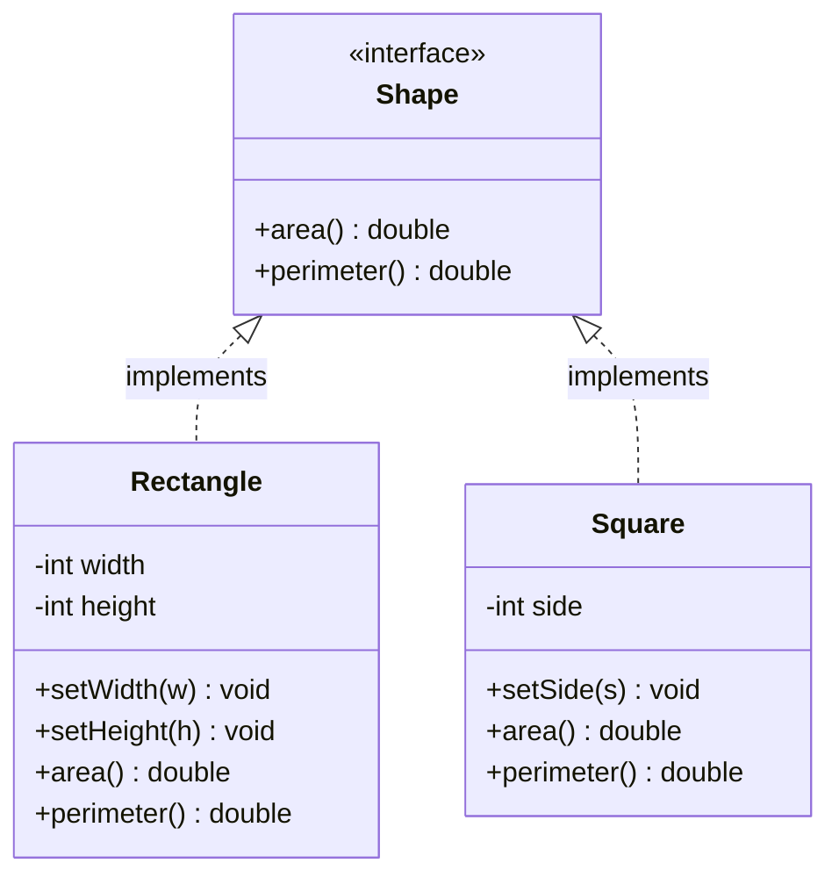

# Liskov Substitution Principle (LSP)

> "If S is a subtype of T, then objects of type T may be replaced with objects of type S without altering any of the desirable properties of the program."
> — Barbara Liskov, 1987

Liskov Substitution Principle is the most subtle of the SOLID principles. Its formal definition is dense, but the practical meaning is sharp: **a subclass must be fully substitutable for its parent class**. Code that works with the parent must work identically with the child — no surprises, no exceptions, no degraded behaviour.

Violations of LSP are particularly dangerous because they compile fine. The failure shows up at runtime, often in edge cases, when a subclass quietly breaks a contract the parent established.

> **Interview relevance:** LSP violations are the most common cause of bugs in inheritance hierarchies. Interviewers test whether you can spot them and whether you know the alternatives — usually composition or redesigning the abstraction.

---

## What "Substitutable" Really Means

LSP has precise technical conditions. A subclass must honour:

| Contract | Means |
|---|---|
| **Preconditions** | The subclass cannot demand *more* from callers than the parent does |
| **Postconditions** | The subclass must deliver *at least as much* as the parent promises |
| **Invariants** | Properties the parent maintains must also hold in the subclass |
| **No exceptions** | The subclass cannot throw exceptions the parent doesn't declare |
| **Return types** | Return values must be compatible (covariance) |

In plain English: **the child must keep every promise the parent made**.

---

## The Classic Violation: Square extends Rectangle

This is the textbook LSP violation — and it appears in almost every interview.

```java
public class Rectangle {
    protected int width;
    protected int height;

    public void setWidth(int width)   { this.width  = width; }
    public void setHeight(int height) { this.height = height; }
    public int  area()                { return width * height; }
}

// Seems logical — a square IS a rectangle...
public class Square extends Rectangle {

    @Override
    public void setWidth(int width) {
        this.width  = width;
        this.height = width;   // must keep both sides equal
    }

    @Override
    public void setHeight(int height) {
        this.width  = height;  // must keep both sides equal
        this.height = height;
    }
}
```

Now consider this perfectly reasonable client code:

```java
public class AreaTest {

    // Works with Rectangle — sets width=5, height=10, expects area=50
    public static void testArea(Rectangle r) {
        r.setWidth(5);
        r.setHeight(10);
        assert r.area() == 50 : "Expected 50, got " + r.area();
    }

    public static void main(String[] args) {
        testArea(new Rectangle()); // passes: 5*10 = 50
        testArea(new Square());    // FAILS: area = 100 (10*10, because setHeight overwrote width)
    }
}
```

`Square` silently breaks the implicit contract: *"setting width does not affect height"*. The assertion that worked for `Rectangle` fails for `Square`. **Square is not substitutable for Rectangle** — LSP is violated.

### Why the Inheritance Is Wrong

The problem is not the code — it's the model. In **geometry**, a square is a rectangle. But in **behavioural terms** (mutable setters), a square is NOT a rectangle. LSP is about *behaviour*, not taxonomy.

---

## The Fix: Redesign the Abstraction

When LSP is violated, the inheritance hierarchy is wrong. Fix it by finding the correct abstraction.



```java
public interface Shape {
    double area();
    double perimeter();
}

public class Rectangle implements Shape {
    private int width;
    private int height;

    public Rectangle(int width, int height) {
        this.width  = width;
        this.height = height;
    }

    public void setWidth(int width)   { this.width  = width; }
    public void setHeight(int height) { this.height = height; }

    @Override public double area()      { return width * height; }
    @Override public double perimeter() { return 2 * (width + height); }
}

public class Square implements Shape {
    private int side;

    public Square(int side) { this.side = side; }
    public void setSide(int side) { this.side = side; }

    @Override public double area()      { return side * side; }
    @Override public double perimeter() { return 4 * side; }
}
```

Now both `Rectangle` and `Square` implement `Shape`. Code working with `Shape` (using `area()` and `perimeter()`) works for both — LSP is satisfied. There's no `setWidth`/`setHeight` in the `Shape` contract, so `Square` doesn't need to make awkward promises it can't keep.

---

## Real-World Example: The Read-Only List

A common violation in production systems: trying to make a read-only collection look like a full collection.

```java
// VIOLATION — client can call add() on what looks like a List
public class ReadOnlyList<T> extends ArrayList<T> {

    public ReadOnlyList(Collection<T> items) {
        super(items);
    }

    @Override
    public boolean add(T item) {
        throw new UnsupportedOperationException("This list is read-only");
    }

    @Override
    public void add(int index, T item) {
        throw new UnsupportedOperationException("This list is read-only");
    }

    @Override
    public T remove(int index) {
        throw new UnsupportedOperationException("This list is read-only");
    }
}
```

This violates LSP: `ArrayList` promises `add()` works. `ReadOnlyList` throws instead. Any code expecting a `List` will break at runtime.

```java
// Client code — perfectly valid for List<T>
public void addDefault(List<String> list) {
    list.add("default");   // throws UnsupportedOperationException for ReadOnlyList
}
```

### The Fix: Use Composition, Not Inheritance

```java
// Does NOT extend List — has its own contract
public class ReadOnlyCollection<T> implements Iterable<T> {
    private final List<T> items;

    public ReadOnlyCollection(Collection<T> items) {
        this.items = List.copyOf(items);  // Java 10+ — immutable copy
    }

    public T get(int index)  { return items.get(index); }
    public int size()        { return items.size(); }
    public boolean contains(T item) { return items.contains(item); }

    @Override
    public Iterator<T> iterator() { return items.iterator(); }
}
```

Now there's no `add()` to violate. The contract is honest from the start.

---

## Real-World Example: Bird Hierarchy

Another classic: modelling birds where not all birds can fly.

```java
// VIOLATION
public class Bird {
    public void fly() {
        System.out.println("Flying...");
    }
}

public class Penguin extends Bird {
    @Override
    public void fly() {
        throw new UnsupportedOperationException("Penguins can't fly!");
    }
}

// Breaks when a Penguin is substituted
public void makeBirdFly(Bird bird) {
    bird.fly(); // throws for Penguin
}
```

### The Fix: Separate the Contracts

```java
public interface Bird {
    String species();
    void eat();
}

public interface FlyingBird extends Bird {
    void fly();
    int maxAltitudeMetres();
}

public class Eagle implements FlyingBird {
    @Override public String species() { return "Bald Eagle"; }
    @Override public void eat()       { System.out.println("Eagle hunting"); }
    @Override public void fly()       { System.out.println("Eagle soaring"); }
    @Override public int maxAltitudeMetres() { return 3000; }
}

public class Penguin implements Bird {
    @Override public String species() { return "Emperor Penguin"; }
    @Override public void eat()       { System.out.println("Penguin catching fish"); }
    // No fly() — contract is honest
}

// Code that only needs Bird never calls fly() — safe
public void feedBird(Bird bird) {
    bird.eat();
}

// Code that needs flying explicitly works with FlyingBird
public void makeItFly(FlyingBird bird) {
    bird.fly();
}
```

---

## Spotting LSP Violations

These patterns are red flags in code reviews:

```java
// Red flag 1: throw in override
@Override
public void someMethod() {
    throw new UnsupportedOperationException("Not supported");
}

// Red flag 2: empty override (silent no-op)
@Override
public void audit(Transaction t) {
    // do nothing — we don't need auditing in this subclass
}

// Red flag 3: narrowing the precondition check
@Override
public void processOrder(Order order) {
    if (order.getAmount().compareTo(MINIMUM) < 0)
        throw new IllegalArgumentException("Amount too small");
    // Parent never had this restriction
}

// Red flag 4: instanceof check in client
public void process(Animal animal) {
    if (animal instanceof Dog) {
        ((Dog) animal).fetch();  // client compensating for LSP violation
    }
}
```

The `instanceof` check in the client is the most telling: it means the subtype *cannot* be substituted transparently — the client has to discriminate.

---

## LSP and Design by Contract

LSP formalises **Design by Contract** (Bertrand Meyer's concept):

- **Preconditions**: what must be true before calling a method
- **Postconditions**: what must be true after it returns
- **Invariants**: what must always be true about the object's state

```java
public abstract class Account {

    // Precondition: amount > 0
    // Postcondition: balance decreases by amount; transaction is recorded
    // Invariant: balance >= 0 always
    public abstract void withdraw(double amount);

    // Invariant maintained by parent contract
    protected double balance;
}

// VIOLATION: SavingsAccount adds a NEW precondition (withdrawal limit)
// — caller code that worked on Account may fail on SavingsAccount
public class SavingsAccount extends Account {
    private static final double MAX_WITHDRAWAL = 50_000.0;

    @Override
    public void withdraw(double amount) {
        if (amount > MAX_WITHDRAWAL)  // Stricter precondition — LSP violation
            throw new IllegalArgumentException("Exceeds savings withdrawal limit");
        balance -= amount;
    }
}
```

The fix: make the withdrawal limit part of the `Account` contract, or use a separate type hierarchy for savings vs checking accounts.

---

## Interview Talking Points

**1. Why is Square-extends-Rectangle a Liskov violation?**
> "Because the *behavioural* contract of Rectangle includes the implicit invariant: setting width leaves height unchanged, and vice versa. Square breaks this — setting height also changes width. The mathematical relationship 'a square is a rectangle' doesn't map to a behavioural substitution relationship. The fix is to extract a common abstraction — like a `Shape` interface with `area()` and `perimeter()` — that both can implement honestly without making promises they can't keep."

**2. How do you detect LSP violations in a code review?**
> "I watch for four patterns: overrides that throw `UnsupportedOperationException`, overrides that are empty no-ops, overrides that add stricter preconditions than the parent, and `instanceof` checks in client code. The last one is the most telling — if the client needs to inspect the runtime type, it means the abstraction has broken down and the subtype cannot be substituted transparently."

**3. What's the relationship between LSP and the Open-Closed Principle?**
> "They reinforce each other. OCP says 'close existing code, extend via abstraction'. LSP ensures those extensions are trustworthy — a new subclass (the extension) must be fully substitutable for the base type. If LSP is violated, OCP breaks too: you'd need to open up client code to add `instanceof` checks every time a new subclass fails to honour the contract. LSP is what makes OCP safe."

---

## Key Takeaways

- LSP = **subclasses must be fully substitutable** for their parent types
- It's about **behavioural contracts**, not just taxonomic "is-a" relationships
- Violations compile fine but fail at runtime — often in edge cases
- **Red flags**: `UnsupportedOperationException` in overrides, empty overrides, stricter preconditions, `instanceof` in clients
- The classic violations: Square/Rectangle, ReadOnlyList, non-flying Bird
- **Fix**: redesign the abstraction (separate interfaces) or use composition instead of inheritance
- LSP makes OCP safe: without it, every new subtype forces clients to be reopened for modification
