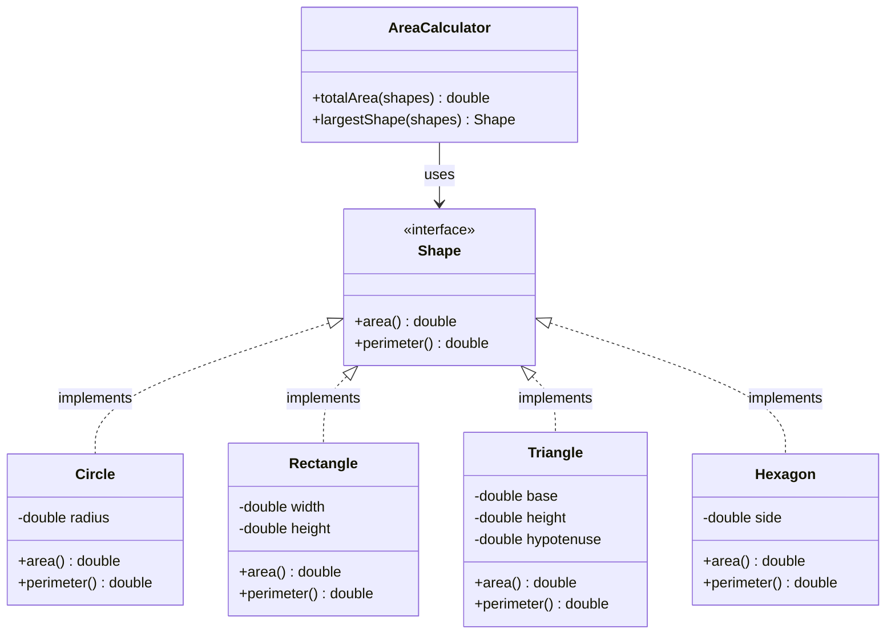

# Open-Closed Principle (OCP)

> "Software entities should be open for extension, but closed for modification."
> — Bertrand Meyer, *Object-Oriented Software Construction*

The Open-Closed Principle is the engine of extensible design. It says: once a class is tested and working, you should be able to **add new behaviour without touching its source code**. New features come from *new code*, not from *changes to existing code*.

This is not about making code immutable forever. It is about drawing a stability boundary: the existing, tested code stays stable; extension happens through polymorphism, composition, or configuration.

> **Interview relevance:** OCP violations are why adding a new payment method, a new discount type, or a new notification channel requires touching 10 different files. Interviewers look for candidates who identify and prevent this pattern.

---

## Why Modification Is Risky

Every time you open a working class and modify it, you risk:
- **Regressions** — existing tests could break
- **Merge conflicts** — multiple features touching the same file
- **Ripple effects** — other code depending on the changed class may behave differently

OCP forces you to add behaviour through **extension** — a new class, a new implementation — rather than through **modification** — editing an existing one.

---

## The Classic Violation: The Shape Area Calculator

```java
// BAD — every new shape requires modifying this class
public class AreaCalculator {

    public double calculate(Object shape) {
        if (shape instanceof Circle) {
            Circle c = (Circle) shape;
            return Math.PI * c.getRadius() * c.getRadius();

        } else if (shape instanceof Rectangle) {
            Rectangle r = (Rectangle) shape;
            return r.getWidth() * r.getHeight();

        } else if (shape instanceof Triangle) {
            Triangle t = (Triangle) shape;
            return 0.5 * t.getBase() * t.getHeight();

        } else {
            throw new IllegalArgumentException("Unknown shape: " + shape.getClass());
        }
    }
}
```

Adding a `Hexagon` means opening `AreaCalculator`, adding another `else if`, and re-testing the entire method. This class is perpetually open for modification. It will never be stable.

---

## The OCP-Compliant Design

Abstract the **varying part** — how area is calculated — into a contract. Then each shape owns its own calculation. `AreaCalculator` is closed forever.



```java
public interface Shape {
    double area();
    double perimeter();
}

public class Circle implements Shape {
    private final double radius;

    public Circle(double radius) {
        if (radius <= 0) throw new IllegalArgumentException("Radius must be positive");
        this.radius = radius;
    }

    @Override
    public double area() {
        return Math.PI * radius * radius;
    }

    @Override
    public double perimeter() {
        return 2 * Math.PI * radius;
    }
}

public class Rectangle implements Shape {
    private final double width;
    private final double height;

    public Rectangle(double width, double height) {
        this.width  = width;
        this.height = height;
    }

    @Override
    public double area() {
        return width * height;
    }

    @Override
    public double perimeter() {
        return 2 * (width + height);
    }
}

// Closed for modification — works for any Shape, forever
public class AreaCalculator {

    public double totalArea(List<Shape> shapes) {
        return shapes.stream()
                     .mapToDouble(Shape::area)
                     .sum();
    }

    public Shape largestShape(List<Shape> shapes) {
        return shapes.stream()
                     .max(Comparator.comparingDouble(Shape::area))
                     .orElseThrow(() -> new NoSuchElementException("No shapes"));
    }
}
```

Adding `Hexagon` now means writing one new class. `AreaCalculator` is never touched. Existing tests never break.

---

## Real-World Example: Payment Processing

This is the OCP example that comes up most in interviews and in production systems.

### Before OCP — The Fragile Switch

```java
// BAD — adding PayPal, Crypto, BNPL means editing this class
public class PaymentProcessor {

    public void process(Order order, String paymentType) {
        if ("CREDIT_CARD".equals(paymentType)) {
            System.out.println("Charging credit card: " + order.total());

        } else if ("UPI".equals(paymentType)) {
            System.out.println("Initiating UPI payment: " + order.total());

        } else if ("NET_BANKING".equals(paymentType)) {
            System.out.println("Net banking transfer: " + order.total());

        } else {
            throw new IllegalArgumentException("Unknown payment type: " + paymentType);
        }
    }
}
```

### After OCP — Stable Core, Extensible Strategies

```java
// The stable abstraction
public interface PaymentStrategy {
    PaymentResult charge(Money amount);
    PaymentResult refund(String transactionId, Money amount);
    String providerName();
}

// One class per provider — adding a new one never touches existing code
public class CreditCardPayment implements PaymentStrategy {
    private final String maskedNumber;
    private final CreditCardGateway gateway;

    public CreditCardPayment(String maskedNumber, CreditCardGateway gateway) {
        this.maskedNumber = maskedNumber;
        this.gateway      = gateway;
    }

    @Override
    public PaymentResult charge(Money amount) {
        return gateway.charge(maskedNumber, amount);
    }

    @Override
    public PaymentResult refund(String transactionId, Money amount) {
        return gateway.reverse(transactionId, amount);
    }

    @Override
    public String providerName() { return "CREDIT_CARD"; }
}

public class UpiPayment implements PaymentStrategy {
    private final String upiId;
    private final UpiGateway gateway;

    public UpiPayment(String upiId, UpiGateway gateway) {
        this.upiId   = upiId;
        this.gateway = gateway;
    }

    @Override
    public PaymentResult charge(Money amount) {
        return gateway.initiate(upiId, amount);
    }

    @Override
    public PaymentResult refund(String transactionId, Money amount) {
        return gateway.reverse(transactionId, amount);
    }

    @Override
    public String providerName() { return "UPI"; }
}

// CLOSED for modification — works for any PaymentStrategy forever
public class PaymentProcessor {
    private final PaymentAuditLog auditLog;

    public PaymentProcessor(PaymentAuditLog auditLog) {
        this.auditLog = auditLog;
    }

    public PaymentResult process(Order order, PaymentStrategy strategy) {
        PaymentResult result = strategy.charge(order.total());
        auditLog.record(order.getId(), strategy.providerName(), result);
        return result;
    }
}
```

Adding PayPal, Crypto, or BNPL tomorrow = one new class implementing `PaymentStrategy`. Zero risk to existing payment flows.

---

## The Three Mechanisms for OCP Extension

OCP is a goal. There are multiple implementation patterns to achieve it:

### 1. Polymorphism (most common)

```java
// Extension through subtyping
public interface Discount {
    Money apply(Money originalPrice);
}

public class PercentageDiscount implements Discount {
    private final double percent;
    public PercentageDiscount(double percent) { this.percent = percent; }

    @Override
    public Money apply(Money price) {
        return price.multiply(1.0 - percent / 100);
    }
}

public class FlatDiscount implements Discount {
    private final Money amount;
    public FlatDiscount(Money amount) { this.amount = amount; }

    @Override
    public Money apply(Money price) {
        return price.subtract(amount);
    }
}

// New discount type? New class. Order class untouched.
public class Order {
    private final List<Discount> discounts = new ArrayList<>();

    public void addDiscount(Discount discount) {
        discounts.add(discount);
    }

    public Money finalPrice() {
        Money price = subtotal();
        for (Discount d : discounts) {
            price = d.apply(price);
        }
        return price;
    }
}
```

### 2. Configuration + Strategy injection

```java
// Extension through wiring — no code changes, just config
public class ReportExporter {
    private final ExportStrategy strategy;

    public ReportExporter(ExportStrategy strategy) {
        this.strategy = strategy;
    }

    public byte[] export(Report report) {
        return strategy.render(report);
    }
}

// Inject PdfExportStrategy, CsvExportStrategy, or XlsxExportStrategy
// from configuration — zero code change required
```

### 3. Template Method (OCP via inheritance)

```java
// Stable algorithm skeleton — extension through subclassing
public abstract class DataProcessor {

    // Template method — closed
    public final void process(DataSource source) {
        List<Record> raw    = read(source);
        List<Record> clean  = validate(raw);
        List<Record> transformed = transform(clean);
        write(transformed);
    }

    protected abstract List<Record> read(DataSource source);
    protected abstract List<Record> transform(List<Record> records);

    // Default implementations — override if needed
    protected List<Record> validate(List<Record> records) {
        return records.stream()
                      .filter(r -> !r.isEmpty())
                      .collect(toList());
    }

    protected abstract void write(List<Record> records);
}

// Extension: new file format = new subclass, zero changes to DataProcessor
public class CsvDataProcessor extends DataProcessor {
    @Override
    protected List<Record> read(DataSource source) { /* parse CSV */ return List.of(); }
    @Override
    protected List<Record> transform(List<Record> records) { /* transform */ return records; }
    @Override
    protected void write(List<Record> records) { /* write output */ }
}
```

---

## OCP vs YAGNI: The Tension

OCP says "design for extension". YAGNI (You Aren't Gonna Need It) says "don't build what you don't need". These can conflict.

The resolution: **apply OCP reactively, not proactively**.

1. Build the simplest working implementation first
2. When a **second variant** appears, refactor to an abstraction
3. The abstraction is now stable and the original code is closed

> If you only ever have one payment method, the `if-else` is fine. When the **second** payment method arrives, that's your signal to extract the `PaymentStrategy` interface.

This is the **Rule of Three** applied to OCP: the third time you add a branch, you probably need an abstraction.

---

## Common OCP Mistakes

| Mistake | Symptom | Fix |
|---|---|---|
| Over-abstracting upfront | Interfaces everywhere with one implementor | Wait for the second variant |
| `if-else` on type strings | New types require editing central logic | Use polymorphism or a registry |
| Missing default case safety | Unknown types silently ignored | Fail fast with explicit exception |
| OCP violation in config | Hardcoded values changed on every release | Externalize to config files or feature flags |

---

## Interview Talking Points

**1. What's the relationship between OCP and polymorphism?**
> "OCP is the *goal*, polymorphism is the primary *mechanism*. When I extract an interface and push variant behaviour into implementations, the caller depends on the abstraction and never needs to change when a new implementation is added. The interface is the 'closed' part; the implementations are the 'open' extension points."

**2. Can you apply OCP without interfaces, using just if-else?**
> "You can't really — if-else chains require modification when new variants appear, which violates OCP. The only alternative is configuration: registering behaviour in a map or registry so new types are added via data, not code. For example, a `Map<String, PaymentStrategy>` populated at startup means adding PayPal is just registering a new entry. But that still requires writing a new `PaymentStrategy` class — you can't entirely avoid new code."

**3. When would you NOT apply OCP?**
> "When there's only one variant and no credible reason to believe a second will appear. Premature abstraction creates indirection without benefit. I follow the rule of three: the first time I implement something, I keep it simple. The second time something similar appears, I note it. The third time, I extract the abstraction. This balances extensibility against over-engineering."

---

## Key Takeaways

- OCP = **open for extension, closed for modification** — add behaviour via new code, not edited code
- The mechanism is **abstraction** — interfaces and abstract classes define stable contracts
- Apply OCP **reactively**: refactor to abstraction when the second variant appears
- The three patterns: **polymorphism** (interface + implementors), **strategy injection** (composition), **template method** (inheritance)
- `if-else` chains on type are the most common OCP violation — replace with polymorphism
- A class that is "closed" is **safe to depend on** — it will not change and break your code
