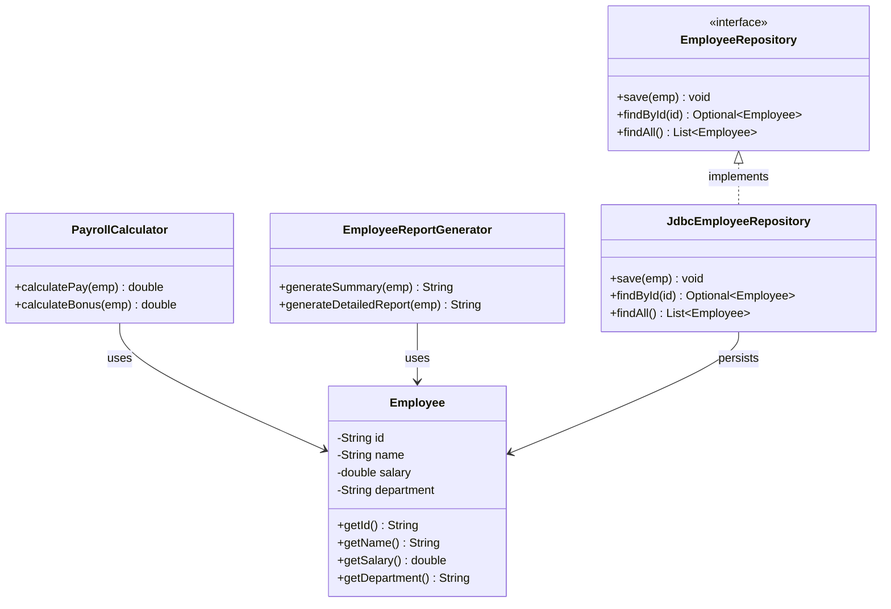

# Single Responsibility Principle (SRP)

> "A class should have only one reason to change."
> — Robert C. Martin, *Clean Code*

The Single Responsibility Principle is the most misunderstood of the SOLID principles. "One responsibility" is commonly misread as "one method" or "one task". The real definition is about **reasons to change**: a class should have exactly one actor — one stakeholder group — whose requirements can force it to change.

> **Interview relevance:** SRP is almost always the first thing violated in a greenfield project. Interviewers ask you to identify violations and refactor them — "how would you improve this design?" SRP is usually the answer.

---

## The Wrong Mental Model

Most developers hear SRP and think: "one class, one job". That's not wrong, but it's imprecise. Two seemingly unrelated operations can be one responsibility if they change for the same reason.

The precise question is: **if a requirement changes, how many classes must change?**

- If a notification format changes → does your class change?
- If a database schema changes → does your class change?
- If both of those change → does the **same** class change?

If yes to all three: that class has multiple responsibilities.

---

## The Classic Violation: The God Service

```java
// BAD — multiple reasons to change
public class EmployeeService {

    // Reason 1: HR changes payroll rules
    public double calculatePay(Employee emp) {
        double base = emp.getSalary();
        double tax  = base * 0.30;
        return base - tax;
    }

    // Reason 2: Finance changes how hours are reported
    public String generateReport(Employee emp) {
        return String.format("Employee: %s | Salary: %.2f", emp.getName(), emp.getSalary());
    }

    // Reason 3: IT changes the database schema
    public void save(Employee emp) {
        // SQL: INSERT INTO employees ...
    }
}
```

Three teams can independently change this class:
- **HR**: "We need to add overtime bonuses" → `calculatePay()` changes
- **Finance**: "Report format must include department" → `generateReport()` changes
- **IT**: "We're migrating from SQL to NoSQL" → `save()` changes

Every change risks breaking the other two features. This is a fragile class.

---

## The Refactored Design

Separate along the axis of change. Each class has exactly one actor.



```java
// <<entity>> — owns only identity + data
public class Employee {
    private final String id;
    private final String name;
    private final double salary;
    private final String department;

    public Employee(String id, String name, double salary, String department) {
        this.id         = Objects.requireNonNull(id);
        this.name       = Objects.requireNonNull(name);
        this.salary     = salary;
        this.department = Objects.requireNonNull(department);
    }

    public String getId()         { return id; }
    public String getName()       { return name; }
    public double getSalary()     { return salary; }
    public String getDepartment() { return department; }
}

// Owned by HR — changes only when payroll rules change
public class PayrollCalculator {
    private static final double TAX_RATE    = 0.30;
    private static final double BONUS_RATE  = 0.10;

    public double calculatePay(Employee emp) {
        double gross = emp.getSalary();
        return gross - (gross * TAX_RATE);
    }

    public double calculateBonus(Employee emp) {
        return emp.getSalary() * BONUS_RATE;
    }
}

// Owned by Finance — changes only when report format changes
public class EmployeeReportGenerator {

    public String generateSummary(Employee emp) {
        return String.format("[%s] %s — Dept: %s",
            emp.getId(), emp.getName(), emp.getDepartment());
    }

    public String generateDetailedReport(Employee emp) {
        return String.format("""
            Employee Report
            ---------------
            ID:         %s
            Name:       %s
            Department: %s
            Salary:     %.2f
            """,
            emp.getId(), emp.getName(),
            emp.getDepartment(), emp.getSalary());
    }
}

// Owned by IT — changes only when persistence strategy changes
public interface EmployeeRepository {
    void save(Employee emp);
    Optional<Employee> findById(String id);
    List<Employee> findAll();
}

public class JdbcEmployeeRepository implements EmployeeRepository {
    private final DataSource dataSource;

    public JdbcEmployeeRepository(DataSource dataSource) {
        this.dataSource = dataSource;
    }

    @Override
    public void save(Employee emp) {
        // JDBC insert — only this class changes if schema changes
    }

    @Override
    public Optional<Employee> findById(String id) {
        // JDBC select
        return Optional.empty(); // simplified
    }

    @Override
    public List<Employee> findAll() {
        // JDBC select all
        return List.of(); // simplified
    }
}
```

Now each class has **one reason to change**:

| Class | Changes when |
|---|---|
| `Employee` | The data model of an employee changes |
| `PayrollCalculator` | HR changes payroll or tax rules |
| `EmployeeReportGenerator` | Finance changes report format |
| `JdbcEmployeeRepository` | IT changes the database or schema |

---

## The Cohesion Test

SRP is really about **cohesion** — how tightly related are the things inside a class?

A simple heuristic: describe your class in one sentence without using "and" or "or".

- `EmployeeService` — "calculates pay **and** generates reports **and** saves to DB" ❌
- `PayrollCalculator` — "calculates employee pay based on salary and tax rules" ✓

If you need "and", you have multiple responsibilities.

---

## Real-World Example: The Notification Blob

Before SRP — a single `NotificationService` that does everything:

```java
// BAD — handles formatting, sending via email, sending via SMS, and logging
public class NotificationService {
    public void notify(User user, String event) {
        // 1. Build message (changes with UX/copy team)
        String message = "Dear " + user.getName() + ", event: " + event;

        // 2. Send email (changes with email provider)
        System.out.println("EMAIL to " + user.getEmail() + ": " + message);

        // 3. Send SMS (changes with SMS gateway)
        System.out.println("SMS to " + user.getPhone() + ": " + message);

        // 4. Log (changes with logging infrastructure)
        System.out.println("[LOG] Notification sent to " + user.getId());
    }
}
```

After SRP:

```java
// Owned by UX/copy — message templates
public class MessageFormatter {
    public String format(User user, String event) {
        return String.format("Dear %s, your %s was processed successfully.",
            user.getName(), event);
    }
}

// Owned by integrations team — email provider
public interface EmailSender {
    void send(String to, String body);
}

public class SendGridEmailSender implements EmailSender {
    @Override
    public void send(String to, String body) {
        // SendGrid API call — changes only when provider changes
    }
}

// Owned by integrations team — SMS gateway
public interface SmsSender {
    void send(String phone, String body);
}

public class TwilioSmsSender implements SmsSender {
    @Override
    public void send(String phone, String body) {
        // Twilio API call — changes only when provider changes
    }
}

// Orchestrates — owned by notification team
public class NotificationService {
    private final MessageFormatter formatter;
    private final EmailSender      emailSender;
    private final SmsSender        smsSender;

    public NotificationService(MessageFormatter formatter,
                               EmailSender emailSender,
                               SmsSender smsSender) {
        this.formatter   = formatter;
        this.emailSender = emailSender;
        this.smsSender   = smsSender;
    }

    public void notify(User user, String event) {
        String message = formatter.format(user, event);
        emailSender.send(user.getEmail(), message);
        smsSender.send(user.getPhone(), message);
    }
}
```

Now swapping from SendGrid to AWS SES touches only `SendGridEmailSender`. Changing the message template touches only `MessageFormatter`. Zero risk of cross-contamination.

---

## SRP at Different Levels

SRP applies beyond individual classes — it's a fractal principle:

| Level | Single Responsibility means... |
|---|---|
| **Method** | Does one thing, described by its name |
| **Class** | Has one reason to change, one actor |
| **Package/Module** | Groups classes that change together |
| **Microservice** | Owns one business capability end-to-end |

A method like `processOrderAndSendEmailAndUpdateInventory()` violates SRP at the method level, long before you think about class design.

---

## Common SRP Mistakes

| Mistake | Symptom | Fix |
|---|---|---|
| **Splitting too fine** | 1-method classes everywhere, constant co-changes | Group things that always change together |
| **Splitting by verb** | `OrderCreator`, `OrderSaver`, `OrderValidator` as separate classes that always move together | Keep cohesive operations together |
| **God Service** | 500-line service classes with 20 methods | Split by actor/domain subdomain |
| **Mixing infrastructure and domain** | Business logic inside a `@Repository` | Push logic to domain class, keep repository as data gateway |

> **The litmus test**: if you always modify two classes together when requirements change, they probably belong in the same class. SRP is about isolation of *independent* change vectors.

---

## Interview Talking Points

**1. What does "one reason to change" actually mean?**
> "It means one actor — one stakeholder group — should be able to cause the class to change. If HR, Finance, and IT can all independently trigger changes to the same class, it has three responsibilities. I decompose along those actor boundaries. The question I ask: if requirement X changes, which class changes? If the answer is 'multiple', I need to refactor."

**2. How do you avoid over-splitting classes?**
> "I watch for co-change: if two classes always change together in the same commit, they're probably one responsibility split across two files. The heuristic I use: can I describe this class in a single sentence without 'and'? If yes, it's likely fine. Also, I don't split proactively — I wait until I see a second reason to change emerge, then I refactor. Premature splitting creates cohesion problems."

**3. What's the relationship between SRP and testability?**
> "They're directly linked. A class with multiple responsibilities is hard to test because you need to set up unrelated context to test any single behaviour. After SRP decomposition, each class is independently testable with minimal setup. `PayrollCalculator` tests only need an `Employee` — no database, no email sender. That's a direct indicator of good SRP application."

---

## Key Takeaways

- SRP = **one reason to change**, not one method or one task
- Identify the **actor** (stakeholder group) who owns each class
- The **cohesion test**: describe the class in one sentence without "and"
- Apply at method, class, module, and service level
- **Don't over-split**: things that always change together belong together
- SRP classes are naturally **easier to test**, **easier to understand**, and **safer to modify**
