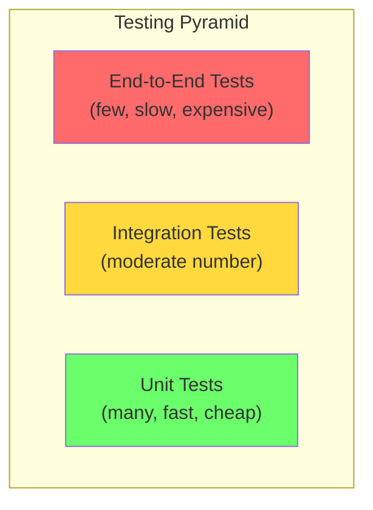
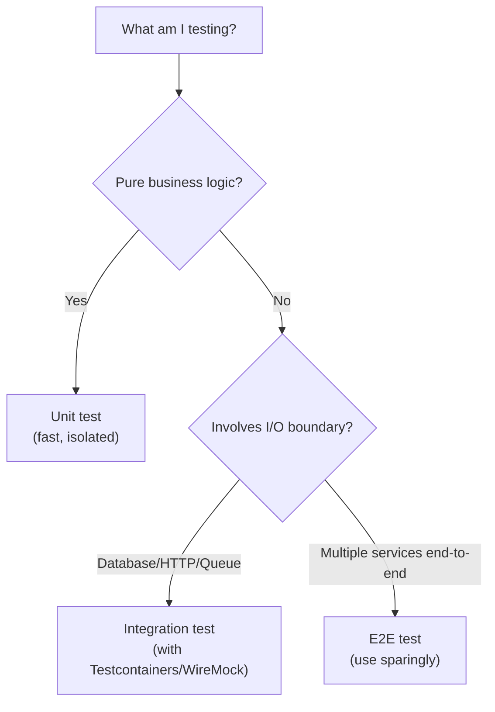

# Integration Testing

Unit tests verify that each gear spins correctly in isolation. Integration tests verify that **the gears mesh together** — that your service correctly talks to the database, that your API correctly serializes responses, that your event publisher actually reaches the message broker.

> **Interview relevance:** "How do you test the repository layer?", "How do you verify your API contract?", "What's your testing strategy for this system?" — interviewers want to see you understand the testing pyramid and know when unit tests aren't enough.

---

## Unit vs Integration vs End-to-End



| Type | Tests what | Speed | Confidence | Maintenance cost |
|---|---|---|---|---|
| **Unit** | Single class/method in isolation | ms | Low (mocks hide real issues) | Low |
| **Integration** | Multiple components working together | seconds | Medium-High | Medium |
| **E2E** | Entire system from user perspective | minutes | Highest | High (brittle) |

---

## What Integration Tests Verify

| Boundary | What can go wrong | Integration test verifies |
|---|---|---|
| **Class → Database** | Wrong SQL, missing columns, constraint violations | Actual queries execute correctly |
| **Class → HTTP API** | Serialization errors, wrong headers, timeouts | Real HTTP calls succeed |
| **Class → Message Queue** | Wrong topic, serialization format, delivery guarantees | Messages are sent and received |
| **Controller → Service** | Request parsing, response format, error mapping | HTTP contract works end-to-end |

---

## Repository Integration Tests

Testing that your data access layer correctly interacts with a real database:

```java
@DataJpaTest  // Configures an in-memory H2 database with JPA
@AutoConfigureTestDatabase(replace = AutoConfigureTestDatabase.Replace.NONE)
@Testcontainers  // Uses real PostgreSQL via Docker
class OrderRepositoryIntegrationTest {

    @Container
    static PostgreSQLContainer<?> postgres = new PostgreSQLContainer<>("postgres:15")
        .withDatabaseName("test")
        .withUsername("test")
        .withPassword("test");

    @DynamicPropertySource
    static void configureProperties(DynamicPropertyRegistry registry) {
        registry.add("spring.datasource.url", postgres::getJdbcUrl);
        registry.add("spring.datasource.username", postgres::getUsername);
        registry.add("spring.datasource.password", postgres::getPassword);
    }

    @Autowired
    private OrderRepository orderRepository;

    @Test
    void save_persistsOrderWithItems() {
        Order order = Order.create("USR-1", List.of(
            new OrderItem("PROD-1", 2, Money.of(25, "USD")),
            new OrderItem("PROD-2", 1, Money.of(50, "USD"))
        ));

        Order saved = orderRepository.save(order);

        assertNotNull(saved.getId());
        Order found = orderRepository.findById(saved.getId()).orElseThrow();
        assertEquals(2, found.getItems().size());
        assertEquals(Money.of(100, "USD"), found.getTotal());
    }

    @Test
    void findByUserId_returnsOnlyUserOrders() {
        orderRepository.save(Order.create("USR-1", List.of(item("A", 10))));
        orderRepository.save(Order.create("USR-1", List.of(item("B", 20))));
        orderRepository.save(Order.create("USR-2", List.of(item("C", 30))));

        List<Order> userOrders = orderRepository.findByUserId("USR-1");

        assertEquals(2, userOrders.size());
        assertTrue(userOrders.stream().allMatch(o -> o.getUserId().equals("USR-1")));
    }

    @Test
    void save_withDuplicateOrderId_throwsConstraintViolation() {
        Order order1 = Order.withId("ORD-DUP", "USR-1", List.of(item("A", 10)));
        Order order2 = Order.withId("ORD-DUP", "USR-2", List.of(item("B", 20)));

        orderRepository.save(order1);

        assertThrows(DataIntegrityViolationException.class,
            () -> orderRepository.save(order2));
    }
}
```

---

## API Integration Tests

Testing your HTTP endpoints with a real (or near-real) server:

```java
@SpringBootTest(webEnvironment = SpringBootTest.WebEnvironment.RANDOM_PORT)
class OrderControllerIntegrationTest {

    @Autowired
    private TestRestTemplate restTemplate;

    @Autowired
    private OrderRepository orderRepository;

    @BeforeEach
    void setUp() {
        orderRepository.deleteAll();
    }

    @Test
    void createOrder_returnsCreatedWithLocation() {
        CreateOrderRequest request = new CreateOrderRequest(
            "USR-1",
            List.of(new ItemRequest("PROD-1", 2))
        );

        ResponseEntity<OrderResponse> response = restTemplate.postForEntity(
            "/api/orders", request, OrderResponse.class);

        assertEquals(HttpStatus.CREATED, response.getStatusCode());
        assertNotNull(response.getHeaders().getLocation());

        OrderResponse body = response.getBody();
        assertNotNull(body.orderId());
        assertEquals("PENDING", body.status());
    }

    @Test
    void getOrder_whenNotFound_returns404() {
        ResponseEntity<ErrorResponse> response = restTemplate.getForEntity(
            "/api/orders/nonexistent", ErrorResponse.class);

        assertEquals(HttpStatus.NOT_FOUND, response.getStatusCode());
        assertEquals("NOT_FOUND", response.getBody().errorCode());
    }

    @Test
    void createOrder_withInvalidPayload_returns400() {
        String invalidJson = """
            { "userId": null, "items": [] }
            """;
        HttpHeaders headers = new HttpHeaders();
        headers.setContentType(MediaType.APPLICATION_JSON);

        ResponseEntity<ErrorResponse> response = restTemplate.exchange(
            "/api/orders", HttpMethod.POST,
            new HttpEntity<>(invalidJson, headers),
            ErrorResponse.class
        );

        assertEquals(HttpStatus.BAD_REQUEST, response.getStatusCode());
    }
}
```

---

## External Service Integration Tests (HTTP-Level Mocking)

When your service calls external APIs, mock the external service at the HTTP level using tools like WireMock (Java), nock (Node.js), or responses (Python):

```java
@SpringBootTest
@WireMockTest(httpPort = 8089)
class PaymentGatewayIntegrationTest {

    @Autowired
    private PaymentService paymentService;

    @Test
    void charge_successfulPayment_returnsTransactionId() {
        // Stub the external payment API response
        stubFor(post(urlEqualTo("/v1/charges"))
            .willReturn(aResponse()
                .withStatus(200)
                .withHeader("Content-Type", "application/json")
                .withBody("""
                    {
                        "transactionId": "TXN-789",
                        "status": "CAPTURED",
                        "amount": 5000
                    }
                    """)
            ));

        PaymentResult result = paymentService.charge(Money.of(50, "USD"), cardToken);

        assertEquals("TXN-789", result.getTransactionId());
        assertEquals(PaymentStatus.CAPTURED, result.getStatus());
    }

    @Test
    void charge_whenProviderTimesOut_throwsUnavailableException() {
        stubFor(post(urlEqualTo("/v1/charges"))
            .willReturn(aResponse()
                .withFixedDelay(5000)  // simulate timeout
                .withStatus(200)
            ));

        assertThrows(PaymentProviderUnavailableException.class,
            () -> paymentService.charge(Money.of(50, "USD"), cardToken));
    }

    @Test
    void charge_whenProviderReturns500_retriesAndSucceeds() {
        // First call fails, second succeeds
        stubFor(post(urlEqualTo("/v1/charges"))
            .inScenario("retry")
            .whenScenarioStateIs(Scenario.STARTED)
            .willReturn(aResponse().withStatus(500))
            .willSetStateTo("RETRY_1"));

        stubFor(post(urlEqualTo("/v1/charges"))
            .inScenario("retry")
            .whenScenarioStateIs("RETRY_1")
            .willReturn(aResponse()
                .withStatus(200)
                .withBody("""
                    { "transactionId": "TXN-RETRY", "status": "CAPTURED" }
                    """)
            ));

        PaymentResult result = paymentService.charge(Money.of(50, "USD"), cardToken);
        assertEquals("TXN-RETRY", result.getTransactionId());
    }
}
```

---

## Test Data Management

### Builders for Test Data

```java
// Test data builder — makes tests readable
public class OrderTestBuilder {
    private String userId = "USR-DEFAULT";
    private List<OrderItem> items = List.of(defaultItem());
    private OrderState state = OrderState.PENDING;

    public static OrderTestBuilder anOrder() {
        return new OrderTestBuilder();
    }

    public OrderTestBuilder forUser(String userId) {
        this.userId = userId;
        return this;
    }

    public OrderTestBuilder withItems(OrderItem... items) {
        this.items = List.of(items);
        return this;
    }

    public OrderTestBuilder inState(OrderState state) {
        this.state = state;
        return this;
    }

    public Order build() {
        Order order = Order.create(userId, items);
        if (state == OrderState.CONFIRMED) order.confirm();
        if (state == OrderState.SHIPPED) { order.confirm(); order.ship(); }
        return order;
    }
}

// Usage in tests
Order confirmedOrder = anOrder()
    .forUser("USR-123")
    .withItems(item("Laptop", 999))
    .inState(OrderState.CONFIRMED)
    .build();
```

---

## Integration Test Best Practices

| Practice | Why |
|---|---|
| Use Testcontainers for databases | Real database behaviour, not H2 quirks |
| Isolate test data (clean before each test) | Tests don't depend on execution order |
| Test error scenarios, not just happy path | Production fails in unexpected ways |
| Use WireMock for external services | Don't depend on third-party uptime |
| Keep integration tests separate from unit tests | Run them in different build phases |
| Test at the boundary, not deep internals | Fewer tests, more confidence |

---

## When to Write Integration Tests vs Unit Tests



---

## Key Takeaways

1. **Integration tests verify boundaries** — database queries, HTTP contracts, message serialization.
2. **Testcontainers** give you real database behaviour without manual setup.
3. **WireMock** lets you test external API interactions, including failures and retries.
4. **Test data builders** make integration tests readable and maintainable.
5. **Run integration tests separately** — they're slower, but they catch bugs unit tests miss.
6. In interviews, mention that your repository and API layer would have integration tests — it shows you understand the testing pyramid.
