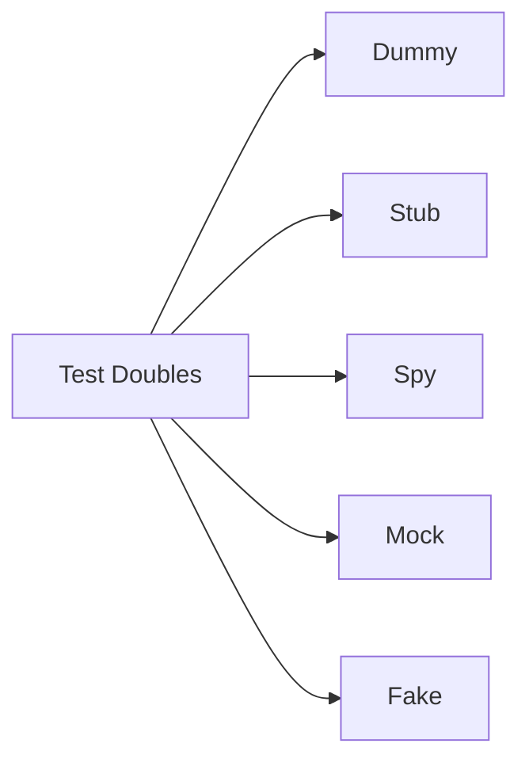
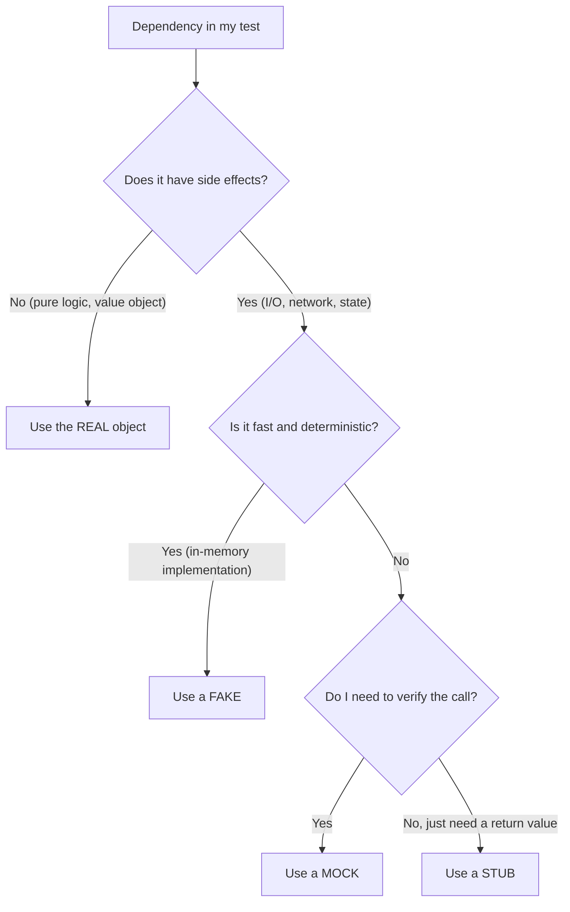

# Mocking and Fakes

When testing a `PaymentService`, you don't want to charge a real credit card. When testing an `EmailSender`, you don't want to actually send emails. **Test doubles** replace real dependencies with controllable substitutes that let you test your class in isolation.

> **Interview relevance:** "How would you test this class that depends on an external API?", "What's the difference between a mock and a stub?", "When is mocking appropriate?" — these questions test your practical testing knowledge.

---

## Types of Test Doubles



| Type | Purpose | Verifies behaviour? | Example |
|---|---|---|---|
| **Dummy** | Fills a parameter slot, never actually used | No | `null` or empty object passed to satisfy compiler |
| **Stub** | Returns canned answers to calls | No | `when(repo.findById("1")).thenReturn(user)` |
| **Spy** | Records calls for later verification | Yes (passively) | Wraps real object, tracks method calls |
| **Mock** | Pre-programmed with expectations | Yes (actively) | `verify(emailSender).send(...)` |
| **Fake** | Working implementation with shortcuts | No | In-memory database, local SMTP server |

### The Key Distinction

- **Stubs** answer questions: "What should `findById` return?"
- **Mocks** verify interactions: "Was `send()` called with these arguments?"

---

## Stubs: Controlling Inputs

Use stubs when your test needs a dependency to **return specific data**:

```java
@ExtendWith(MockitoExtension.class)
class OrderServiceTest {

    @Mock
    private InventoryService inventoryService;  // used as a STUB here

    @Mock
    private OrderRepository orderRepository;

    @InjectMocks
    private OrderService orderService;

    @Test
    void placeOrder_whenInStock_createsOrder() {
        // STUB — control what the dependency returns
        when(inventoryService.checkAvailability("PROD-1", 5))
            .thenReturn(new Availability(true, 100));
        when(orderRepository.save(any(Order.class)))
            .thenAnswer(invocation -> invocation.getArgument(0));

        Order order = orderService.placeOrder("USR-1", "PROD-1", 5);

        assertEquals(OrderState.CONFIRMED, order.getState());
    }

    @Test
    void placeOrder_whenOutOfStock_throwsException() {
        // STUB — simulate out-of-stock
        when(inventoryService.checkAvailability("PROD-1", 5))
            .thenReturn(new Availability(false, 0));

        assertThrows(OutOfStockException.class,
            () -> orderService.placeOrder("USR-1", "PROD-1", 5));
    }
}
```

---

## Mocks: Verifying Interactions

Use mocks when you need to verify that your class **called a dependency correctly**:

```java
@Test
void placeOrder_sendsConfirmationEmail() {
    when(inventoryService.checkAvailability(any(), anyInt()))
        .thenReturn(new Availability(true, 100));
    when(orderRepository.save(any())).thenAnswer(inv -> inv.getArgument(0));

    orderService.placeOrder("USR-1", "PROD-1", 2);

    // MOCK — verify the interaction happened correctly
    verify(emailService).sendOrderConfirmation(
        eq("USR-1"),
        argThat(order -> order.getProductId().equals("PROD-1"))
    );
}

@Test
void placeOrder_whenOutOfStock_doesNotSendEmail() {
    when(inventoryService.checkAvailability(any(), anyInt()))
        .thenReturn(new Availability(false, 0));

    assertThrows(OutOfStockException.class,
        () -> orderService.placeOrder("USR-1", "PROD-1", 5));

    // Verify email was NEVER sent
    verifyNoInteractions(emailService);
}
```

---

## Fakes: Lightweight Real Implementations

Fakes have working logic but take shortcuts unsuitable for production:

```java
// Fake repository — stores in memory instead of database
public class InMemoryOrderRepository implements OrderRepository {
    private final Map<String, Order> store = new ConcurrentHashMap<>();
    private final AtomicLong sequence = new AtomicLong(1);

    @Override
    public Order save(Order order) {
        if (order.getId() == null) {
            order.setId("ORD-" + sequence.getAndIncrement());
        }
        store.put(order.getId(), order);
        return order;
    }

    @Override
    public Optional<Order> findById(String id) {
        return Optional.ofNullable(store.get(id));
    }

    @Override
    public List<Order> findByUserId(String userId) {
        return store.values().stream()
            .filter(o -> o.getUserId().equals(userId))
            .collect(Collectors.toList());
    }

    // Test helper — not part of the interface
    public void clear() {
        store.clear();
        sequence.set(1);
    }
}
```

```java
// Usage in tests — no mocking framework needed
class OrderServiceTest {
    private final InMemoryOrderRepository orderRepo = new InMemoryOrderRepository();
    private final OrderService service = new OrderService(orderRepo, ...);

    @BeforeEach
    void setUp() {
        orderRepo.clear();
    }

    @Test
    void placeOrder_persistsToRepository() {
        service.placeOrder("USR-1", "PROD-1", 2);

        List<Order> orders = orderRepo.findByUserId("USR-1");
        assertEquals(1, orders.size());
    }
}
```

### When to Use Fakes vs Mocks

| Use Fakes when... | Use Mocks when... |
|---|---|
| The dependency has complex query logic | You need to verify a specific interaction |
| Multiple tests need realistic behaviour | The test is about one specific call |
| You want tests to read like real usage | You want to test error scenarios easily |
| The interface is stable | You're prototyping and the interface may change |

---

## Advanced Mocking Techniques

Every mocking framework (Mockito for Java, unittest.mock for Python, Jest for JavaScript) provides these capabilities. The concepts are universal — here's how they look in Java with Mockito:

### Argument Matchers

```java
// Exact match
verify(service).process(eq("exact-value"));

// Any value
verify(service).process(any());
verify(service).process(anyString());
verify(service).process(anyInt());

// Custom matcher
verify(service).process(argThat(order ->
    order.getTotal().isGreaterThan(Money.of(100, "USD"))
));

// Capturing arguments for detailed assertions
ArgumentCaptor<Order> captor = ArgumentCaptor.forClass(Order.class);
verify(repository).save(captor.capture());
Order savedOrder = captor.getValue();
assertEquals("USR-1", savedOrder.getUserId());
assertEquals(OrderState.CONFIRMED, savedOrder.getState());
```

### Stubbing Exceptions

```java
// Simulate failures
when(paymentService.charge(any()))
    .thenThrow(new PaymentProviderUnavailableException("Stripe down"));

// Simulate timeout
when(httpClient.post(any()))
    .thenAnswer(invocation -> {
        Thread.sleep(5000);  // simulate slow response
        return new Response(200);
    });
```

### Stubbing Consecutive Calls

```java
// First call fails, second succeeds (testing retry logic)
when(externalApi.call(any()))
    .thenThrow(new TimeoutException())   // first call
    .thenReturn(successResponse);         // second call (retry)
```

### Verify Call Count

```java
verify(emailService, times(1)).send(any());     // exactly once
verify(emailService, never()).send(any());       // never called
verify(emailService, atLeast(2)).send(any());   // at least twice
verify(emailService, atMost(3)).send(any());    // no more than 3 times
```

---

## Mocking Anti-Patterns

### Anti-Pattern 1: Mocking Everything

```java
// BAD — mocking value objects that have no side effects
when(money.getAmount()).thenReturn(BigDecimal.TEN);
when(money.getCurrency()).thenReturn(Currency.USD);

// GOOD — just use the real thing
Money money = Money.of(10, "USD");
```

**Rule:** Only mock things that have **side effects** (I/O, state mutation) or are **expensive** to create.

### Anti-Pattern 2: Testing Implementation Details

```java
// BAD — this test breaks if you refactor the internal algorithm
verify(cache).get("key");          // verifying internal caching strategy
verify(cache).put("key", result);  // test knows too much about internals

// GOOD — test the observable outcome
assertEquals(expectedResult, service.compute("key"));
// Don't care HOW it got the result (cached or not)
```

### Anti-Pattern 3: Over-Specifying Interactions

```java
// BAD — every method call is verified (brittle)
verify(repo).findById("1");
verify(validator).validate(any());
verify(repo).save(any());
verify(events).publish(any());
verifyNoMoreInteractions(repo, validator, events);

// GOOD — verify only the meaningful interactions
verify(events).publish(argThat(e -> e.getType().equals("ORDER_PLACED")));
```

---

## Deciding What to Mock



---

## Key Takeaways

1. **Stubs return data, mocks verify interactions** — use the right tool for the assertion.
2. **Don't mock value objects** — use real instances of `Money`, `Address`, `DateRange`.
3. **Fakes are underused** — `InMemoryRepository` is often better than a mock for complex queries.
4. **Test behaviour, not implementation** — if your test breaks after a refactor that doesn't change behaviour, the test is too coupled.
5. **Argument captors** are powerful for verifying complex objects passed to dependencies.
6. In interviews, explain **why** you're mocking something — "I mock the PaymentGateway because I don't want to charge a real card, and I need to test the failure path."
