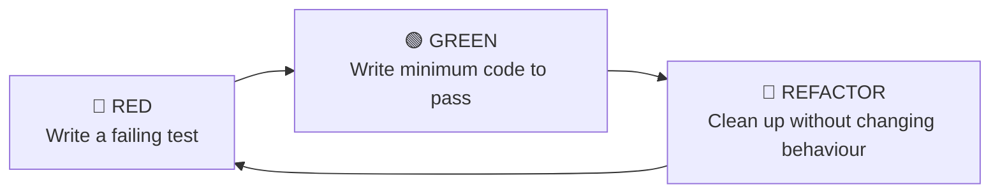

# Test-Driven Development

Most developers write code first, then write tests to verify it. TDD flips this: **write the test first**, watch it fail, then write the minimum code to make it pass. It feels backward until you experience the clarity it provides — your tests become a specification, and your design emerges clean because it's forced to be testable from the start.

> **Interview relevance:** "Walk me through how you'd implement this", "Show me your design process" — demonstrating TDD thinking (even if you don't do full TDD in the interview) shows disciplined engineering. Many interviewers specifically ask "Do you practice TDD? How?"

---

## The TDD Cycle: Red-Green-Refactor



| Phase | What you do | Duration |
|---|---|---|
| **Red** | Write one test that describes the next behaviour you want | 1-2 minutes |
| **Green** | Write the simplest code that makes the test pass (even ugly code) | 2-5 minutes |
| **Refactor** | Improve structure, remove duplication, rename — tests must stay green | 2-5 minutes |

**Critical rule:** Never write production code without a failing test. Never refactor with a failing test.

---

## TDD in Action: Building a Stack

Let's build a `Stack` class using strict TDD. Each step shows the test first, then the implementation.

### Cycle 1: A new stack is empty

```java
// RED — write the test (it won't even compile)
@Test
void newStack_isEmpty() {
    Stack<Integer> stack = new Stack<>();
    assertTrue(stack.isEmpty());
}
```

```java
// GREEN — minimum code to pass
public class Stack<T> {
    public boolean isEmpty() {
        return true;  // simplest thing that works
    }
}
```

### Cycle 2: Push makes it non-empty

```java
// RED
@Test
void afterPush_stackIsNotEmpty() {
    Stack<Integer> stack = new Stack<>();
    stack.push(42);
    assertFalse(stack.isEmpty());
}
```

```java
// GREEN — now we need real state
public class Stack<T> {
    private int size = 0;

    public void push(T item) {
        size++;
    }

    public boolean isEmpty() {
        return size == 0;
    }
}
```

### Cycle 3: Pop returns the last pushed item

```java
// RED
@Test
void pop_returnsLastPushedItem() {
    Stack<Integer> stack = new Stack<>();
    stack.push(42);
    assertEquals(42, stack.pop());
}
```

```java
// GREEN — now we need actual storage
public class Stack<T> {
    private final List<T> items = new ArrayList<>();

    public void push(T item) {
        items.add(item);
    }

    public T pop() {
        return items.remove(items.size() - 1);
    }

    public boolean isEmpty() {
        return items.isEmpty();
    }
}
```

### Cycle 4: Pop on empty stack throws exception

```java
// RED
@Test
void popOnEmptyStack_throwsException() {
    Stack<Integer> stack = new Stack<>();
    assertThrows(EmptyStackException.class, () -> stack.pop());
}
```

```java
// GREEN — add the guard
public T pop() {
    if (items.isEmpty()) {
        throw new EmptyStackException();
    }
    return items.remove(items.size() - 1);
}
```

### Refactor: The tests pass. Is the code clean? Yes — move on.

After 4 cycles, we have a working, well-tested Stack with clear error handling. The tests document exactly what the Stack does.

---

## TDD for a Real-World Class: PricingEngine

### Step 1: Simplest Rule — Base price with no discounts

```java
@Test
void noDiscount_returnsBasePrice() {
    PricingEngine engine = new PricingEngine();
    Product product = new Product("Widget", Money.of(100, "USD"));
    Customer customer = Customer.standard();

    Money price = engine.calculatePrice(product, customer);

    assertEquals(Money.of(100, "USD"), price);
}
```

```java
// GREEN
public class PricingEngine {
    public Money calculatePrice(Product product, Customer customer) {
        return product.getBasePrice();
    }
}
```

### Step 2: Premium customer discount

```java
@Test
void premiumCustomer_gets10PercentDiscount() {
    PricingEngine engine = new PricingEngine();
    Product product = new Product("Widget", Money.of(100, "USD"));
    Customer customer = Customer.premium();

    Money price = engine.calculatePrice(product, customer);

    assertEquals(Money.of(90, "USD"), price);
}
```

```java
// GREEN
public Money calculatePrice(Product product, Customer customer) {
    Money base = product.getBasePrice();
    if (customer.isPremium()) {
        return base.multiply(0.90);
    }
    return base;
}
```

### Step 3: Bulk discount (order > 10 units)

```java
@Test
void bulkOrder_getsAdditional5PercentDiscount() {
    PricingEngine engine = new PricingEngine();
    Product product = new Product("Widget", Money.of(100, "USD"));
    Customer customer = Customer.standard();

    Money price = engine.calculatePrice(product, customer, 15);  // 15 units

    assertEquals(Money.of(95, "USD"), price);  // 5% bulk discount
}
```

### Refactor: Pattern Emerges → Strategy

After 3 discount rules, we see the pattern. Time to refactor (tests stay green):

```java
// REFACTORED — Strategy pattern emerged from TDD
public class PricingEngine {
    private final List<DiscountRule> rules;

    public PricingEngine(List<DiscountRule> rules) {
        this.rules = rules;
    }

    public Money calculatePrice(Product product, Customer customer, int quantity) {
        Money price = product.getBasePrice();
        for (DiscountRule rule : rules) {
            price = rule.apply(price, customer, quantity);
        }
        return price;
    }
}

public interface DiscountRule {
    Money apply(Money currentPrice, Customer customer, int quantity);
}
```

**Key insight:** The Strategy pattern wasn't planned upfront — it **emerged** from the refactoring step when duplication appeared. This is how TDD drives clean design.

---

## The Three Laws of TDD (Robert C. Martin)

1. You may not write production code until you have a failing unit test.
2. You may not write more of a unit test than is sufficient to fail (compilation failures count).
3. You may not write more production code than is sufficient to pass the currently failing test.

---

## When TDD Works Best

| Scenario | TDD value |
|---|---|
| Complex business logic with many rules | **High** — each rule is a test, design stays clean |
| Algorithm implementation | **High** — edge cases caught incrementally |
| New class/module from scratch | **High** — design emerges testable |
| UI code | Low — behaviour is visual, hard to specify in tests |
| Exploratory/prototype code | Low — requirements are unknown |
| Glue code/configuration | Low — little logic to test |

---

## TDD Anti-Patterns

| Anti-pattern | Problem | Fix |
|---|---|---|
| **Testing implementation** | Tests break on refactoring | Test behaviour (inputs → outputs) |
| **Too-large steps** | Green phase takes 30+ minutes | Smaller increments — each cycle ≤ 10 min |
| **Skipping refactor** | Code works but becomes spaghetti | Refactor every 2-3 green cycles |
| **Testing trivial code** | Getters, setters, constructors | Only test logic that can be wrong |
| **Gold plating** | Building features no test requires | Write the test first — it defines scope |

---

## TDD and Design Emergence

TDD drives you toward certain design qualities:

| TDD pressure | Design result |
|---|---|
| "I need to test this class alone" | → Dependency injection (interfaces, not `new`) |
| "This test is hard to set up" | → Class has too many responsibilities (SRP violation) |
| "I can't test this without the database" | → Separate domain logic from I/O |
| "I need to test many scenarios" | → Polymorphism / Strategy pattern |
| "This test name is awkward" | → Method does too much (needs splitting) |

---

## Key Takeaways

1. **TDD = Red → Green → Refactor** — never skip the refactor step.
2. **Tests are a specification** — write them as if documenting what the system should do.
3. **Small steps** — each cycle should be under 10 minutes. If it's longer, the step is too big.
4. **Design emerges from refactoring** — don't plan patterns upfront, let them appear.
5. **TDD drives testable design** — if it's hard to test, the design has a problem.
6. In interviews, even if you don't do full TDD, **start with a test case** to show you think about correctness before implementation.
