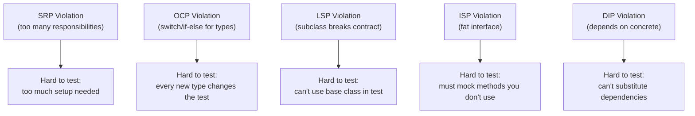
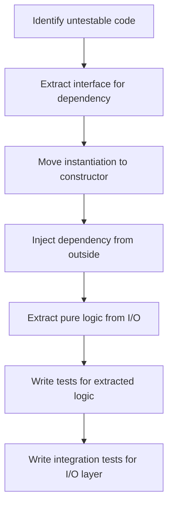

# Testable Design

Some classes are a joy to test — you create them, call a method, assert the result. Others are nightmares: they create their own dependencies internally, call static methods, access global state, and mix business logic with I/O. The difference isn't the testing framework — it's the **design**.

Testability is not a testing concern. It's a **design quality indicator**. Code that's hard to test is hard to test because it violates SOLID principles.

> **Interview relevance:** "Is this design testable?", "How would you refactor this to make it testable?", "Why is dependency injection important?" — these questions probe whether you understand the relationship between good design and testability.

---

## Why Untestable Code Exists

### The Untestable Class

```java
// UNTESTABLE — try writing a unit test for this
public class OrderProcessor {
    public void processOrder(String orderId) {
        // Problem 1: Creates its own dependency (tight coupling)
        DatabaseConnection db = new DatabaseConnection("jdbc:mysql://prod:3306/orders");

        // Problem 2: Static method call (global state)
        Order order = OrderDAO.findById(db, orderId);

        // Problem 3: Business logic mixed with I/O
        if (order.getTotal() > 1000) {
            order.setDiscount(0.1);
        }

        // Problem 4: Constructs external service internally
        EmailService email = new EmailService("smtp.company.com", 587);
        email.send(order.getCustomerEmail(), "Order processed");

        // Problem 5: Static method for side effect
        AuditLog.record("Processed order " + orderId);
    }
}
```

**Why is this untestable?**
- Can't test without a real database
- Can't test without a real SMTP server
- Can't verify the discount logic alone
- Can't test failure scenarios (what if email fails?)
- Can't run in parallel (global state)

---

## The Testable Redesign

```java
// TESTABLE — same functionality, completely different design
public class OrderProcessor {
    private final OrderRepository orderRepository;
    private final EmailService emailService;
    private final AuditService auditService;
    private final DiscountPolicy discountPolicy;

    // Dependencies are INJECTED — caller controls them
    public OrderProcessor(OrderRepository orderRepository,
                          EmailService emailService,
                          AuditService auditService,
                          DiscountPolicy discountPolicy) {
        this.orderRepository = orderRepository;
        this.emailService = emailService;
        this.auditService = auditService;
        this.discountPolicy = discountPolicy;
    }

    public void processOrder(String orderId) {
        Order order = orderRepository.findById(orderId)
            .orElseThrow(() -> new OrderNotFoundException(orderId));

        discountPolicy.apply(order);

        orderRepository.save(order);
        emailService.sendOrderConfirmation(order);
        auditService.record("Processed order " + orderId);
    }
}
```

Now testing is trivial:

```java
@ExtendWith(MockitoExtension.class)
class OrderProcessorTest {
    @Mock OrderRepository orderRepository;
    @Mock EmailService emailService;
    @Mock AuditService auditService;
    @Mock DiscountPolicy discountPolicy;
    @InjectMocks OrderProcessor processor;

    @Test
    void processOrder_appliesDiscountAndSendsEmail() {
        Order order = new Order("ORD-1", Money.of(1500, "USD"));
        when(orderRepository.findById("ORD-1")).thenReturn(Optional.of(order));

        processor.processOrder("ORD-1");

        verify(discountPolicy).apply(order);
        verify(emailService).sendOrderConfirmation(order);
        verify(auditService).record(contains("ORD-1"));
    }

    @Test
    void processOrder_whenNotFound_throwsException() {
        when(orderRepository.findById("ORD-999")).thenReturn(Optional.empty());

        assertThrows(OrderNotFoundException.class,
            () -> processor.processOrder("ORD-999"));

        verifyNoInteractions(emailService);
    }
}
```

---

## The SOLID-Testability Connection

Every SOLID violation makes testing harder:



| SOLID Principle | Testability benefit |
|---|---|
| **SRP** | Fewer tests per class, simpler setup |
| **OCP** | Add new behaviour without modifying existing tests |
| **LSP** | Test the base contract once, not per subclass |
| **ISP** | Smaller interfaces = simpler mocks |
| **DIP** | Inject test doubles via constructor |

---

## Design Patterns That Enable Testability

### Dependency Injection

The single most important technique for testable code:

```java
// HARD TO TEST — creates its own dependency
public class ReportGenerator {
    public Report generate() {
        DataSource ds = new PostgresDataSource("jdbc:...");  // can't test without DB
        // ...
    }
}

// EASY TO TEST — dependency injected
public class ReportGenerator {
    private final DataSource dataSource;

    public ReportGenerator(DataSource dataSource) {
        this.dataSource = dataSource;  // test passes InMemoryDataSource
    }
}
```

### Strategy Pattern — Test Each Strategy Independently

```java
public interface ShippingCalculator {
    Money calculate(Order order);
}

public class StandardShipping implements ShippingCalculator {
    public Money calculate(Order order) {
        return Money.of(5, "USD");
    }
}

public class ExpressShipping implements ShippingCalculator {
    public Money calculate(Order order) {
        return order.getWeight() > 10
            ? Money.of(25, "USD")
            : Money.of(15, "USD");
    }
}

// Each strategy can be unit tested in complete isolation
@Test
void expressShipping_heavyOrder_chargesMore() {
    var calculator = new ExpressShipping();
    var heavyOrder = OrderTestBuilder.anOrder().withWeight(15).build();

    assertEquals(Money.of(25, "USD"), calculator.calculate(heavyOrder));
}
```

### Separating Pure Logic from I/O

```java
// BEFORE — logic and I/O mixed (hard to test)
public class InvoiceGenerator {
    public void generateInvoice(String orderId) {
        Order order = database.findOrder(orderId);   // I/O
        double tax = order.getTotal() * 0.18;        // Logic
        double total = order.getTotal() + tax;       // Logic
        pdfService.generate(order, total);           // I/O
        emailService.send(order.getEmail(), pdf);    // I/O
    }
}

// AFTER — logic extracted into a testable pure function
public class InvoiceCalculator {
    // PURE — no I/O, no dependencies, trivially testable
    public InvoiceDetails calculate(Order order, TaxRate taxRate) {
        Money tax = order.getTotal().multiply(taxRate.rate());
        Money total = order.getTotal().add(tax);
        return new InvoiceDetails(order.getId(), order.getTotal(), tax, total);
    }
}

// Orchestrator handles I/O
public class InvoiceOrchestrator {
    private final OrderRepository repo;
    private final InvoiceCalculator calculator;
    private final PdfService pdfService;
    private final EmailService emailService;

    public void generateInvoice(String orderId) {
        Order order = repo.findById(orderId).orElseThrow();
        InvoiceDetails details = calculator.calculate(order, TaxRate.current());
        byte[] pdf = pdfService.generate(details);
        emailService.send(order.getEmail(), pdf);
    }
}
```

Now `InvoiceCalculator` is testable with zero mocks:

```java
@Test
void calculate_adds18PercentTax() {
    var order = OrderTestBuilder.anOrder().withTotal(Money.of(100, "USD")).build();
    var calculator = new InvoiceCalculator();

    var details = calculator.calculate(order, TaxRate.of(0.18));

    assertEquals(Money.of(18, "USD"), details.tax());
    assertEquals(Money.of(118, "USD"), details.total());
}
```

---

## Testability Red Flags

When you see these in code, testability (and design quality) is compromised:

| Red flag | Why it hurts | Fix |
|---|---|---|
| `new ConcreteService()` in business code | Can't substitute in tests | Inject via constructor |
| `static` methods with side effects | Can't mock, global state | Wrap in an injectable interface |
| `Singleton.getInstance()` | Hidden dependency, global state | Inject the singleton instance |
| `System.currentTimeMillis()` / `new Date()` | Tests depend on wall clock | Inject a `Clock` |
| `Thread.sleep()` in production code | Tests are slow, flaky | Use scheduled executors, inject time |
| Private methods with complex logic | Can't test directly | Extract to a collaborator class |
| God class (1000+ lines) | Too many test scenarios | Split by responsibility |

### The Clock Problem (Before and After)

```java
// UNTESTABLE — how do you test "expires after 24 hours"?
public class TokenService {
    public boolean isExpired(Token token) {
        return System.currentTimeMillis() > token.getExpiresAt();
    }
}

// TESTABLE — inject a Clock
public class TokenService {
    private final Clock clock;

    public TokenService(Clock clock) {
        this.clock = clock;
    }

    public boolean isExpired(Token token) {
        return clock.instant().isAfter(token.getExpiresAt());
    }
}

// Test with fixed time
@Test
void token_isExpired_afterExpirationTime() {
    Clock fixedClock = Clock.fixed(
        Instant.parse("2024-03-15T12:00:00Z"), ZoneOffset.UTC);
    TokenService service = new TokenService(fixedClock);
    Token token = new Token(Instant.parse("2024-03-15T11:00:00Z"));  // expired 1h ago

    assertTrue(service.isExpired(token));
}
```

---

## The Testability Checklist

Use this when designing or reviewing a class:

- [ ] Can I instantiate this class in a test without starting the application?
- [ ] Can I replace every external dependency with a test double?
- [ ] Can I test the business logic without any I/O (database, network, filesystem)?
- [ ] Can I control time, randomness, and other non-deterministic inputs?
- [ ] Can I run the test in milliseconds, not seconds?
- [ ] Can I test each behaviour independently (no prerequisite tests)?

If any answer is "no," the design needs refactoring.

---

## Refactoring Toward Testability: Step by Step



---

## Key Takeaways

1. **Testability = Good design.** If it's hard to test, it violates SOLID.
2. **Inject dependencies** — never `new` a service inside business logic.
3. **Separate pure logic from I/O** — business rules should be testable with zero mocks.
4. **Inject non-deterministic inputs** (`Clock`, `Random`) — tests must be repeatable.
5. **If you need more than 3 mocks in a test, the class has too many responsibilities** — split it.
6. In interviews, **designing for testability simultaneously** demonstrates senior-level thinking — mention "I'm keeping this interface-based so it's testable."
