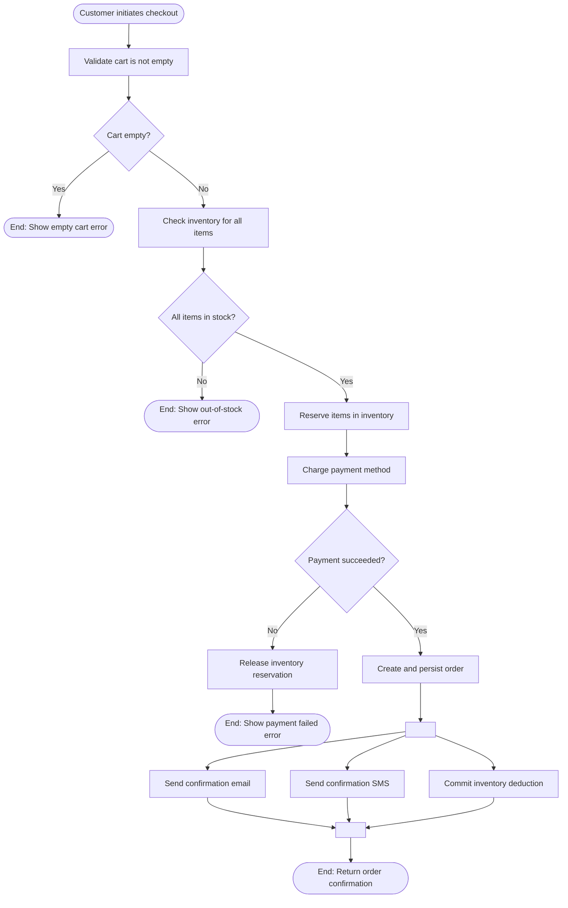
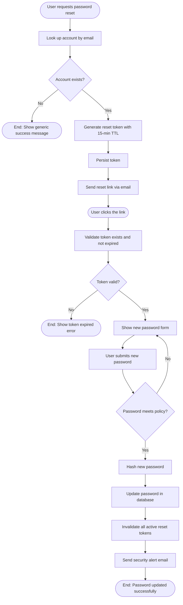
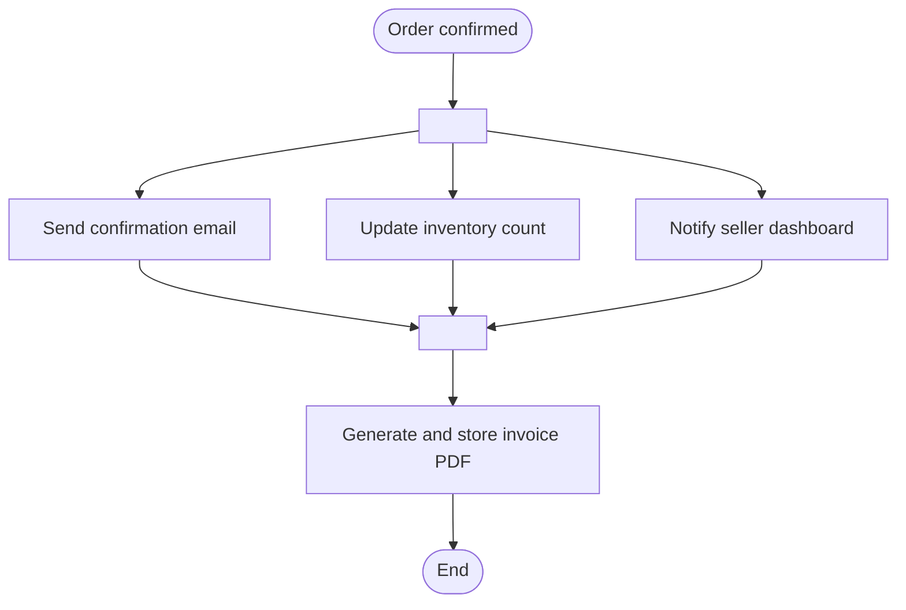
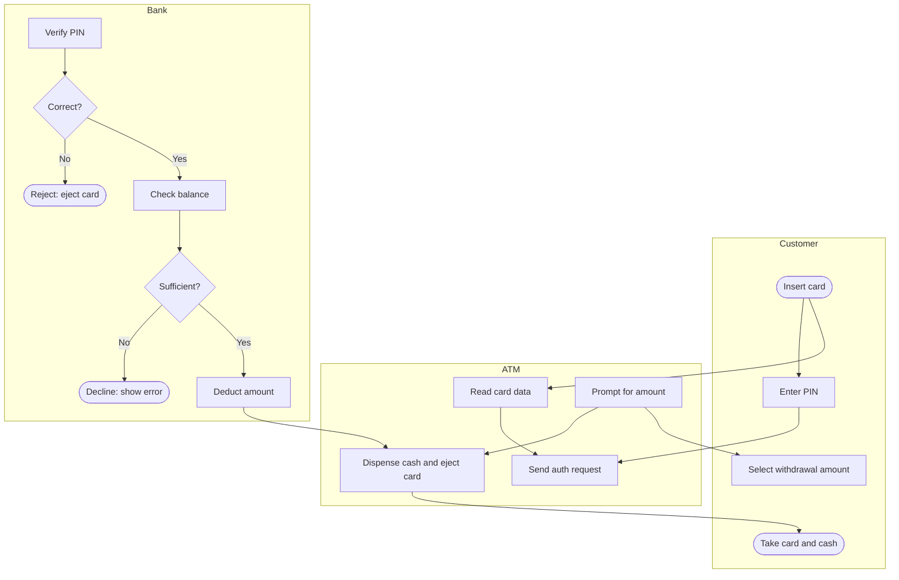

# Activity Diagrams

An activity diagram models **workflow** — the step-by-step sequence of actions required to complete a process, with explicit decision points, parallel paths, and loops. Where a sequence diagram shows *who* talks to *whom*, an activity diagram shows *what happens* in what order, and under what conditions.

Think of it as a structured, UML-flavoured flowchart for business processes and algorithmic logic.

> **Interview relevance:** Activity diagrams help clarify complex business rules before you touch the class or sequence diagram. "Walk me through the order cancellation flow", "how does a user reset their password?" — drawing an activity diagram forces you to reason through every branch and edge case systematically.

---

## Key Notation

| Element | Shape | Meaning |
|---|---|---|
| **Initial node** | Filled circle | Where the activity starts |
| **Final node** | Filled circle in ring | Where the activity ends |
| **Action** | Rounded rectangle | A single unit of work |
| **Decision** | Diamond | Branching point — one input, multiple guarded outputs |
| **Merge** | Diamond | Re-joins branches — multiple inputs, one output |
| **Fork** | Thick horizontal bar | Split into parallel concurrent paths |
| **Join** | Thick horizontal bar | Wait for all parallel paths to complete |
| **Swim lane** | Vertical column | Partition actions by responsible actor or component |

> **Mermaid note:** Mermaid has no dedicated activity diagram type. Use `flowchart TD` (top-down flowchart) — it is functionally equivalent and widely understood. `flowchart LR` for left-right layouts in wide diagrams.

---

## Example 1: Order Placement Workflow

Full checkout flow — validation, stock reservation, payment, and async notifications.



The Java that implements this flow:

```java
@Service
public class CheckoutService {
    private final CartRepository    cartRepo;
    private final InventoryService  inventory;
    private final PaymentGateway    payments;
    private final OrderRepository   orderRepo;
    private final NotificationService notify;

    public Order checkout(String cartId, PaymentDetails paymentDetails) {
        // Validate cart
        Cart cart = cartRepo.findById(cartId).orElseThrow(CartNotFoundException::new);
        if (cart.isEmpty()) throw new EmptyCartException();

        // Reserve stock
        ReservationToken reservation = inventory.reserveAll(cart.getItems());

        // Attempt payment — compensate on failure
        PaymentConfirmation confirmation;
        try {
            confirmation = payments.charge(paymentDetails, cart.total());
        } catch (PaymentException e) {
            inventory.release(reservation);   // compensation
            throw e;
        }

        // Persist order
        Order order = Order.from(cart, confirmation);
        orderRepo.save(order);

        // Parallel post-order tasks (fork/join)
        CompletableFuture<Void> emailFuture = CompletableFuture.runAsync(
            () -> notify.sendConfirmationEmail(order));
        CompletableFuture<Void> smsFuture = CompletableFuture.runAsync(
            () -> notify.sendConfirmationSms(order));
        CompletableFuture<Void> inventoryFuture = CompletableFuture.runAsync(
            () -> inventory.commit(reservation));

        CompletableFuture.allOf(emailFuture, smsFuture, inventoryFuture).join();  // join

        return order;
    }
}
```

---

## Example 2: Password Reset Flow

Decision-heavy flow with a time-limited token and a security consideration: return a generic success even when the email doesn't exist (to prevent user enumeration).



Note the self-loop on `ShowForm` when the password is too weak — the user stays on the same form. This is a detail easily missed without an activity diagram.

---

## Fork and Join: Concurrent Steps

Fork splits the flow into parallel paths; join waits for all of them. In Java this maps directly to `CompletableFuture.allOf()`:



```java
// Three parallel post-order tasks, then a sequential one after all complete
public void postOrderWork(Order order) {
    var email    = CompletableFuture.runAsync(() -> notify.email(order));
    var inv      = CompletableFuture.runAsync(() -> inventory.commit(order));
    var seller   = CompletableFuture.runAsync(() -> sellerService.notify(order));

    CompletableFuture.allOf(email, inv, seller)           // join
        .thenRun(() -> invoiceService.generate(order))    // sequential step after join
        .join();
}
```

---

## Swim Lanes: Partitioning by Actor

Swim lanes show which step is performed by which actor or system. Use `subgraph` in Mermaid flowcharts to approximate lanes:



---

## Activity vs Sequence: When to Use Which

| Question | Activity Diagram | Sequence Diagram |
|---|---|---|
| What are all the steps in this process? | ✅ | |
| What are the decision points and branches? | ✅ | ✅ alt/opt |
| Who calls whom with what parameters? | | ✅ |
| What are the concurrent steps? | ✅ Fork/Join | ✅ par |
| What is the business logic end to end? | ✅ | |
| Which object is responsible for each action? | | ✅ |

**Rule of thumb:** Activity diagram to understand *business logic and workflow*. Sequence diagram to understand *object collaboration and message passing*.

---

## Interview Talking Points

**1. When would you draw an activity diagram instead of a sequence diagram?**
> "I use an activity diagram to clarify the business process — all the steps, decision points, and branches — before committing to a class or sequence design. It answers 'what needs to happen?' without locking in which class does what. Once the workflow is clear, I layer on a sequence diagram to show which objects collaborate and how. In an interview, an activity diagram is especially useful for complex conditional flows — like order cancellation with different rules for paid vs. unpaid orders — because the diamond decision nodes make every branch explicit."

**2. How do you model concurrent steps in an activity diagram?**
> "With a fork and join. A fork bar splits the flow into multiple parallel paths that execute simultaneously. A join bar waits for all of them to complete before the flow continues. In code, this maps to `CompletableFuture.allOf()` or a thread pool. The key design decision is identifying which steps are genuinely independent — sending a confirmation email, committing inventory, and notifying the seller are all independent post-order actions, so they belong in a fork rather than in sequence. Making concurrency explicit in the diagram often reveals unnecessary sequential bottlenecks."

**3. How do you show error handling and compensation in an activity diagram?**
> "With decision diamonds and explicit error paths. After each action that can fail, I add a diamond with two exits: success continues down, failure branches to a compensation action or a terminal error node. The compensation step is especially important — releasing an inventory reservation when payment fails, or rolling back a database write when the downstream API fails. Drawing these paths explicitly forces me to think through every rollback scenario, which is exactly what an interviewer is probing when they ask 'what happens if payment fails halfway through checkout?'"

---

## Key Takeaways

- Activity diagrams model **workflow** — steps, decisions, parallel paths, and loops
- Use `flowchart TD` in Mermaid as the standard activity diagram representation
- Decision diamonds have multiple guarded outputs; merge diamonds re-join them
- **Fork/Join** models parallel execution — maps directly to `CompletableFuture.allOf()`
- **Swim lanes** (`subgraph`) partition actions by responsible actor or component
- Use activity diagrams to clarify **business logic**; use sequence diagrams to clarify **object collaboration**
- Always draw the **failure and compensation paths** — they reveal the hardest design decisions
