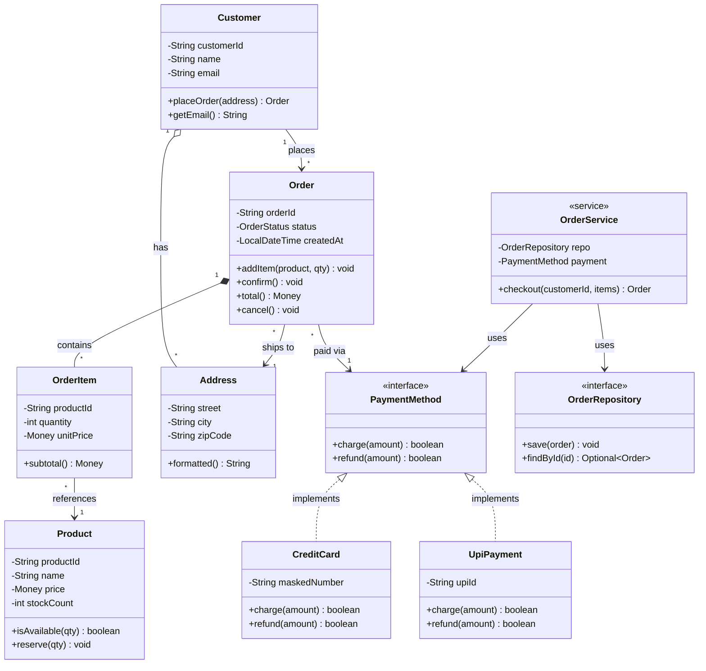

# Class Diagrams

A class diagram is the cornerstone of UML and the primary artefact of Low-Level Design. It shows the **static structure** of a system: what classes exist, what data they hold, what behaviour they expose, and how they relate to each other.

In an LLD interview, your class diagram *is* your design. The moment you put pen to whiteboard, the interviewer is evaluating your class hierarchy, your coupling decisions, and whether you apply SOLID principles instinctively.

> **Interview relevance:** Every LLD interview — "design a parking lot", "design a library system", "design a notification service" — begins here. Class diagrams are the universal language between engineers, architects, and interviewers.

---

## The Three-Compartment Class Box

```
+----------------------------+
|       ClassName            |  <- Class name (PascalCase)
+----------------------------+
|  - fieldName: Type         |  <- Attributes / state
|  # protectedField: Type    |
+----------------------------+
|  + methodName(): Return    |  <- Methods / behaviour
|  - privateHelper(): void   |
+----------------------------+
```

### Visibility Modifiers

| Symbol | Modifier | Accessible from |
|---|---|---|
| `+` | `public` | Everywhere |
| `-` | `private` | Class only |
| `#` | `protected` | Class + subclasses |
| `~` | package-private | Same package |

### Stereotypes

| Stereotype | Meaning |
|---|---|
| `<<interface>>` | Pure contract — no state, no implementation |
| `<<abstract>>` | Partial blueprint — cannot be instantiated |
| `<<service>>` | Stateless orchestrator of business logic |
| `<<repository>>` | Data-access abstraction |
| `<<entity>>` | Domain object with unique identity |
| `<<value>>` | Immutable, equality by all fields |

---

## Relationship Quick Reference

| Arrow | Name | Code signal | Coupling |
|---|---|---|---|
| `A *-- B` filled diamond | **Composition** | `new B()` inside A | Strongest |
| `A o-- B` hollow diamond | **Aggregation** | B passed into A | Strong |
| `A <\|-- B` solid triangle | **Inheritance** | `B extends A` | Structural |
| `A <\|.. B` dashed triangle | **Realization** | `B implements A` | Structural |
| `A --> B` open arrow | **Association** | A holds field of type B | Moderate |
| `A ..> B` dashed arrow | **Dependency** | B appears as method param | Weakest |

Multiplicity goes at each end of the relationship line:
- `1` — exactly one
- `*` — zero or more
- `0..1` — optional
- `1..*` — at least one

---

## Full Example: E-Commerce Order System

Designing the core of an e-commerce platform. A `Customer` places `Order`s. Each `Order` contains `OrderItem`s linked to `Product`s, ships to an `Address`, and is paid via a `Payment` strategy.



---

## The Java Behind the Diagram

```java
// <<entity>> — composition owner
public class Order {
    private final String orderId;
    private final List<OrderItem> items = new ArrayList<>();   // composition *--
    private final Address shippingAddress;                     // association -->
    private PaymentMethod paymentMethod;                       // association -->
    private OrderStatus status = OrderStatus.PENDING;

    Order(String orderId, Address shippingAddress) {           // package-private: only OrderService creates
        this.orderId         = Objects.requireNonNull(orderId);
        this.shippingAddress = Objects.requireNonNull(shippingAddress);
    }

    public void addItem(Product product, int quantity) {
        if (!product.isAvailable(quantity))
            throw new IllegalStateException("Out of stock: " + product.getProductId());
        items.add(new OrderItem(product.getProductId(), quantity, product.getPrice()));
        product.reserve(quantity);
    }

    public void setPaymentMethod(PaymentMethod method) {
        this.paymentMethod = Objects.requireNonNull(method);
    }

    public void confirm() {
        if (paymentMethod == null)
            throw new IllegalStateException("No payment method attached");
        if (!paymentMethod.charge(total()))
            throw new PaymentException("Payment declined");
        this.status = OrderStatus.CONFIRMED;
    }

    public Money total() {
        return items.stream()
                    .map(OrderItem::subtotal)
                    .reduce(new Money(0, "USD"), Money::add);
    }

    public void cancel() {
        if (status == OrderStatus.SHIPPED)
            throw new IllegalStateException("Cannot cancel a shipped order");
        if (status == OrderStatus.CONFIRMED)
            paymentMethod.refund(total());
        this.status = OrderStatus.CANCELLED;
    }
}

// Package-private: only Order can create OrderItems — enforces composition
final class OrderItem {
    private final String productId;
    private final int    quantity;
    private final Money  unitPrice;

    OrderItem(String productId, int quantity, Money unitPrice) {
        if (quantity <= 0) throw new IllegalArgumentException("Quantity must be positive");
        this.productId = productId;
        this.quantity  = quantity;
        this.unitPrice = unitPrice;
    }

    public Money subtotal() {
        return new Money(unitPrice.amountCents() * quantity, unitPrice.currency());
    }
}

// <<interface>> — realization target for CreditCard, UpiPayment
public interface PaymentMethod {
    boolean charge(Money amount);
    boolean refund(Money amount);
}

public class CreditCard implements PaymentMethod {
    private final String maskedNumber;
    private final String expiryMonth;

    public CreditCard(String maskedNumber, String expiryMonth) {
        this.maskedNumber = maskedNumber;
        this.expiryMonth  = expiryMonth;
    }

    @Override public boolean charge(Money amount) {
        // call card network API
        return true;
    }

    @Override public boolean refund(Money amount) {
        // reverse charge
        return true;
    }
}

// <<service>> — orchestrates the checkout use case
public class OrderService {
    private final OrderRepository orderRepo;    // association via interface
    private final PaymentMethod   payment;      // association via interface

    public OrderService(OrderRepository repo, PaymentMethod payment) {
        this.orderRepo = Objects.requireNonNull(repo);
        this.payment   = Objects.requireNonNull(payment);
    }

    public Order checkout(Customer customer, List<CartItem> items, Address address) {
        Order order = new Order(UUID.randomUUID().toString(), address);
        items.forEach(i -> order.addItem(i.getProduct(), i.getQuantity()));
        order.setPaymentMethod(payment);
        order.confirm();
        orderRepo.save(order);
        return order;
    }
}
```

---

## Relationship Decision Guide

| If you can say... | Use |
|---|---|
| "B is a type of A" | Inheritance `<\|--` |
| "B fulfils the contract of A" | Realization `<\|..` |
| "A owns B; B dies when A dies" | Composition `*--` |
| "A has B; B can exist independently" | Aggregation `o--` |
| "A knows about B permanently" | Association `-->` |
| "A uses B only during a method call" | Dependency `..>` |

---

## Common Mistakes

| Mistake | Fix |
|---|---|
| All relationships drawn the same | Differentiate: composition vs aggregation vs association |
| No multiplicity labels | Add `"1"`, `"*"`, `"0..1"` at both ends of every line |
| God class with 15+ methods | Apply SRP — break into focused collaborating classes |
| Concrete class dependencies everywhere | Introduce interfaces (Dependency Inversion Principle) |
| Bidirectional associations everywhere | Prefer unidirectional; add reverse only when runtime navigation requires it |
| Missing stereotypes | Mark `<<interface>>`, `<<abstract>>`, `<<service>>` — it communicates intent |

---

## Interview Talking Points

**1. How do you start a class diagram in an LLD interview?**
> "I start by identifying the core domain entities from the requirements — the nouns. I then ask what each one is responsible for — the verbs. I lay out entities as classes with key attributes and methods, then draw relationships: is this composition (Order owns OrderItem) or aggregation (Department references Employee)? I add multiplicity to every line. Finally, I look for shared behaviour that should become an interface or abstract class, and I convert concrete dependencies to interface dependencies to apply DIP."

**2. When would you use an abstract class vs an interface?**
> "Interface when I want a contract multiple unrelated classes can fulfil — like `PaymentMethod` implemented by `CreditCard` and `UpiPayment`. The caller depends only on the abstraction. Abstract class when related subclasses share both a contract AND some implementation — like `DataProcessor` with a template method that orchestrates steps. The rule: if there's shared state or a shared algorithm skeleton, lean toward abstract class. If it's purely a contract, use an interface. When in doubt, prefer interface — you can only extend one class, but implement many interfaces."

**3. How do you decide the direction of an association arrow?**
> "Direction follows navigation need at runtime. `Order` points to `Customer` because Order needs to retrieve the customer's email for notifications. If Customer never needs to list its Orders at runtime, I don't draw the reverse — I'd query Orders through a repository. Ask: does this class actually need to reach the other object during execution? Unnecessary bidirectionality adds coupling without benefit. If both sides genuinely need each other, I draw both arrows and ensure one method manages both ends to keep them consistent."

---

## Key Takeaways

- Class diagrams show **static structure** — classes, attributes, methods, and relationships
- Learn and distinguish the six relationship types: composition, aggregation, association, inheritance, realization, dependency
- Always mark **multiplicity** at both ends of every relationship line
- Visibility symbols (`+`, `-`, `#`, `~`) communicate your encapsulation intent
- Use `<<interface>>` to separate contracts from implementations — enables Dependency Inversion
- Draw arrows in the **direction of navigation** — from the class that needs to reach the other
- A good LLD class diagram has: one responsibility per class, explicit relationship types, and interface-driven dependencies
