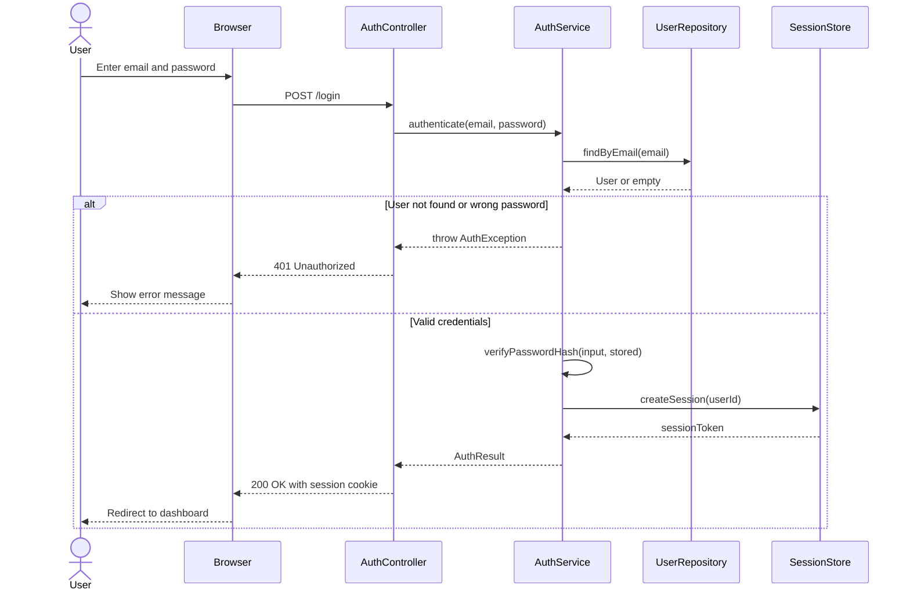
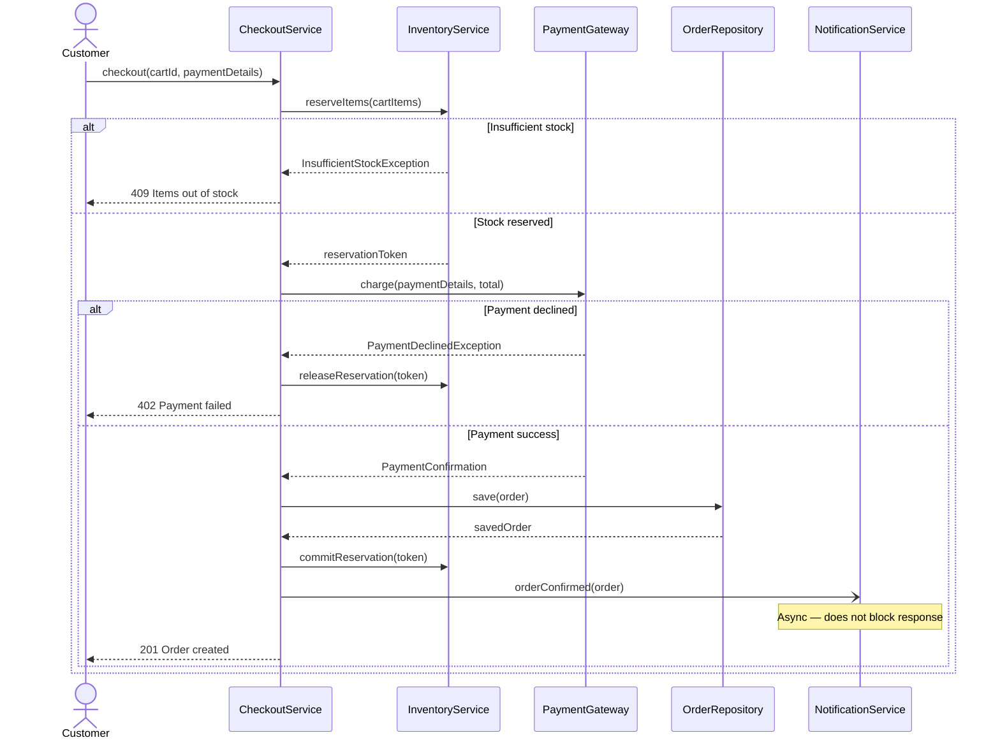
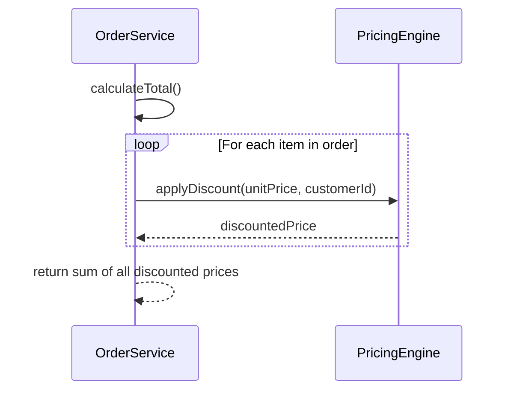
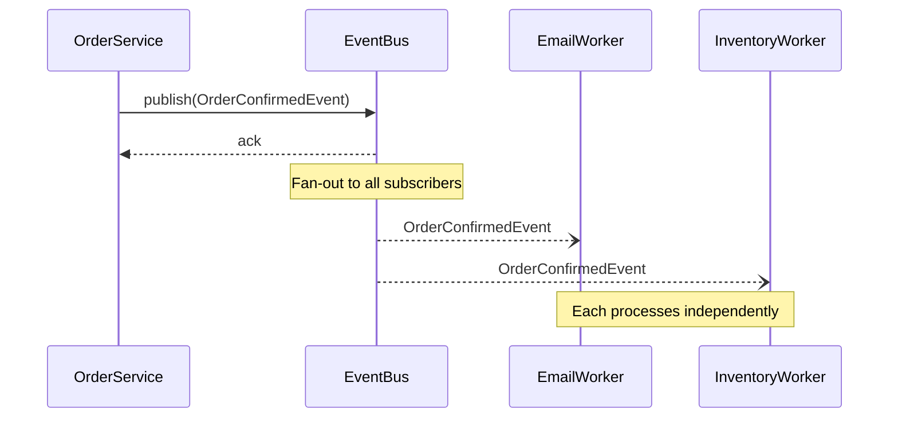

# Sequence Diagrams

A sequence diagram shows **how objects interact over time** to complete a specific operation. Where a class diagram shows structure, a sequence diagram shows behaviour — the exact messages that flow between objects, in order, to accomplish a use case.

Think of it as a wiretap on your running system: you see every call, every response, and who is talking to whom, in what order.

> **Interview relevance:** Whenever an interviewer says "walk me through the login flow" or "how does the system handle a failed payment?", they want a sequence diagram. Drawing one signals that you've thought about runtime behaviour, not just static structure.

---

## Key Notation

| Element | Meaning |
|---|---|
| **Participant** | A named object or actor in the interaction |
| **Actor** | A human user (rendered as a stick figure with `actor` keyword) |
| **Lifeline** | The vertical dashed line — represents an object's existence over time |
| **Solid arrow `->>` ** | Synchronous message — caller blocks and waits for a response |
| **Dashed arrow `-->>`** | Return message — the response traveling back |
| **Async arrow `-)` / `--)` ** | Asynchronous message — fire and forget, caller does not wait |
| **Self-call** | Arrow from a participant back to itself |
| **`Note over X`** | An annotation next to participant X |
| **`Note over X,Y`** | An annotation spanning participants X through Y |

## Interaction Fragments

| Fragment | Purpose | Example |
|---|---|---|
| `alt` / `else` | If-else branching | Valid credentials vs invalid |
| `opt` | Optional step (only if condition is true) | Send SMS if phone is on file |
| `loop` | Repetition | Retry payment up to 3 times |
| `par` | Parallel execution | Send email AND SMS concurrently |
| `ref` | Reference to another diagram | Avoid repeating a sub-flow |

---

## Example 1: User Login Flow

User submits credentials; the system authenticates and creates a session token.



The Java implementation of this exact flow:

```java
@RestController
public class AuthController {
    private final AuthService authService;

    public AuthController(AuthService authService) {
        this.authService = authService;
    }

    @PostMapping("/login")
    public ResponseEntity<AuthResponse> login(@RequestBody LoginRequest request) {
        try {
            AuthResult result = authService.authenticate(
                request.getEmail(), request.getPassword()
            );
            return ResponseEntity.ok()
                .header("Set-Cookie", "session=" + result.getSessionToken() + "; HttpOnly")
                .body(new AuthResponse(result.getUserId()));
        } catch (AuthException e) {
            return ResponseEntity.status(HttpStatus.UNAUTHORIZED).build();
        }
    }
}

@Service
public class AuthService {
    private final UserRepository userRepository;
    private final SessionStore   sessionStore;
    private final PasswordHasher hasher;

    public AuthService(UserRepository repo, SessionStore store, PasswordHasher hasher) {
        this.userRepository = repo;
        this.sessionStore   = store;
        this.hasher         = hasher;
    }

    public AuthResult authenticate(String email, String password) {
        // Step 1: find user
        User user = userRepository.findByEmail(email)
            .orElseThrow(() -> new AuthException("Invalid credentials"));

        // Step 2: verify hash (self-call in the diagram)
        if (!hasher.verify(password, user.getPasswordHash()))
            throw new AuthException("Invalid credentials");

        // Step 3: create session
        String token = sessionStore.createSession(user.getUserId());
        return new AuthResult(token, user.getUserId());
    }
}
```

---

## Example 2: Order Checkout with Error Handling

A more complex flow — multiple collaborators, compensation on failure, and async post-order work.



Key design decisions visible in the diagram:
- **Reservation before payment** — prevents overselling; released on payment failure (compensation)
- **Commit reservation after payment** — only permanently deduct stock on success
- **Notification is async** (`-)` arrow) — email/SMS doesn't block the customer's response

---

## Self-Calls and Loops



---

## Asynchronous and Event-Driven Flows

In event-driven systems, a publisher fires an event and multiple consumers react independently. The `--)` syntax (dashed open arrow) represents an async delivery:



---

## Reading a Sequence Diagram: Checklist

1. **Time flows top to bottom** — earlier events are higher
2. **Solid arrow = synchronous** — sender blocks; dashed = return or async
3. **Model the unhappy path** — always include at least one `alt` for failure
4. **One diagram per use case** — don't cram three flows into one
5. **Async calls get `--)` arrows** — and a `Note` to make it explicit
6. **Validate your class diagram** — every arrow must correspond to a method that exists

---

## Interview Talking Points

**1. What is the difference between a class diagram and a sequence diagram?**
> "A class diagram shows static structure — what classes exist and how they relate at design time. A sequence diagram shows dynamic behaviour — how specific objects collaborate at runtime to complete a use case. I use both in LLD interviews: the class diagram to lay out the design, and then a sequence diagram to validate it — to prove that my classes can actually cooperate to handle the key flows. If I can't draw the sequence diagram from the class diagram, it means my design has a gap."

**2. How do you model error paths in a sequence diagram?**
> "With `alt` fragments. The first block is the happy path; each `else` block models a failure mode. I always include the main failure — payment declined, item out of stock, authentication failure — because interviewers always probe the unhappy path. Errors typically propagate upward as exceptions or result objects. The sequence diagram also shows compensation logic: when payment fails, we release the inventory reservation. That compensating action is a critical design decision that a class diagram alone doesn't make obvious."

**3. How do you represent asynchronous calls?**
> "With a dashed open arrow (`-)` or `--)`) rather than a solid one. I also add a `Note` above the async consumer to flag that this leg is non-blocking. If there's an event bus in the middle, I show the publisher sending to the bus, the bus acking, and then the bus delivering to consumers independently. The key insight I communicate: the caller's response is not delayed by the async work — the customer gets their 201 immediately even though the confirmation email is still being prepared."

---

## Key Takeaways

- Sequence diagrams show **dynamic behaviour** — runtime message flow between objects in time order
- Solid `->>` = synchronous (blocks); dashed `-->>` = return; `-)` = async (fire and forget)
- Use `alt` / `opt` / `loop` / `par` fragments to model branching, optional steps, repetition, and concurrency
- Always model at least **one failure path** — interviewers probe these
- Keep each diagram to **one use case** — clarity beats comprehensiveness in a single diagram
- Async legs use `--)` and a `Note` to make non-blocking intent explicit
- A sequence diagram **validates** your class diagram — every arrow must correspond to a real method
