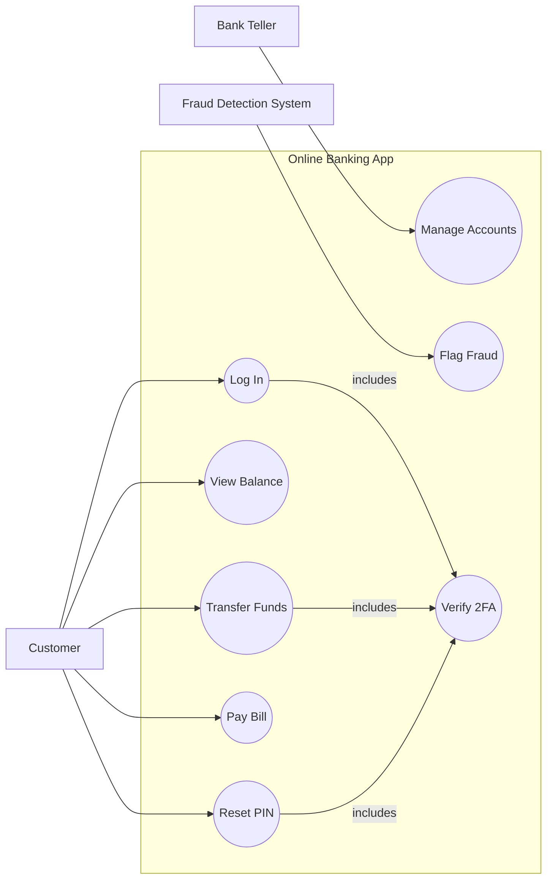
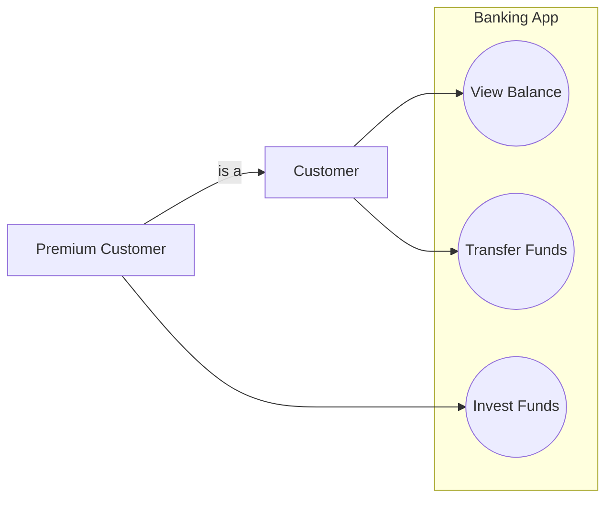

# Use Case Diagrams

A use case diagram shows a system from the **user's perspective**: what actions the system supports, who performs them, and how those actions relate to each other. It answers the question: *"What does this system do, and for whom?"*

It deliberately hides *how* things are done — that's the job of class and sequence diagrams. A use case diagram is a **requirements map**, not a design blueprint.

> **Interview relevance:** Use case diagrams appear early in LLD interviews to scope the problem — "what are the actors and their goals?" They are less important than class and sequence diagrams for design, but getting the actors and use cases right sets the foundation for everything that follows.

---

## Key Notation

| Element | Symbol | Description |
|---|---|---|
| **Actor** | Stick figure | A role that interacts with the system (user, external system, timer) |
| **Use Case** | Oval | A complete, discrete goal that an actor achieves using the system |
| **System boundary** | Rectangle | The border of the system being designed |
| **Association** | Solid line | Actor participates in a use case |
| **`<<include>>`** | Dashed arrow | Use case A always invokes use case B |
| **`<<extend>>`** | Dashed arrow | Use case B optionally extends use case A under a condition |
| **Generalization** | Solid arrow with hollow triangle | One actor or use case is a specialisation of another |

> **Mermaid note:** Mermaid does not support use case diagrams natively. The diagram below uses `graph LR` as a practical approximation — circles represent use cases, rectangles represent actors, and subgraphs represent the system boundary.

---

## Example: Online Banking System



---

## `<<include>>` vs `<<extend>>`

These two relationships are the most frequently confused in UML.

### `<<include>>` — Mandatory reuse

`A <<include>> B` means: whenever A runs, B **always** runs as part of it. It is not optional. Use it to factor out a sub-flow that multiple use cases share.

```
Transfer Funds  ---<<include>>---> Verify 2FA
Pay Bill        ---<<include>>---> Verify 2FA
Reset PIN       ---<<include>>---> Verify 2FA
```

In code: `Verify2FA` is a method called unconditionally inside every operation that requires it.

```java
public void transferFunds(TransferRequest request, String otpToken) {
    twoFactorService.verify(request.getUserId(), otpToken);  // <<include>>
    accountService.debit(request.getSourceAccount(), request.getAmount());
    accountService.credit(request.getTargetAccount(), request.getAmount());
}
```

### `<<extend>>` — Optional augmentation

`B <<extend>> A` means: B **sometimes** adds extra behaviour to A, under a specific condition. A is complete on its own; B is the optional extension.

```
Email Statement  ---<<extend>>---> View Balance
  (condition: user has email notifications enabled)
```

In code: an optional step checked by a condition.

```java
public BalanceSummary viewBalance(String userId) {
    BalanceSummary summary = accountService.getBalance(userId);

    // <<extend>> — only fires under specific condition
    User user = userService.findById(userId);
    if (user.hasEmailNotificationsEnabled()) {
        notificationService.sendBalanceSummaryEmail(user, summary);
    }

    return summary;
}
```

### Side-by-Side Comparison

| | `<<include>>` | `<<extend>>` |
|---|---|---|
| **Execution** | Always | Only under a condition |
| **Dependency** | Base use case depends on the included one | Extension is optional from base's perspective |
| **Who knows about whom** | Base calls included | Extension knows about base; base is unaware |
| **Code equivalent** | Unconditional method call | Conditional block or observer hook |
| **Typical use** | Factor out shared sub-flows | Add optional, plugin-like behaviour |

---

## Actor Generalization

Actors can have generalization (inheritance) relationships — a `Premium Customer` is a `Customer` and can do everything a Customer can, plus more:



`Premium Customer` inherits all of `Customer`'s use case associations, and adds its own.

---

## From Use Cases to Classes

Use cases directly inform the class diagram. Each use case maps to one or more methods on service classes. The actors map to entry points (controllers, APIs, event listeners):

| Use Case | Java entry point | Core service |
|---|---|---|
| Log In | `POST /auth/login` → `AuthController` | `AuthService.authenticate()` |
| Transfer Funds | `POST /transfers` → `TransferController` | `TransferService.execute()` |
| View Balance | `GET /accounts/{id}/balance` → `AccountController` | `AccountService.getBalance()` |
| Flag Fraud | Scheduled job / event | `FraudDetectionService.analyse()` |

This mapping is what an interviewer expects you to make explicit — "how does this use case become a class and a method in your design?"

---

## When to Draw a Use Case Diagram

**Draw one when:**
- Scoping a new system at the start of an LLD interview — who are the actors, what are their goals?
- Clarifying which features are in vs. out of scope
- Identifying shared sub-flows to factor out (candidates for `<<include>>`)
- Communicating system capability to non-technical stakeholders

**Skip it when:**
- The requirements are already clear and you need to move to design
- The system has a single actor with a small number of obvious use cases
- The interviewer has asked specifically for a class or sequence diagram

---

## Use Cases vs User Stories

| | Use Cases | User Stories |
|---|---|---|
| **Format** | Diagram + written flow | "As a [role], I want [goal] so that [benefit]" |
| **Perspective** | System-centric: what the system does | User-centric: what the user needs |
| **Scope** | Full system view | Single feature slice |
| **Detail level** | Medium — shows relationships | Low — shows intent |
| **Common in** | UML / LLD interviews | Agile teams / product planning |

In practice, use cases and user stories are complementary — user stories capture the *why*, use case diagrams show the *what* and *who*, and class/sequence diagrams show the *how*.

---

## Interview Talking Points

**1. What is the purpose of a use case diagram and when do you draw it?**
> "A use case diagram scopes the system from the user's perspective — it shows the actors (the roles that interact with the system) and the use cases (the goals those actors can achieve). I draw it at the start of an LLD interview to align on scope: who are the users, what do they need to do, and are there external systems that interact? It deliberately omits implementation details — that comes later with class and sequence diagrams. The use case diagram is the 'what', the class diagram is the 'what structure', and the sequence diagram is the 'how'."

**2. Explain the difference between `<<include>>` and `<<extend>>`.**
> "Include is mandatory reuse — whenever use case A runs, B always runs as part of it. It's like calling a helper method unconditionally. Three use cases all include Verify2FA because every sensitive action requires it. Extend is optional augmentation — B adds extra behaviour to A only under a specific condition. A is complete without B. If a user has email notifications enabled, viewing their balance also emails them a summary — that's an extension. The direction of the arrow is opposite too: include points from the base to the included use case; extend points from the extension to the base."

**3. How do use cases relate to your class design?**
> "Each use case becomes one or more methods on a service class. The actor maps to an entry point — a REST controller, an event listener, a scheduled job. So 'Transfer Funds' by 'Customer' becomes `TransferController.transfer()` calling `TransferService.execute()`. By mapping every use case to a service method, I ensure that every actor's goal has a clear code path, and I can check that my class diagram actually supports all the requirements. Use cases also reveal which service classes I need — one service per bounded domain area."

---

## Key Takeaways

- Use case diagrams show **what** the system does and **who** it does it for — not how
- **Actors** are roles (human or system), not individual people
- **Use cases** are complete user goals, not individual steps or methods
- `<<include>>` = always runs (shared mandatory sub-flow); `<<extend>>` = optionally runs (plugin behaviour)
- Each use case maps to one or more **service methods** in the class diagram
- Draw use case diagrams to **scope the problem** at the start of a design session
- In LLD interviews, use case diagrams support the design; class and sequence diagrams *are* the design
